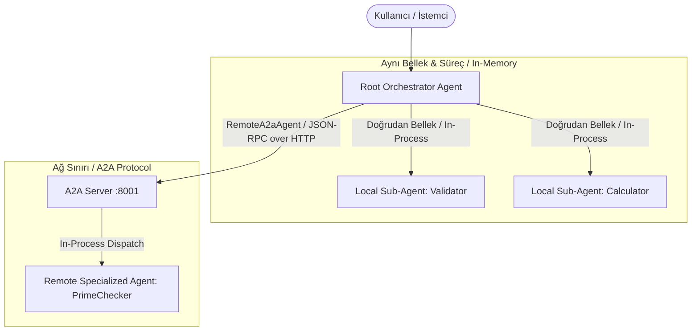
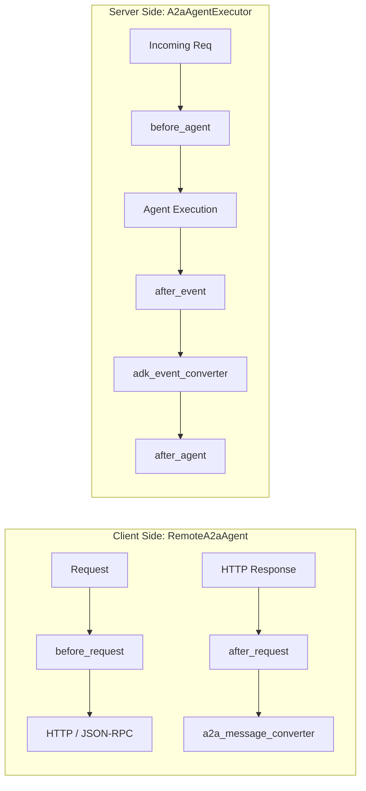

# Google ADK Agent-to-Agent (A2A) Protokolü Mimari Rehberi

Google Agent Development Kit (ADK), tekil monolitik ajanların sınırlarını aşarak heterojen, bağımsız ve farklı dillerde/çatılarda yazılmış yapay zeka ajanlarının standart bir ağ protokolü üzerinden birbiriyle konuşmasını sağlayan **Agent2Agent (A2A) Protokolü** (`https://a2a-protocol.org`) standardını tam olarak destekler.

Bu rehber; bir ADK ajanını A2A servisi olarak dış dünyaya sunma (**Exposing**), uzak bir A2A ajanını yerel bir alt ajan gibi kullanma (**Consuming**), A2A V2 Extension ile akış güvenilirliğini sağlama ve çoklu dil (Python, Go, Java, Kotlin) entegrasyonlarını kapsayan derinlemesine referanstır.

---

## 1. Mimari Karar: Yerel Alt Ajanlar vs. Uzak A2A Ajanları

Karmaşık bir çoklu ajan sistemi tasarlarken verilen ilk ve en kritik mimari karar, alt ajanların **aynı süreç (process) içinde mi** yoksa **bağımsız bir mikroservis olarak ağ üzerinde mi (A2A)** çalışacağıdır:



### Karşılaştırma Matrisi

| Kriter | Yerel Alt Ajan (Local Sub-Agent) | Uzak Ajan (Remote A2A Agent) |
| :--- | :--- | :--- |
| **Çalışma Alanı** | Ana ajanla aynı uygulama süreci (in-process). | Ağ üzerindeki bağımsız bir mikroservis (standalone service). |
| **İletişim Hızı** | Çok yüksek (sıfır ağ maliyeti, bellek içi nesne aktarımı). | Ağ gecikmesine (network latency) ve serileştirmeye bağlı. |
| **Dil & Çatı Bağımlılığı** | Ana ajanla aynı dilde (Python, Go vb.) olmak zorunda. | **Tamamen dil ve çatı bağımsız** (Python -> Go -> Java). |
| **Sözleşme (Contract)** | Gevşek kod içi nesne bağımlılığı. | **Katı ve resmi A2A Protokol Sözleşmesi** (`AgentCard`). |
| **Yönetim & Dağıtım** | Monolitik; ana ajanla birlikte derlenir ve dağıtılır. | Bağımsız CI/CD, bağımsız ölçekleme ve ayrı ekiplerce yönetim. |
| **Örnek Senaryo** | Girdi doğrulama, format temizleme, yerel matematiksel hesap. | Şirket dışı finansal veri servisi, legacy Java servisi, ödeme ajanı. |

### Ne Zaman A2A Kullanılmalı?
1. **Farklı Ekipler veya Organizasyonlar:** İlgili ajan başka bir ekip veya 3. parti sağlayıcı tarafından yönetiliyorsa.
2. **Çoklu Dil Mimarisi:** Ana orkestrasyon Python'dayken, özel bir hesaplama motoru Go veya Java ile yazılmışsa.
3. **Mikroservis Mimarisi:** Ajanların birbirinden bağımsız ölçeklenmesi, güncellenmesi veya konteynerize edilmesi gerekiyorsa.
4. **Katı API Sözleşmesi:** Ajanlar arasında `AgentCard` ile tanımlanmış açık ve doğrulanabilir bir yetenek protokolü isteniyorsa.

### Ne Zaman Yerel Alt Ajan Tercih Edilmeli?
1. **İç Kod Organizasyonu:** Tek bir ajanın karmaşık iş mantığını modüllere ayırmak için.
2. **Yüksek Frekans / Düşük Gecikme:** Milisaniyelerin kritik olduğu anlık veri akışı işlemlerinde.
3. **Ortak Bellek / Durum (Shared State):** Alt ajanın ana ajanın dahili durumuna (`session.state`) doğrudan erişmesi gerektiğinde.

---

## 2. A2A Temel Yetenekleri (Capabilities)

ADK'nın A2A entegrasyonu, standart HTTP/JSON-RPC veri aktarımının ötesinde 3 kritik ajan yeteneğini protokol üzerinde şeffaf biçimde taşır:

1. **Reasoning (Model Düşünce İzleri):** Ajanlar arası A2A mesajlaşmasında modelin akıl yürütme (`thought traces`) blokları kaybolmaz, korunur.
2. **Long-Running Tools (Uzun Süren Araçlar):** Standart HTTP yanıt sürelerini aşan uzun araç çağrıları için A2A görev (`Task`) ve durum güncelleme mekanizması devreye girer; bağlantı zaman aşımına uğramaz.
3. **Artifacts (Artefakt ve Dosya Aktarımı):** Uzak ajanın ürettiği dosyalar, raporlar veya veri yapıları A2A artefakt güncelleme olayları (`TaskArtifactUpdateEvent`) üzerinden ana ajana iletilir.

---

## 3. Agent Card Spesifikasyonu (`.well-known/agent-card.json`)

A2A protokolünün temel yapı taşı `AgentCard` nesnesidir. Her A2A ajanı, ne iş yaptığını, desteklediği girdi/çıktı formatlarını ve yeteneklerini standart bir URL altında yayınlar:
`http://<host>:<port>/.well-known/agent-card.json` (veya çoklu ajan sunucularında `http://<host>:<port>/a2a/<agent_name>/.well-known/agent-card.json`).

### A2A 0.3 vs A2A 1.0 Şema Farkı
- **A2A 0.3:** Doğrudan en üst seviyede `url` ve `preferredTransport` alanlarını kullanır.
- **A2A 1.0:** Çoklu protokol desteği için `supportedInterfaces` dizisini (`protocolBinding` ve `url`) zorunlu kılar.

### Standart Agent Card Örneği (A2A 1.0)
```json
{
  "name": "check_prime_agent",
  "version": "1.0.0",
  "description": "An agent specialized in checking whether numbers are prime.",
  "capabilities": {
    "streaming": true,
    "extensions": [
      {
        "uri": "https://google.github.io/adk-docs/a2a/a2a-extension/",
        "description": "Ability to use the new agent executor implementation",
        "required": false
      }
    ]
  },
  "defaultInputModes": ["text/plain"],
  "defaultOutputModes": ["application/json"],
  "skills": [
    {
      "id": "prime_checking",
      "name": "Prime Number Checking",
      "description": "Check if numbers in a list are prime using efficient mathematical algorithms",
      "tags": ["mathematical", "computation", "prime", "numbers"]
    }
  ],
  "supportedInterfaces": [
    {
      "protocolBinding": "JSONRPC",
      "url": "http://localhost:8001/a2a/check_prime_agent"
    }
  ],
  "supportsAuthenticatedExtendedCard": false
}
```

---

## 4. Ajanı Dışa Açma (Exposing Agents via A2A)

### Kurulum ve Bağımlılıklar
ADK'nın A2A protokol yeteneklerini kullanmak için ekstra A2A bağımlılık paketi kurulmalıdır:

```powershell
pip install "google-adk[a2a]"
```

> [!NOTE]
> **A2A Python SDK Sürüm Uyumluluğu:** ADK hem `a2a-sdk` 0.3.x hem de 1.x.x sürümlerini destekler. Ortamda kurulu olan SDK sürümü otomatik olarak tespit edilir ve uygulama kodunuzda değişiklik gerektirmez. Ancak yeni projelerde 1.x.x hedeflenmelidir.

### Deneysel Özellik Uyarılarını Gizleme (Opsiyonel)
A2A entegrasyonu deneysel (experimental) aşamada olduğu için terminal çıktılarında uyarılar üretebilir. Temiz loglar için uyarıları ortam değişkeniyle kapatabilirsiniz:

```powershell
$env:ADK_SUPPRESS_A2A_EXPERIMENTAL_FEATURE_WARNINGS="true"
```

---

Bir ADK ajanını ağ üzerinden tüketilebilir bir A2A servisine dönüştürmenin 2 temel yolu vardır:

### Yöntem 1: `to_a2a()` Yardımcı Fonksiyonu ve Uvicorn (Önerilen)
Bu yaklaşım, ajanın kodundan (`Agent` tanımlaması, araçları ve talimatları) otomatik olarak bir `AgentCard` üretir ve doğrudan Starlette tabanlı bir ASGI uygulaması döner.

```python
from contextlib import asynccontextmanager
from google.adk.agents.llm_agent import Agent
from google.adk.a2a.utils.agent_to_a2a import to_a2a
from starlette.applications import Starlette

# 1. Standart ADK Ajanı
def check_prime(nums: list[int]) -> str:
    """Belirtilen sayıların asal olup olmadığını kontrol eder.
    
    Args:
        nums: Kontrol edilecek tamsayı listesi.
    Returns:
        Hangi sayıların asal olduğunu bildiren metin.
    """
    primes = [n for n in nums if n > 1 and all(n % i != 0 for i in range(2, int(n**0.5) + 1))]
    return f"Primes found: {primes}"

root_agent = Agent(
    model="gemini-2.0-flash",
    name="prime_service_agent",
    description="Asal sayı tespiti yapan uzman matematik ajanı.",
    instruction="Verilen sayı listesi için check_prime aracını çalıştır.",
    tools=[check_prime],
)

# 2. Uygulama Yaşam Döngüsü (Lifespan - Opsiyonel)
@asynccontextmanager
async def app_lifespan(app: Starlette):
    # Başlangıç: DB veya kaynak havuzunu başlat
    app.state.ready = True
    yield
    # Kapanış: Kaynakları temizle
    app.state.ready = False

# 3. A2A ASGI Uygulamasına Dönüştürme
a2a_app = to_a2a(
    agent=root_agent,
    host="localhost",
    port=8001,               # Uvicorn portu ile birebir eşleşmelidir!
    lifespan=app_lifespan,
)
```

#### Özel `AgentCard` Nesnesi veya JSON Dosyası Verme
Varsayılan otomatik kart üretimini (`AgentCardBuilder`) geçersiz kılıp kendi kartınızı sağlayabilirsiniz:

```python
from a2a.types import AgentCard
from google.adk.a2a.utils.agent_to_a2a import to_a2a

# A. Doğrudan Kod İçinde AgentCard Nesnesi Tanımlama
my_agent_card = AgentCard(
    name="prime_service_agent",
    url="http://localhost:8001",
    description="Özel asal sayı kontrol servisi.",
    version="1.0.0",
    capabilities={},
    skills=[],
    default_input_modes=["text/plain"],
    default_output_modes=["application/json"],
    supports_authenticated_extended_card=False,
)
a2a_app = to_a2a(root_agent, port=8001, agent_card=my_agent_card)

# B. Harici JSON Dosyası Üzerinden Yükleme
a2a_app = to_a2a(root_agent, port=8001, agent_card="configs/prime_agent.json")
```

#### Kaput Altında `to_a2a()` Nasıl Çalışır?
`to_a2a()` fonksiyonu çağrıldığında arka planda şu mimari bileşenler otomatik kurulur:
1. **`A2aAgentExecutor` Kurulumu:** A2A protokolü ile yerel ADK ajanı arasında köprü görevi görür. Özel bir `Runner` verilmemişse bellek içi servislerle donatılmış varsayılan bir runner örneği başlatır.
2. **Durum Yönetimi (State Management):** Görev durumlarını (`InMemoryTaskStore`) ve anlık bildirim yapılandırmalarını (`InMemoryPushNotificationConfigStore`) saklayan bellek içi depolar yaratılır.
3. **İstek Yönlendirme (Request Handling):** Gelen A2A HTTP/JSON-RPC isteklerini karşılayıp doğru yürütücüye dağıtan `DefaultRequestHandler` ayağa kalkar.
4. **Starlette ASGI Uygulaması ve Rotalar:** Starlette uygulaması oluşturularak `/.well-known/agent-card.json` ve A2A işlem rotaları bağlanır.

#### Sunucuyu Çalıştırma ve Port Çakışmasını Önleme
```powershell
uvicorn app.agent:a2a_app --host localhost --port 8001
```

> [!TIP]
> **Neden Port 8001?** Yerel geliştirme ortamında tüketen ana ajan (`root_agent`) veya `adk web` arayüzü varsayılan olarak `8000` portunu dinler. Dışa açılan A2A servisinin port çakışması yaşamaması için `8001` (veya farklı bir port) seçilmelidir.

#### `to_a2a()` Parametre Referansı
- `agent` *(Zorunlu)*: Dışa açılacak ana ADK `Agent` veya `Workflow` nesnesi.
- `host` *(Opsiyonel, varsayılan: `"localhost"`)*: Üretilen AgentCard içindeki RPC URL ana makine adı.
- `protocol` *(Opsiyonel, varsayılan: `"http"`)*: Bağlantı protokolü (`http` veya `https`).
- `port` *(Opsiyonel, varsayılan: `8000`)*: Üretilen AgentCard içindeki port. **Uvicorn'un dinlediği port ile aynı olmalıdır.**
- `agent_card` *(Opsiyonel)*: Otomatik kart üretimini devre dışı bırakıp özel bir `AgentCard` nesnesi veya JSON dosya yolu (`"/path/agent.json"`) vermeyi sağlar.
- `runner` *(Opsiyonel)*: Özel `Runner` örneği. Boş bırakılırsa bellek içi servislerle (`InMemorySessionService`, `InMemoryArtifactService`) donatılmış varsayılan bir runner atanır.
- `push_config_store` *(Opsiyonel)*: A2A anlık bildirimlerini (push notifications) saklamak için özel depo.
- `lifespan` *(Opsiyonel)*: Starlette asenkron yaşam döngüsü context manager'ı.

---

### Yöntem 2: `adk api_server --a2a` ve Statik `agent.json`
Birden fazla bağımsız ajanın bulunduğu bir klasör hiyerarşisini tek bir komutla sunmak için kullanılır. Sunucu yalnızca içinde geçerli bir `agent.json` bulunan alt klasörleri A2A üzerinden yayınlar:

```text
my_agents/
├── billing_agent/
│   ├── agent.py
│   └── agent.json       # <-- A2A üzerinden yayınlanır
└── analytics_agent/
    ├── agent.py         # agent.json yoksa A2A üzerinden açılmaz
```

Çalıştırma komutu:
```powershell
adk api_server --a2a --port 8001 my_agents --log_level debug
```

---

## 5. Ajanı Tüketme (Consuming Remote A2A Agents)

Ana ajanınızın (`Root Agent`), uzak bir A2A servisini çağırması için `RemoteA2aAgent` istemci vekili kullanılır. `RemoteA2aAgent`, uzak ajanla kurulan JSON-RPC iletişimini yönetir ve gelen yanıtları ADK'nın yerel `Event` ve `Part` nesnelerine otomatik çevirir.

### Python ile Tüketim
```python
from google.adk.agents.llm_agent import Agent
from google.adk.agents.remote_a2a_agent import RemoteA2aAgent, AGENT_CARD_WELL_KNOWN_PATH
from google.genai import types

# 1. Uzak A2A Ajanını Yerel Bir Temsilci Olarak Tanımla
prime_remote_agent = RemoteA2aAgent(
    name="prime_agent",
    description="Sayıların asal olup olmadığını kontrol eden uzak servis.",
    # AGENT_CARD_WELL_KNOWN_PATH sabiti "/.well-known/agent-card.json" değerini tutar
    agent_card=f"http://localhost:8001{AGENT_CARD_WELL_KNOWN_PATH}",
    # ÇOK ÖNEMLİ: use_legacy varsayılan olarak True'dur. 
    # V2 Extension ve güvenilir akış için mutlaka False yapılmalıdır!
    use_legacy=False,
)

# 2. Yerel Alt Ajan (Örnek)
def roll_die(sides: int) -> int:
    """Zar atar."""
    import random
    return random.randint(1, sides)

roll_local_agent = Agent(
    model="gemini-2.0-flash",
    name="roll_agent",
    instruction="İstenen kenar sayısına göre zar at.",
    tools=[roll_die],
)

# 3. Orkestratör Ana Ajan (Root Agent)
root_agent = Agent(
    model="gemini-2.0-flash",
    name="root_coordinator",
    instruction="""
    Kullanıcı taleplerini koordine et:
    1. Zar atma isteklerini 'roll_agent'a aktar.
    2. Asal sayı kontrollerini 'prime_agent'a aktar.
    3. 'Zar at ve asal mı bak' denirse önce zarı at, sonucu alıp prime_agent'a ver.
    """,
    sub_agents=[roll_local_agent, prime_remote_agent],  # RemoteA2aAgent normal sub-agent gibidir!
    generate_content_config=types.GenerateContentConfig(
        safety_settings=[
            # Zar atma veya simülasyon gibi araçlarda hatalı güvenlik blokajlarını önlemek için:
            types.SafetySetting(
                category=types.HarmCategory.HARM_CATEGORY_DANGEROUS_CONTENT,
                threshold=types.HarmBlockThreshold.OFF,
            ),
        ]
    ),
)
```

#### `RemoteA2aAgent` Parametre Referansı
- **`name`** *(Zorunlu)*: İstemci tarafında ajanı tanımlayan benzersiz isim.
- **`agent_card`** *(Zorunlu)*: Uzak ajanın kart tanımı. Bir URL dizgesi (`http://<host>:<port>/.well-known/agent-card.json`), doğrudan bir `AgentCard` nesnesi veya yerel bir JSON dosya yolu olabilir.
- **`description`** *(Opsiyonel, varsayılan: `""`)*: Ajanın yeteneklerini orkestratöre bildiren açıklama.
- **`use_legacy`** *(Opsiyonel, varsayılan: `True`)*: Eski A2A protokol motorunu mu yoksa yeni akış güvenilirliği sağlayan V2 motorunu mu kullanacağını belirler. **V2 için kesinlikle `False` verilmelidir.**
- **`config`** *(Opsiyonel)*: Özel dönüştürücüler, kesiciler ve parametre enjeksiyonu için `A2aRemoteAgentConfig` nesnesi.

---

## 6. A2A Extension V2 ve Akış Güvenilirliği (Streaming Reliability)

ADK Python v1.27.0 ile birlikte, özellikle akış (streaming) modunda çalışan sistemlerdeki veri kaybını ve biçim bozulmalarını önleyen **A2A Extension V2** mimarisi (`A2aAgentExecutor` yeni motoru) devreye alınmıştır.

### Legacy (V1) Sorunları ve V2 Çözümleri
1. **Message Duplication (Mükerrer Mesajlar):** Eski yürütücüde kullanıcı mesajları görev geçmişinde (`task history`) tekrarlanarak kopyalanabiliyordu. V2 mesaj tekilleştirmesini garanti eder.
2. **Output Misclassification (Çıktı Sınıflandırma Hatası):** Uzak ajanın ürettiği gerçek model yanıtları hatalı olarak dahili "düşünce olayları" (`thought events`) sanılıp istemciye aktarılmayabiliyordu. V2 model yanıtı ile düşünce adımlarını katı olarak ayrıştırır.
3. **Sub-Agent Data Loss (İç İçe Ajan Veri Kaybı):** Uzak ajan kendi bünyesinde başka yerel alt ajanlar barındırdığında hiyerarşik ağaçtaki ara çıktılar kaybolabiliyordu. V2 iç içe ajan hiyerarşisindeki tüm olay akışını korur.

### Uzantının Taşıma Seviyesinde Aktivasyonu
İstemciler bu uzantıyı kullanmak istediklerini taşıma protokolüne göre bildirir:
- **HTTP & JSON-RPC:** İstek başlıklarına `X-A2A-Extensions: https://google.github.io/adk-docs/a2a/a2a-extension/` eklenir.
- **gRPC:** İstek meta-verisine (`metadata`) `X-A2A-Extensions` anahtarı atanır.

#### İstemci Tarafı (Python):
```python
from google.adk.agents.remote_a2a_agent import RemoteA2aAgent

remote_agent = RemoteA2aAgent(
    name="remote_service",
    agent_card="http://localhost:8001/.well-known/agent-card.json",
    use_legacy=False,  # X-A2A-Extensions başlığını otomatik ekler
)
```

#### Sunucu Tarafı ve Doğrulama:
Sunucudaki `A2aAgentExecutor`, gelen istekteki `X-A2A-Extensions` başlığını algıladığında yürütmeyi otomatik olarak yeni motora (`a2a_agent_executor_impl.py`) yönlendirir.
- **Doğrulama (Confirmation):** Uzantının başarıyla devreye alındığını teyit etmek için sunucu, istemciye dönen yanıt meta-verisinde ve üretilen A2A olaylarında `"activated extensions"` listesine bu uzantı URI'sini dahil eder.
- **Geri Çekilme (Opt-Out):** Eski motora dönmek istenirse istemci `use_legacy=True` ile başlatılır veya sunucuda `A2aAgentExecutor(..., use_legacy=True)` yapılandırılır.

### Agent Card Tanımında Uzantı Bildirimi
A2A servisleri bu uzantıyı desteklediklerini `AgentCard` nesnesinin `capabilities.extensions` dizisinde ilan eder:

```json
{
  "capabilities": {
    "streaming": true,
    "extensions": [
      {
        "uri": "https://google.github.io/adk-docs/a2a/a2a-extension/",
        "description": "Ability to use the new agent executor implementation",
        "required": false
      }
    ]
  }
}
```

---

## 7. İleri Seviye Yapılandırma: Dönüştürücüler (Converters) ve Kesiciler (Interceptors)

A2A protokol mesajları ile ADK'nın dahili `Event` / `Part` nesneleri arasındaki serileştirme sürecine müdahale etmek için dönüştürücüler ve ara katmanlar (middleware) tanımlanabilir:



### Sunucu Tarafı: `A2aAgentExecutorConfig`
```python
from google.adk.a2a.executor.config import A2aAgentExecutorConfig

server_config = A2aAgentExecutorConfig(
    # Dönüştürücüler (Converters)
    adk_event_converter=custom_adk_event_converter,
    gen_ai_part_converter=custom_genai_part_converter,
    request_converter=custom_request_converter,
    
    # Kesiciler (Execute Interceptors)
    execute_interceptors=[
        # before_agent: Gelen RequestContext'i denetler/değiştirir
        # after_event: Olay kuyruğa girmeden önce filtreler veya None dönerek eler
        # after_agent: Tamamlanma/hata durum olayını sonlandırmadan önce düzenler
    ]
)
```

### İstemci Tarafı: `A2aRemoteAgentConfig`

Uzak ajandan dönen A2A yanıtlarını ve istemci isteklerini dönüştürmek için kullanılan kancalar:

- **Dönüştürücüler (Converters):**
  - `a2a_message_converter`: Standart A2A Mesajlarını ADK `Event` nesnelerine çevirir.
  - `a2a_task_converter`: A2A `Task` nesnelerini ADK `Event` nesnelerine çevirir.
  - `a2a_status_update_converter`: A2A `TaskStatusUpdateEvent` durum güncellemelerini ADK `Event`ine çevirir.
  - `a2a_artifact_update_converter`: A2A `TaskArtifactUpdateEvent` artefakt olaylarını ADK `Event`ine çevirir.
  - `a2a_part_converter`: Temel düşük seviyeli kanca; A2A Mesaj Parçalarını (Message Parts) GenAI `Part` nesnelerine çevirir.
- **İstek Kesicileri (Request Interceptors):**
  - `before_request`: İstek uzak sunucuya gönderilmeden önce tetiklenir; `A2AMessage` nesnesini düzenleyebilir veya anında bir `Event` dönerek isteği durdurabilir.
  - `after_request`: Uzak sunucudan yanıt alındıktan sonra tetiklenir; oluşturulan ADK `Event` nesnesini düzenleyebilir veya `None` dönerek olayı tamamen düşürebilir.
- **Parametre Enjeksiyonu (Request Parameters Config):**
  - `request_metadata`: İstek HTTP başlıklarına özel meta-veri sözlükleri enjekte eder.
  - `client_call_context`: İlgili taşıma katmanı (transport) için istemci çağrı bağlamlarını ayarlar.

```python
from google.adk.a2a.agent import A2aRemoteAgentConfig
from google.adk.agents.remote_a2a_agent import RemoteA2aAgent

client_config = A2aRemoteAgentConfig(
    a2a_message_converter=custom_message_converter,
    a2a_task_converter=custom_task_converter,
    a2a_status_update_converter=custom_status_converter,
    a2a_artifact_update_converter=custom_artifact_converter,
    request_interceptors=[custom_request_interceptor],
)

remote_agent = RemoteA2aAgent(
    name="custom_client_agent",
    agent_card="http://localhost:8001/.well-known/agent-card.json",
    use_legacy=False,
    config=client_config,
)
```

---

## 8. Çok Dilli (Multi-Language) Entegrasyon Kılavuzu

A2A tamamen dil bağımsızdır. Python bir orkestratör, Go ile yazılmış bir hesaplama ajanını veya Java ile yazılmış bir kurumsal servisi doğal bir alt ajan gibi tüketebilir.

### Çok Dilli Kodlama Karşılaştırması

#### 1. Go ile Dışa Açma ve Tüketme (Go ADK `a2a.NewLauncher`)

Go ADK ortamında ajanlar `a2a.NewLauncher()` ve `web.NewLauncher()` bileşenleri kullanılarak dışa açılır; bu işlem `.well-known/agent-card.json` kartını bellek içinde dinamik olarak üretir.

##### A. Dışa Açma (Go Server - Exposing):
```go
package main

import (
	"context"
	"log"
	"strconv"

	"google.golang.org/genai"
	"github.com/google/adk/pkg/agent"
	"github.com/google/adk/pkg/agent/llmagent"
	"github.com/google/adk/pkg/launcher"
	"github.com/google/adk/pkg/launcher/web"
	"github.com/google/adk/pkg/launcher/web/a2a"
	"github.com/google/adk/pkg/model/gemini"
	"github.com/google/adk/pkg/session"
	"github.com/google/adk/pkg/tool"
	"github.com/google/adk/pkg/tool/functiontool"
)

func checkPrimeTool(ctx context.Context, input struct{ Nums []int }) (string, error) {
	// Asal kontrol algoritması
	return "Primes checked successfully", nil
}

func main() {
	ctx := context.Background()

	// 1. Fonksiyon Aracını Tanımla
	primeTool, err := functiontool.New(functiontool.Config{
		Name:        "prime_checking",
		Description: "Check if numbers in a list are prime using efficient mathematical algorithms",
	}, checkPrimeTool)
	if err != nil {
		log.Fatalf("Failed to create prime tool: %v", err)
	}

	// 2. Modeli Başlat
	model, err := gemini.NewModel(ctx, "gemini-2.0-flash", &genai.ClientConfig{})
	if err != nil {
		log.Fatalf("Failed to create model: %v", err)
	}

	// 3. LLM Ajanını Oluştur
	primeAgent, err := llmagent.New(llmagent.Config{
		Name:        "check_prime_agent",
		Description: "Checks whether numbers in a list are prime.",
		Instruction: "When checking prime numbers, call the check_prime tool with a list of integers.",
		Model:       model,
		Tools:       []tool.Tool{primeTool},
	})
	if err != nil {
		log.Fatalf("Failed to create agent: %v", err)
	}

	// 4. A2A Launcher Kurulumu (Dinamik Agent Card Üretimi)
	port := 8001
	webLauncher := web.NewLauncher(a2a.NewLauncher())
	_, err = webLauncher.Parse([]string{
		"--port", strconv.Itoa(port),
		"a2a", "--a2a_agent_url", "http://localhost:" + strconv.Itoa(port),
	})
	if err != nil {
		log.Fatalf("launcher.Parse error: %v", err)
	}

	config := &launcher.Config{
		AgentLoader:    agent.NewSingleLoader(primeAgent),
		SessionService: session.InMemoryService(),
	}

	log.Printf("Starting Go A2A prime checker server on port %d\n", port)
	if err := webLauncher.Run(context.Background(), config); err != nil {
		log.Fatalf("webLauncher.Run error: %v", err)
	}
}
```

##### B. Tüketme (Go Client - Consuming):
`examples/go/a2a_basic` referansında, yerel bir zar atma ajanı (`roll_agent`) ile uzak A2A asal sayı ajanı (`prime_agent`), tek bir `root_agent` altında birleştirilir:

```go
package main

import (
	"context"
	"fmt"
	"log"
	"math/rand"

	"google.golang.org/genai"
	"github.com/google/adk/pkg/agent"
	"github.com/google/adk/pkg/agent/llmagent"
	"github.com/google/adk/pkg/agent/remoteagent"
	"github.com/google/adk/pkg/model/gemini"
	"github.com/google/adk/pkg/tool"
	"github.com/google/adk/pkg/tool/functiontool"
)

// 1. Yerel Zar Aracı
func rollDie(ctx context.Context, input struct{ Sides int }) (int, error) {
	if input.Sides <= 0 {
		input.Sides = 6
	}
	return rand.Intn(input.Sides) + 1, nil
}

func main() {
	ctx := context.Background()
	model, err := gemini.NewModel(ctx, "gemini-2.0-flash", &genai.ClientConfig{})
	if err != nil {
		log.Fatalf("Model error: %v", err)
	}

	// 2. Yerel Alt Ajan (Roll Agent)
	rollTool, _ := functiontool.New(functiontool.Config{
		Name:        "roll_die",
		Description: "Rolls a die with given sides",
	}, rollDie)

	rollAgent, _ := llmagent.New(llmagent.Config{
		Name:        "roll_agent",
		Description: "Rolls dice of various sides",
		Instruction: "Roll a die when requested using roll_die tool.",
		Model:       model,
		Tools:       []tool.Tool{rollTool},
	})

	// 3. Uzak A2A Ajanı (Remote Prime Agent)
	// AgentCardSource: localhost:8001/.well-known/agent-card.json adresini otomatik sorgular
	primeAgent, err := remoteagent.NewA2A(remoteagent.A2AConfig{
		Name:            "prime_agent",
		Description:     "Checks if numbers are prime via remote service",
		AgentCardSource: "http://localhost:8001",
	})
	if err != nil {
		log.Fatalf("Remote agent error: %v", err)
	}

	// 4. Ana Koordinatör Ajan (Root Agent)
	rootAgent, err := llmagent.New(llmagent.Config{
		Name:        "root_coordinator",
		Description: "Coordinates rolling dice and checking primality",
		Instruction: `
			If the user asks to roll a die, delegate to roll_agent.
			If the user asks to check prime, delegate to prime_agent.
			If asked to 'roll and check prime', delegate to roll_agent first, then pass result to prime_agent.
		`,
		Model:     model,
		SubAgents: []agent.Agent{rollAgent, primeAgent},
	})
	if err != nil {
		log.Fatalf("Root agent error: %v", err)
	}

	fmt.Println("Root agent ready with local and remote sub-agents!")
}
```

> [!NOTE]
> **Go ADK Çalışma Zamanı Yetki Aktarımı (`transfer_to_agent`):** Go ADK, çoklu ajan koordinasyonunda alt ajanlar arasındaki geçişleri otomatik olarak `transfer_to_agent` aracıyla yürütür:
> 1. Kullanıcı: *"Zar at ve asal mı kontrol et"*
> 2. Model: `transfer_to_agent(agent_name="roll_agent")` -> `roll_die(sides=6)` -> Yanıt: `4`
> 3. Model: `transfer_to_agent(agent_name="prime_agent")` -> `prime_checking(nums=[4])` -> Yanıt: `4 asal değildir`

#### 2. Java (Quarkus) ile Dışa Açma ve Tüketme (ADK Java Experimental)

Java ekosisteminde ADK, **Quarkus** çatısı ve CDI (`@ApplicationScoped`, `@Produces`) bağımlılık enjeksiyonu üzerine kuruludur. Java A2A çalışma zamanı gelen JSON-RPC isteklerini ve oturum yönetimini Quarkus uzantısı üzerinden otomatik olarak uç noktalara bağlar.

> [!NOTE]
> **Java A2A Protokol Sürümü ve Port:** Java SDK şu anda **A2A Protokolü 0.3** standardını kullanır. Örnek Quarkus sunucuları varsayılan olarak `9090` portunda çalışır (`http://localhost:9090`).

##### A. Dışa Açma (Java Quarkus Server - Exposing):
`contrib/samples/a2a_server` referans mimarisinde, ajan bir CDI üretici metoduyla (`@Produces`) bir `AgentExecutor` nesnesine bağlanır. Quarkus uzantısı bu nesneyi otomatik olarak keşfeder:

```java
package com.google.adk.sample;

import jakarta.enterprise.context.ApplicationScoped;
import jakarta.enterprise.inject.Produces;
import com.google.adk.agent.BaseAgent;
import com.google.adk.a2a.executor.AgentExecutor;
import com.google.adk.service.session.InMemorySessionService;
import com.google.adk.service.artifact.InMemoryArtifactService;

@ApplicationScoped
public class A2aExposer {

    @Produces
    public AgentExecutor agentExecutor(BaseAgent primeAgent) {
        return new AgentExecutor.Builder()
            .agent(primeAgent)
            .appName("java-a2a-server")
            .sessionService(new InMemorySessionService())
            .artifactService(new InMemoryArtifactService())
            .build();
    }
}
```

##### B. Tüketme (Java Client - Consuming):
`contrib/samples/a2a_basic` referansında, uzak A2A ajanı `A2ACardResolver` ile kartı çözer, `JSONRPCTransport` istemcisi oluşturur ve `RemoteA2AAgent` vekiliyle yerel `LlmAgent` bünyesine sub-agent olarak dahil eder:

```java
package com.google.adk.sample;

import com.google.adk.a2a.client.A2ACardResolver;
import com.google.adk.a2a.client.JdkA2AHttpClient;
import com.google.adk.a2a.client.RemoteA2AAgent;
import com.google.adk.agent.BaseAgent;
import com.google.adk.agent.llmagent.LlmAgent;
import io.a2a.spec.AgentCard;
import io.a2a.client.Client;
import io.a2a.client.transport.jsonrpc.JSONRPCTransport;
import io.a2a.client.transport.jsonrpc.JSONRPCTransportConfig;

public class JavaA2AConsumer {
    public static BaseAgent createRootAgent() throws Exception {
        String cardUrl = "http://localhost:9090/.well-known/agent-card.json";
        
        // 1. Agent Card'ı Uzak Sunucudan Çözümle
        AgentCard card = new A2ACardResolver(new JdkA2AHttpClient(), "http://localhost:9090", cardUrl).getAgentCard();
        
        // 2. JSON-RPC Taşıma İstemcisini İnşa Et
        Client client = Client.builder(card)
            .withTransport(JSONRPCTransport.class, new JSONRPCTransportConfig())
            .build();
            
        // 3. Uzak Temsilciyi Yerel Alt Ajan Olarak Bağla
        BaseAgent remoteAgent = RemoteA2AAgent.builder()
            .name(card.name())
            .a2aClient(client)
            .agentCard(card)
            .build();
            
        // 4. Yerel Alt Ajan (Roll Agent)
        BaseAgent rollAgent = LlmAgent.builder()
            .name("roll_agent")
            .instruction("Roll dice of specified sides when requested.")
            .tools(new RollDieTool())
            .build();
            
        // 5. Ana Orkestratör Ajan (Yerel + Uzak Ajanları Yönetir)
        return LlmAgent.builder()
            .name("root_agent")
            .instruction("Coordinate rolling dice with roll_agent and checking primality with prime_agent.")
            .subAgents(rollAgent, remoteAgent)
            .build();
    }
}
```

#### 3. Kotlin ile Tüketme (ADK Kotlin Experimental)

> [!WARNING]
> **Kotlin Kısıtı (Sadece Consuming):** `adk-kotlin` şu anda A2A üzerinden bir ajanı **dışa açmayı (exposing) desteklememektedir**. Uzak A2A sunucusunun Python, Go veya Java ile çalıştırılması gerekir. Kotlin yalnızca uzak ajanları **tüketme (consuming)** yeteneğine sahiptir.

##### Gradle Bağımlılıkları (`build.gradle.kts`)
`A2AAgent` HTTP istekleri için varsayılan olarak `JdkA2AHttpClient()` kullandığından hem ADK Kotlin A2A modülü hem de temel Java SDK istemcisi derleme yoluna eklenmelidir:

```kotlin
dependencies {
    implementation("com.google.adk:google-adk-kotlin-a2a:1.3.0")
    implementation("org.a2aproject.sdk:a2a-java-sdk-client:1.3.2.Final")
}
```

> [!NOTE]
> **A2A 1.0 Kart Zorunluluğu ve Doğrulama:** Kotlin istemcisi **A2A 1.0** standardındaki kartları okur; bu nedenle hedef sunucunun `agent-card.json` çıktısında `supportedInterfaces` alanı mutlaka tanımlı olmalıdır. Kotlin uygulamasını başlatmadan önce kartın erişilebilirliği terminalden kontrol edilebilir:
> ```powershell
> Invoke-RestMethod http://localhost:8001/a2a/check_prime_agent/.well-known/agent-card.json
> ```

##### Kotlin A2A Tüketim Kodu:
```kotlin
package com.example.agent

import com.google.adk.agent.A2AAgent
import com.google.adk.agent.LlmAgent
import com.google.adk.model.Gemini

// 1. Uzak A2A Ajanı Tanımlama (A2A 1.0 Kartını Çözer)
val primeAgent = A2AAgent(
    name = "prime_agent",
    agentCardUrl = "http://localhost:8001/a2a/check_prime_agent/.well-known/agent-card.json"
)

// 2. Ana Orkestratör Ajan
val rootAgent = LlmAgent(
    name = "root_agent",
    model = Gemini("gemini-2.0-flash"),
    instruction = "Matematiksel asal sayı sorularını prime_agent servisine aktar.",
    subAgents = listOf(primeAgent)
)
```

---

## 9. Üretim Ortamı En İyi Uygulamaları & Sorun Giderme

1. **Port Çatışması ve Localhost İzolasyonu:**
   - Yerel testlerde tüketici UI (`adk web`) varsayılan `8000` portunu kullanır.
   - Dışa açılan A2A sunucusu (`uvicorn` veya `adk api_server`) mutlaka farklı bir porta (örneğin `8001`, `9090`) bağlanmalıdır.
   - `to_a2a(..., port=8001)` içindeki port ile `uvicorn --port 8001` portunun birebir aynı olması zorunludur; aksi halde AgentCard içindeki adres erişilemez kalır.

2. **Deneysel Özellik Uyarılarını Gizleme:**
   - A2A henüz hızlı gelişen bir protokol olduğundan loglarda çıkan uyarıları bastırmak için şu ortam değişkeni kullanılır:
     ```powershell
     $env:ADK_SUPPRESS_A2A_EXPERIMENTAL_FEATURE_WARNINGS="true"
     ```

3. **Gerekli Paketler:**
   - Python tarafında A2A bağımlılıklarını yüklemek için:
     ```powershell
     uv pip install "google-adk[a2a]"
     ```

4. **Hata İzolasyonu (Failure Isolation):**
   - Uzak bir A2A servisinin çökmesi veya ağ hatası alması ana orkestratörü düşürmemelidir. `RemoteA2aAgent` çağrıları `try-except` blokları veya `after_request` kesicileriyle yakalanarak alternatif (fallback) yanıtlara yönlendirilmelidir.
