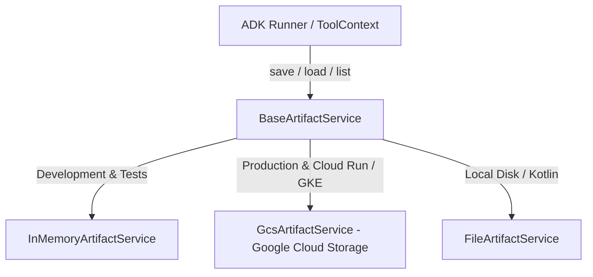

---
title: "ADK Artifacts & Binary Data Management Guide"
description: "Complete architectural guide for managing versioned binary artifacts, Session vs User namespacing, LoadArtifactsTool, and GcsArtifactService in Google ADK."
category: architecture
doc_type: guide
status: active
version: "2.0"
last_updated: "2026-10-04"
author: "Antigravity Engineering"
tags:
  - adk
  - artifacts
  - base-artifact-service
  - gcs-artifact-service
  - load-artifacts-tool
  - types-part
  - blob
  - binary-data
  - namespacing
  - architecture
---

# Google ADK Yapay Zekâ Eserleri (Artifacts) ve İkili Veri Yönetimi

ADK'da **Artifacts (Eserler)**; bir oturumla veya oturumlar arası kullanıcıyla ilişkilendirilmiş, adlandırılmış ve versiyonlanmış ikili (binary) verileri (görseller, PDF belgeleri, ses dosyaları, elektronik tablolar) yönetmek için tasarlanmış birinci sınıf bir mimari mekanizmadır.

Artifacts sistemi, büyük dosyaların doğrudan modelin konuşma geçmişinde kalarak **bağlam penceresini (context window) şişirmesini (`context bloat`) önler**; dosya içeriğini yalnızca model ihtiyaç duyduğunda geçici olarak çalışma belleğine çeker.

---

## 1. Temel Kavramlar ve Veri Temsili

### A. İkili Veri Temsili (`types.Part`)
ADK içinde tüm eserler Google GenAI standart `google.genai.types.Part` nesnesi olarak temsil edilir. İkili veri `inline_data` (`Blob`) içinde saklanır:
- `data`: Ham ikili baytlar (bytes).
- `mime_type`: Veri formatını belirten MIME türü (`"image/png"`, `"application/pdf"`, `"text/csv"` vb.).

```python
import google.genai.types as types

# 1. Primitif Blob ile oluşturma
image_bytes = b"\x89PNG\r\n\x1a\n..." # Ham PNG baytları
image_artifact = types.Part(
    inline_data=types.Blob(
        mime_type="image/png",
        data=image_bytes
    )
)

# 2. Kolaylaştırıcı sınıf metodu ile oluşturma
image_artifact_alt = types.Part.from_bytes(data=image_bytes, mime_type="image/png")
```

### B. Versiyonlama (Versioning)
Aynı dosya adı (`filename`) ile bir eser her kaydedildiğinde, `ArtifactService` mevcut dosyanın üzerine yazmak yerine otomatik olarak artan bir versiyon numarası (`version=1, 2, 3...`) üretir. Geçmiş versiyonlara istenildiği an erişilebilir.

### C. Kapsam ve Ad Alanları (Namespacing: Session vs. User)

ADK iki farklı saklama kapsamı sunar:
1. **Oturum Düzeyi (Session-Scoped - Varsayılan):**
   - Dosya adı doğrudan verilir (örn. `"sales_chart.png"`, `"summary.pdf"`).
   - Eser yalnızca o anki `app_name`, `user_id` ve `session_id` kombinasyonuna aittir. Oturum kapandığında diğer oturumlardan izole kalır.
2. **Kullanıcı Düzeyi (User-Scoped - `user:` Öneki):**
   - Dosya adının başına `user:` öneki eklenir (örn. `"user:profile_picture.jpg"`, `"user:preferences.json"`).
   - Eser `app_name` ve `user_id` düzeyinde saklanır; kullanıcının **tüm geçmiş ve gelecekteki oturumları arasında kalıcıdır**.

---

## 2. Çalışma Zamanı API'si ve Eser Metotları

Ajanlar, özel araçlar (`ToolContext`) ve kancalar (Callbacks) üzerinden `ArtifactService` metotlarına erişebilir:

### A. Eser Kaydetme (`save_artifact`)
```python
# Bir araç fonksiyonu içinde
async def generate_report_tool(tool_context: ToolContext) -> str:
    pdf_bytes = build_pdf_report(...)
    pdf_part = types.Part.from_bytes(data=pdf_bytes, mime_type="application/pdf")
    
    # Oturuma özel kaydet
    version = await tool_context.save_artifact("q3_report.pdf", pdf_part)
    
    # Kullanıcı geneline kalıcı kaydet
    await tool_context.save_artifact("user:last_report.pdf", pdf_part)
    
    return f"Rapor versiyon {version} olarak kaydedildi."
```

### B. Eser Yükleme (`load_artifact`)
```python
# En son versiyonu yükleme
latest_part = await tool_context.load_artifact("q3_report.pdf")

# Belirli bir versiyonu yükleme
v1_part = await tool_context.load_artifact("q3_report.pdf", version=1)

# Kullanıcı düzeyindeki eseri yükleme
user_pref_part = await tool_context.load_artifact("user:preferences.json")
```

### C. Eserleri Listeleme (`list_artifacts`)
```python
# Oturumdaki tüm dosya adlarını listeleme
filenames = await tool_context.list_artifacts()
# Çıktı: ["q3_report.pdf", "user:preferences.json", "sales_chart.png"]
```

---

## 3. Dinamik Model Erişimi: `LoadArtifactsTool`

Kullanıcılar daha önce yüklenmiş dosyalar veya sistem tarafından üretilmiş raporlar hakkında sorular sorduğunda (örn: *"Az önce yüklediğim bütçe tablosundaki toplam harcama nedir?"*), modelin hangi dosyayı ne zaman okuyacağına kendisinin karar vermesi gerekir.

ADK, yerleşik `LoadArtifactsTool` aracını sunar:
- **Otomatik Fihrist:** `LoadArtifactsTool`, mevcut eserlerin listesini modelin sistem talimatına dinamik olarak enjekte eder.
- **İhtiyaç Anında Yükleme:** Model eseri okumaya karar verdiğinde `load_artifacts(filename="budget.xlsx")` aracını çağırır.
- **Geçici Bağlam Enjeksiyonu:** ADK, çağrılan eserin ikili içeriğini yalnızca o turdaki LLM isteğine ekler. Yanıt üretildikten sonra dosya içeriği konuşma geçmişinde kalıcı olarak saklanmaz; bu sayede sonraki turlarda token israfı engellenir.
- **Elektronik Tablo Ayrıştırma:** `enable_spreadsheet_parsing=True` parametresi verildiğinde Excel ve CSV dosyalarını yapılandırılmış metin olarak ayrıştırır.

```python
from google.adk.agents import LlmAgent
from google.adk.tools.load_artifacts_tool import LoadArtifactsTool

analyst_agent = LlmAgent(
    model="gemini-2.5-flash",
    name="data_analyst",
    instruction="Kullanıcı sorularını yanıtlamak için mevcut eserleri LoadArtifactsTool ile inceleyin.",
    tools=[
        LoadArtifactsTool(enable_spreadsheet_parsing=True)
    ],
)
```

---

## 4. Depolama Arka Uçları (`BaseArtifactService`)

ADK, `BaseArtifactService` arayüzünü uygulayan farklı depolama sağlayıcıları sunar:



### A. Geliştirme Ortamı: `InMemoryArtifactService`
Süreç belleğinde tutulur; uygulama veya konteyner yeniden başladığında veriler kaybolur. Hızlı yerel prototipleme ve testler için idealdir:

```python
from google.adk.runners import Runner
from google.adk.artifacts import InMemoryArtifactService

runner = Runner(
    agent=my_agent,
    app_name="prototype_app",
    artifact_service=InMemoryArtifactService(),
)
```

### B. Kurumsal Üretim: `GcsArtifactService` (Cloud Storage)
Cloud Run, Agent Runtime (Agent Engine) ve GKE gibi ölçeklenen ve sunucusuz dağıtımlarda verilerin kalıcı olması için **Google Cloud Storage (GCS)** arka ucu kullanılır:

```python
import os
from google.adk.runners import Runner
from google.adk.artifacts import GcsArtifactService

# Cloud Storage Bucket yapılandırması
bucket_name = os.environ.get("ADK_ARTIFACTS_BUCKET", "my-corp-adk-artifacts")
gcs_service = GcsArtifactService(bucket_name=bucket_name)

runner = Runner(
    agent=enterprise_agent,
    app_name="enterprise_app",
    artifact_service=gcs_service,
)
```

---

## 5. Çoklu Dil SDK Desteği

ADK Artifacts mimarisi tüm desteklenen dillerde birebir uyumludur:

| Dil | Eser Temsili | Ana Servis Sınıfları | Model Aracı |
| :--- | :--- | :--- | :--- |
| **Python** | `google.genai.types.Part` | `InMemoryArtifactService`, `GcsArtifactService` | `LoadArtifactsTool` |
| **TypeScript** | `@google/genai` `createPartFromBase64` | `InMemoryArtifactService`, `GcsArtifactService` | `LoadArtifactsTool` |
| **Go** | `genai.Part` (`InlineData.Blob`) | `BaseArtifactService`, `GCS / In-Memory` | `LoadArtifactsTool` |
| **Java** | `google.genai.types.Part` | `InMemoryArtifactService`, `GcsArtifactService` | `LoadArtifactsTool` |
| **Kotlin** | `genai.Part` | `InMemoryArtifactService`, `GcsArtifactService`, `FileArtifactService` | `LoadArtifactsTool` |

**Java Örneği:**
```java
import com.google.adk.artifacts.BaseArtifactService;
import com.google.adk.artifacts.GcsArtifactService;
import com.google.cloud.storage.Storage;
import com.google.cloud.storage.StorageOptions;

Storage storage = StorageOptions.getDefaultInstance().getService();
BaseArtifactService gcsService = new GcsArtifactService("my-adk-artifacts-bucket", storage);
```

---

## 6. Üretim Mimarisi ve En İyi Uygulamalar

1. **Bucket Yaşam Döngüsü Kuralları (GCS Lifecycle):** Üretimde geçici eserlerin depolama maliyetini düşürmek için GCS bucket üzerinde 30 veya 90 günlük TTL (Time to Live) yaşam döngüsü kuralları yapılandırılmalıdır.
2. **Hata Yönetimi (Resilience):** GCS erişiminde yetki hataları (`Forbidden`) ve ağ istisnaları (`NotFound`, timeouts) için koruyucu `try/except` blokları kullanılmalıdır.
3. **Kalıcı vs. Geçici Ayrımı:** Kullanıcı ayarları ve profil bilgileri her zaman `user:` önekiyle kaydedilmeli; analiz edilen oturum içi ham çıktılar ise varsayılan oturum kapsamında bırakılmalıdır.
