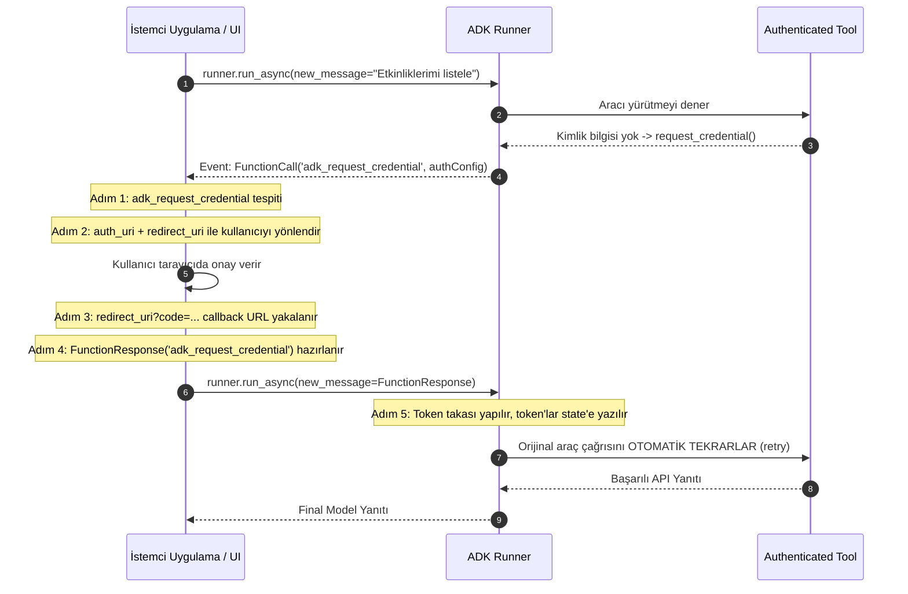

---
title: "ADK Tool Authentication & Credential Management Guide"
description: "Comprehensive guide for authenticating ADK tools, managing OAuth2/OIDC interactive flows, IAM ID tokens with audience, external access tokens, and implementing auth in custom FunctionTools."
category: integrations
doc_type: guide
status: active
version: "2.0"
last_updated: "2026-10-04"
author: "Antigravity Engineering"
tags:
  - adk
  - authentication
  - oauth2
  - oidc
  - id-token
  - audience
  - auth-scheme
  - auth-credential
  - adk-request-credential
  - function-tool
  - integrations
---

# Google ADK Araç Kimlik Doğrulama ve Yetkilendirme Rehberi

Yapay zekâ ajanlarının kurumsal verilere, özel bulut servislerine veya üçüncü taraf API'lara güvenli bir şekilde erişmesi için ADK, çok katmanlı ve standartlaştırılmış bir kimlik doğrulama mimarisi sunar.

---

## 1. Kimlik Doğrulama ve Kimlik Bilgisi Yönetim Yöntemleri

| Yöntem | Güvenlik Düzeyi | Kullanım Senaryosu & Tavsiye |
| :--- | :--- | :--- |
| **Authentication Manager (Agent Identity)** | En Yüksek | **Önerilen:** Anahtar, secret ve OAuth token alımı/yenilenmesi tam yönetilen servis tarafından yapılır. |
| **Secrets Manager (Cloud Secret Manager)** | Yüksek | **Üretim Standardı:** Kimlik bilgileri Google Cloud Secret Manager'da saklanır; bellekte yalnızca kısa ömürlü erişim belirteçleri tutulur. |
| **KMS ile Şifrelenmiş Yerel Depolama** | Orta | İnternete kapalı veya şirket içi sistemlerde yerel veritabanının KMS ile şifrelenmesi. |
| **Oturum İçi Bellek (`InMemorySessionService`)** | Düşük | **Yalnızca Erken Geliştirme:** Oturum kapandığında silinir; üretimde kesinlikle kullanılmamalıdır. |

---

## 2. Temel Çerçeve Bileşenleri

ADK kimlik doğrulama modeli üç ana primitif üzerine kuruludur:

- **`AuthScheme`:** Hedef API'nin kimlik doğrulamasını nasıl beklediğini tanımlar (OpenAPI 3.0 standartları). Desteklenen tipler: `APIKey`, `HTTPBearer`, `OAuth2`, `OpenIdConnectWithConfig`.
- **`AuthCredential`:** Kimlik doğrulama sürecini başlatmak için gereken ilk bilgidir (Client ID, Client Secret, API Key veya Service Account JSON). `auth_type` parametresi alır (`API_KEY`, `OAUTH2`, `SERVICE_ACCOUNT`, `OPEN_ID_CONNECT`, `HTTP`).
- **`AuthConfig`:** Bir `AuthScheme` ile ham kimlik bilgisini (`raw_auth_credential`) ve takas edilmiş belirteci (`exchanged_auth_credential`) birleştiren üst nesnedir.

---

## 3. OpenAPI ve Google API Araçlarında Kimlik Yapılandırması

### A. OpenAPI Toolset ile API Key
```python
from google.adk.tools.openapi_tool.auth.auth_helpers import token_to_scheme_credential
from google.adk.tools.openapi_tool.openapi_spec_parser.openapi_toolset import OpenAPIToolset

auth_scheme, auth_credential = token_to_scheme_credential(
    "apikey", "query", "apikey", "YOUR_API_KEY_STRING"
)

toolset = OpenAPIToolset(
    spec_str=my_openapi_spec,
    spec_str_type="yaml",
    auth_scheme=auth_scheme,
    auth_credential=auth_credential,
)
```

### B. OpenAPI Toolset ile OAuth 2.0
```python
from fastapi.openapi.models import OAuth2, OAuthFlowAuthorizationCode, OAuthFlows
from google.adk.auth import AuthCredential, AuthCredentialTypes, OAuth2Auth
from google.adk.tools.openapi_tool.openapi_spec_parser.openapi_toolset import OpenAPIToolset

auth_scheme = OAuth2(
    flows=OAuthFlows(
        authorizationCode=OAuthFlowAuthorizationCode(
            authorizationUrl="https://accounts.google.com/o/oauth2/auth",
            tokenUrl="https://oauth2.googleapis.com/token",
            scopes={"https://www.googleapis.com/auth/calendar": "calendar access"},
        )
    )
)

auth_credential = AuthCredential(
    auth_type=AuthCredentialTypes.OAUTH2,
    oauth2=OAuth2Auth(
        client_id="YOUR_OAUTH_CLIENT_ID",
        client_secret="YOUR_OAUTH_CLIENT_SECRET",
    ),
)

calendar_api_toolset = OpenAPIToolset(
    spec_str=calendar_spec_str,
    spec_str_type="yaml",
    auth_scheme=auth_scheme,
    auth_credential=auth_credential,
)
```

### C. Google API Yerleşik Toolset'leri
```python
from google.adk.tools.google_api_tool import CalendarToolset

calendar_toolset = CalendarToolset()
calendar_toolset.configure_auth(
    client_id="YOUR_CLIENT_ID.apps.googleusercontent.com",
    client_secret="YOUR_CLIENT_SECRET",
)
```

---

## 4. Cloud IAM Korumalı Servisler ve ID Token Mimarisi

Ajanınız özel bir Cloud Run servisi veya Cloud Function gibi Cloud IAM ile korunan bir mikroservise erişiyorsa standart Access Token yerine **ID Token** kullanmalıdır:
- **Access Token:** Google API'larını (Drive, BigQuery) çağırmak için kullanılır ("Anahtar Kartı").
- **ID Token:** IAM ile korunan kendi özel servislerinizi çağırmak için kullanılır ("Pasaport").

### Kritik Kural: `use_id_token=True` ile `audience` Zorunluluğu

> [!WARNING]
> **Replay Saldırısı Önlemi:** `use_id_token=True` kullanıldığında hedef servisin tam URL'si `audience` parametresi olarak verilmek **zorundadır**. Biri verilip diğeri eksik bırakılırsa ADK yapılandırma hatası fırlatır.

```python
from google.adk.auth.auth_credential import ServiceAccount
from google.adk.tools.openapi_tool.auth.auth_helpers import service_account_scheme_credential
from google.adk.tools.openapi_tool.openapi_spec_parser.openapi_toolset import OpenAPIToolset

# IAM Korumalı Özel Cloud Run Servisi
sa_config = ServiceAccount(
    use_default_credential=True,        # Cloud Run ortamında ADC kullan
    use_id_token=True,                  # IAM kimliği için ID Token üret
    audience="https://private-billing-service.run.app", # Hedef servis URL'si
)

auth_scheme, auth_credential = service_account_scheme_credential(sa_config)

private_api_toolset = OpenAPIToolset(
    spec_str=billing_openapi_spec,
    spec_str_type="json",
    auth_scheme=auth_scheme,
    auth_credential=auth_credential,
)
```
*Not: ID Token'lar arka planda otomatik yenilenmez; her HTTP isteği anında Google yetkilendirme sunucularından taze olarak alınır ve `Authorization: Bearer <ID_TOKEN>` başlığına enjekte edilir.*

---

## 5. Hazır Ön Yüz Belirteç Enjeksiyonu (`external_access_token_key`)

Ön yüz uygulamasının (React, mobil uygulama vb.) oturum açmış kullanıcı adına zaten aldığı bir OAuth token'ı varsa, yeni bir akış başlatmak yerine bu hazır token doğrudan oturum state'inden tüketilebilir:

```python
from google.adk.integrations.bigquery import BigQueryCredentialsConfig

# ADK'ya oturum durumundaki "user_jwt_token" anahtarını okumasını söyle
credentials_config = BigQueryCredentialsConfig(
    external_access_token_key="user_jwt_token"
)
```
Bu ayar yapıldığında standart OAuth akışları atlanır ve `tool_context.state["user_jwt_token"]` değeri doğrudan istek başlıklarında kullanılır.

---

## 6. İstemci Tarafı Etkileşimli OAuth/OIDC Akışı (3LO)

Bir araç kullanıcı onayı (consent) gerektirdiğinde ADK yürütmeyi duraksatır ve istemci uygulamaya özel bir olay sinyali gönderir.



### 5 Aşamalı İstemci Entegrasyon Kodu

```python
from google.genai import types
from google.adk.auth import AuthConfig

# 1. Aşama: Çalıştır ve Kimlik Talebini Algıla
auth_call_id, auth_config = None, None

async for event in runner.run_async(session_id=session.id, user_id="user_1", new_message=user_msg):
    if event.content and event.content.parts:
        for part in event.content.parts:
            if (
                part.function_call 
                and part.function_call.name == "adk_request_credential"
                and event.long_running_tool_ids 
                and part.function_call.id in event.long_running_tool_ids
            ):
                auth_call_id = part.function_call.id
                raw_config = part.function_call.args.get("authConfig")
                auth_config = AuthConfig.model_validate(raw_config) if isinstance(raw_config, dict) else raw_config
                break
    if auth_call_id:
        break

# 2. Aşama: Kullanıcıyı Yetkilendirme Sayfasına Yönlendir
if auth_call_id and auth_config:
    base_auth_uri = auth_config.exchanged_auth_credential.oauth2.auth_uri
    redirect_uri = "https://myapp.com/oauth/callback"
    full_auth_url = f"{base_auth_uri}&redirect_uri={redirect_uri}"
    print(f"Lütfen tarayıcınızda oturum açın: {full_auth_url}")

    # 3. Aşama: Callback URL'sini Yakala (Web route veya kullanıcı girdisi)
    full_callback_url = await get_incoming_redirect_url() # https://myapp.com/oauth/callback?code=4/0Ab...

    # 4. Aşama: AuthConfig'i Güncelle ve FunctionResponse Olarak İlet
    auth_config.exchanged_auth_credential.oauth2.auth_response_uri = full_callback_url
    auth_config.exchanged_auth_credential.oauth2.redirect_uri = redirect_uri

    auth_response_content = types.Content(
        role="user",
        parts=[
            types.Part(
                function_response=types.FunctionResponse(
                    id=auth_call_id,
                    name="adk_request_credential", # Özel ADK fonksiyon adı
                    response=auth_config.model_dump(),
                )
            )
        ],
    )

    # 5. Aşama: Ajanı Yeniden Tetikle (ADK belirteç takasını ve araç tekrarını otomatik yapar)
    async for event in runner.run_async(session_id=session.id, user_id="user_1", new_message=auth_response_content):
        if event.is_final_response() and event.content:
            print("Nihai Yanıt:", event.content.parts[0].text)
```

---

## 7. Özel `FunctionTool` İçerisinde Kimlik Doğrulama Mantığı

Kendi yazdığınız bir Python fonksiyonunu ADK'nın kimlik doğrulama mekanizmasıyla entegre etmek için `tool_context: ToolContext` parametresi kullanılmalıdır:

```python
import json
from google.adk.tools import FunctionTool, ToolContext
from google.adk.auth import AuthConfig
from google.oauth2.credentials import Credentials
from google.auth.transport.requests import Request
from googleapiclient.discovery import build

TOKEN_KEY = "custom_calendar_token"

def my_authenticated_calendar_tool(query: str, tool_context: ToolContext) -> dict:
    """Kullanıcının takvim etkinliklerini getiren kimlik doğrulamalı araç."""
    
    # 1. Adım: Oturum durumundaki (state) önbelleklenmiş token'ı kontrol et
    creds = None
    cached_token = tool_context.state.get(TOKEN_KEY)
    if cached_token:
        try:
            creds = Credentials.from_authorized_user_info(cached_token)
            if creds.expired and creds.refresh_token:
                creds.refresh(Request())
                tool_context.state[TOKEN_KEY] = json.loads(creds.to_json())
        except Exception:
            creds = None

    # 2. Adım: İstemciden dönen auth yanıtını kontrol et
    if not creds or not creds.valid:
        exchanged_credential = tool_context.get_auth_response(AuthConfig(
            auth_scheme=MY_AUTH_SCHEME,
            raw_auth_credential=MY_AUTH_CREDENTIAL,
        ))
        if exchanged_credential:
            creds = Credentials(
                token=exchanged_credential.oauth2.access_token,
                refresh_token=exchanged_credential.oauth2.refresh_token,
                token_uri="https://oauth2.googleapis.com/token",
                client_id=MY_AUTH_CREDENTIAL.oauth2.client_id,
                client_secret=MY_AUTH_CREDENTIAL.oauth2.client_secret,
            )
            tool_context.state[TOKEN_KEY] = json.loads(creds.to_json())

    # 3. Adım: Hâlâ geçerli token yoksa kimlik doğrulama talebi başlat
    if not creds or not creds.valid:
        tool_context.request_credential(AuthConfig(
            auth_scheme=MY_AUTH_SCHEME,
            raw_auth_credential=MY_AUTH_CREDENTIAL,
        ))
        return {"status": "pending", "message": "Kullanıcı kimlik doğrulaması bekleniyor."}

    # 4. Adım: Kimlik doğrulanmış API çağrısını gerçekleştir
    try:
        service = build("calendar", "v3", credentials=creds)
        events = service.events().list(calendarId="primary", q=query).execute()
        return {"status": "success", "events": events.get("items", [])}
    except Exception as e:
        # 401/403 durumunda önbelleği temizleyip yeniden talep edilebilir
        tool_context.state.pop(TOKEN_KEY, None)
        return {"status": "error", "message": f"API çağrısı başarısız: {str(e)}"}

authenticated_tool = FunctionTool(func=my_authenticated_calendar_tool)
```
