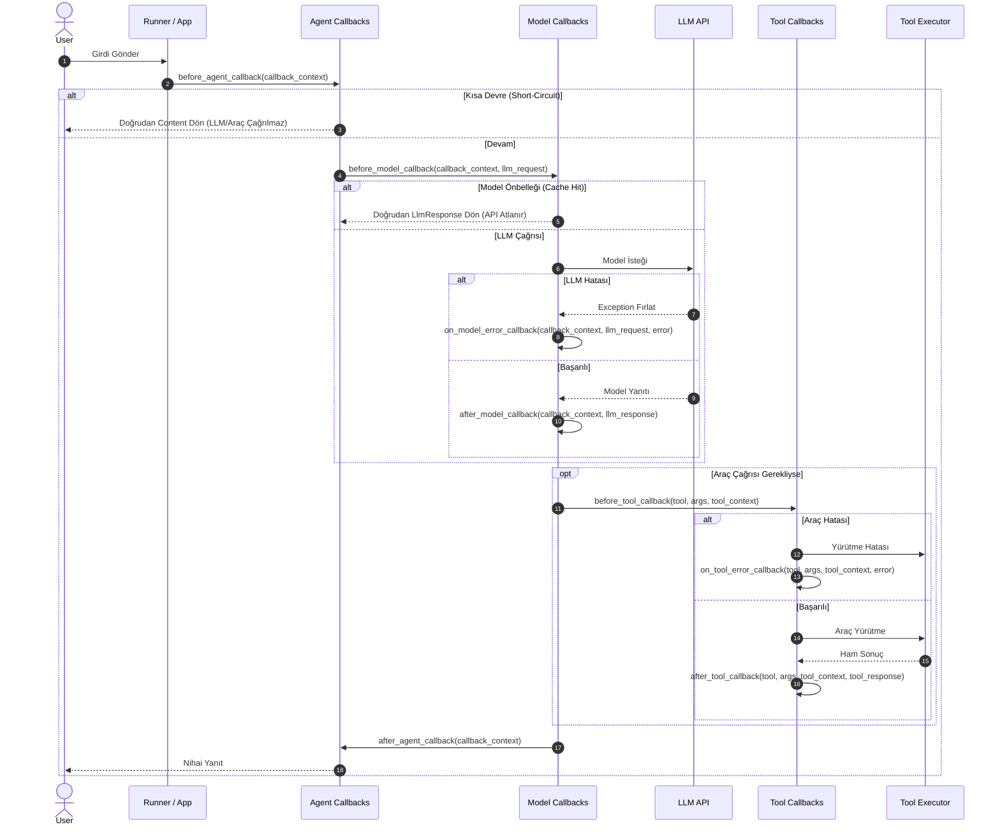

---
title: "ADK Callbacks Architecture, Design Patterns & Best Practices Guide"
description: "Comprehensive guide to Google ADK Callbacks covering BaseAgent vs LlmAgent scope, strict Python kwarg parameter naming rules, 8 official design patterns, error suppression, chaining lists, artifacts, state deltas, and performance best practices."
category: architecture
doc_type: guide
status: active
version: "2.0"
last_updated: "2026-10-04"
author: "Antigravity Engineering"
tags:
  - adk
  - callbacks
  - design-patterns
  - best-practices
  - guardrails
  - context-caching
  - artifacts
  - short-circuiting
  - lifecycle
  - error-handling
  - plugins
  - python
  - java
  - typescript
  - go
  - architecture
---

# Google ADK Callbacks (Yaşam Döngüsü Kancaları, Tasarım Kalıpları ve En İyi Uygulamalar)

Google ADK'da **Callbacks**, ajanın bilişsel akıl yürütme döngüsüne (execution loop) çerçeve kodunu değiştirmeden müdahale etmeyi sağlayan yaşam döngüsü denetim noktalarıdır (checkpoints). 

Gözlemlenebilirlik, güvenlik denetimi (guardrails), hata yakalama ve bastırma (error suppression), hassas veri maskeleme (PII redaction), argüman doğrulama, iki fazlı önbellekleme (caching) ve dosya/eser (artifact) yönetimi gibi çapraz kesen endişeler (cross-cutting concerns) için kullanılır.

---

## 1. Yaşam Döngüsü ve Mimari Akış

ADK, yürütme akışında 3 seviyede toplam **8 farklı callback kancası** sunar:
- **Agent Seviyesi (2):** `before_agent_callback`, `after_agent_callback`
- **Model Seviyesi (3):** `before_model_callback`, `after_model_callback`, `on_model_error_callback`
- **Tool Seviyesi (3):** `before_tool_callback`, `after_tool_callback`, `on_tool_error_callback`



---

## 2. Ajan Kapsamı: `BaseAgent` vs `LlmAgent`

Kancaların hangi ajan türlerinde tanımlı olduğu katı bir hiyerarşiye bağlıdır:

1. **Tüm `BaseAgent` Türevleri:**
   - `before_agent_callback` ve `after_agent_callback`, `BaseAgent` sınıfından miras alan **tüm ajanlarda** (`LlmAgent`, `SequentialAgent`, `ParallelAgent`, `LoopAgent` ve özel ajan sınıfları) mevcuttur.
2. **Yalnızca `LlmAgent`:**
   - Kalan 6 model ve araç kancası (`before_model_callback`, `after_model_callback`, `on_model_error_callback`, `before_tool_callback`, `after_tool_callback`, `on_tool_error_callback`) **yalnızca `LlmAgent`** sınıfına özgüdür. Deterministik iş akışı yöneticilerinde (`SequentialAgent` vb.) model veya doğrudan araç kancası bulunmaz.

---

## 3. KRİTİK: Python Parametre İsimlendirme Kuralı

> [!CAUTION]
> Python'da ADK callback argümanlarını **anahtar kelime (`keyword arguments / kwargs`)** ile geçirir! Bu nedenle callback fonksiyonlarınızın parametre isimleri dokümante edilen isimlerle **birebir harfi harfine aynı olmak zorundadır**.
> 
> Parametreleri `ctx`, `c` veya `response` gibi takma adlarla adlandırmak çalışma zamanında **`TypeError: ... got an unexpected keyword argument`** hatası fırlatır!

### Resmi Parametre İsimleri Tablosu

| Callback Adı | Zorunlu Python Parametre İsimleri | Kapsam |
| :--- | :--- | :--- |
| `before_agent_callback` | `callback_context` (veya `context`) | Tüm `BaseAgent` |
| `after_agent_callback` | `callback_context` (veya `context`) | Tüm `BaseAgent` |
| `before_model_callback` | `callback_context`, `llm_request` | Yalnızca `LlmAgent` |
| `after_model_callback` | `callback_context`, `llm_response` | Yalnızca `LlmAgent` |
| `on_model_error_callback` | `callback_context`, `llm_request`, `error` | Yalnızca `LlmAgent` |
| `before_tool_callback` | `tool`, `args`, `tool_context` | Yalnızca `LlmAgent` |
| `after_tool_callback` | `tool`, `args`, `tool_context`, `tool_response` | Yalnızca `LlmAgent` |
| `on_tool_error_callback` | `tool`, `args`, `tool_context`, `error` | Yalnızca `LlmAgent` |

> [!NOTE]
> Agent ve Model kancaları **`callback_context`** alırken; Araç kancaları **`tool_context`** alır! Ayrıca araç kancalarında araç nesnesi `tool`, parametreler `args` ve araç çıktısı `tool_response` olarak adlandırılır. Modern Python ADK kodlarında birleştirilmiş `context` türü de desteklenmektedir.

---

## 4. Kanca İmzaları ve Protokolleri

### A. Agent Seviyesi Kancalar
```python
from google.adk.agents.callback_context import CallbackContext
from google.genai import types
from typing import Optional

def before_agent_callback(callback_context: CallbackContext) -> Optional[types.Content]:
    """Ajanın _run_async_impl veya _run_live_impl öncesi tetiklenir.
    - None: Normal devam eder.
    - types.Content: Ajan döngüsü ATLANIR (short-circuit), doğrudan kullanıcıya döner.
    """
    return None

def after_agent_callback(callback_context: CallbackContext) -> Optional[types.Content]:
    """Ajanın yanıtı hazırlandıktan sonra tetiklenir.
    - None: Orijinal yanıt korunur.
    - types.Content: Ajan yanıtını bu nesneyle ezer.
    """
    return None
```

### B. Model Seviyesi Kancalar
```python
from google.adk.agents.callback_context import CallbackContext
from google.adk.models.llm_request import LlmRequest
from google.adk.models.llm_response import LlmResponse
from typing import Optional

def before_model_callback(
    callback_context: CallbackContext, 
    llm_request: LlmRequest
) -> Optional[LlmResponse]:
    """Model API çağrısı yapılmadan önce tetiklenir.
    - None: LLM API çağrısı devam eder.
    - LlmResponse: LLM çağrısı ATLANIR (önbellekten yanıt).
    """
    return None

def after_model_callback(
    callback_context: CallbackContext, 
    llm_response: LlmResponse
) -> Optional[LlmResponse]:
    """Model API yanıtı döndükten sonra tetiklenir.
    - None: Orijinal yanıt korunur.
    - LlmResponse: Model yanıtı modifiye edilir.
    """
    return None

def on_model_error_callback(
    callback_context: CallbackContext, 
    llm_request: LlmRequest, 
    error: Exception
) -> Optional[LlmResponse]:
    """Model API çağrısı istisna fırlattığında tetiklenir.
    - None: İstisna yukarı fırlatılmaya devam eder.
    - LlmResponse: İstisna BASTIRILIR (suppressed) ve bu yanıt model çıktısı kabul edilir.
    """
    return None
```

### C. Araç Seviyesi Kancalar
```python
from google.adk.tools import BaseTool, ToolContext
from typing import Any, Dict, Optional

def before_tool_callback(
    tool: BaseTool, 
    args: Dict[str, Any], 
    tool_context: ToolContext
) -> Optional[Dict[str, Any]]:
    """Araç fonksiyonu çalıştırılmadan hemen önce devreye girer.
    - None veya args: Argümanlar korunur veya değiştirilir.
    - Exception fırlatılırsa: Araç çağrısı durdurulur.
    """
    return args

def after_tool_callback(
    tool: BaseTool, 
    args: Dict[str, Any], 
    tool_context: ToolContext, 
    tool_response: Any
) -> Optional[Any]:
    """Araç başarıyla tamamlandığında devreye girer.
    - None: Orijinal araç yanıtı korunur.
    - Any: LLM'e dönecek araç yanıtı değiştirilir.
    """
    return tool_response

def on_tool_error_callback(
    tool: BaseTool, 
    args: Dict[str, Any], 
    tool_context: ToolContext, 
    error: Exception
) -> Optional[Any]:
    """Araç çalışırken bir istisna fırlatıldığında tetiklenir.
    - None: Hata fırlatılmaya devam eder.
    - Any (None olmayan herhangi bir değer, örn. {} veya string): 
      İstisna BASTIRILIR ve dönen değer aracın geçerli sonucu kabul edilir!
    """
    return None
```

---

## 5. Çoklu Callback Listesi ve Zincirleme (Chaining) Kuralları

Her callback parametresi tek bir fonksiyon veya bir **fonksiyon listesi** (`list[Callable]`) kabul eder:

```python
root_agent = LlmAgent(
    name="my_agent",
    model="gemini-2.5-flash",
    before_model_callback=[check_policy, check_cache, log_request],
    on_tool_error_callback=[log_tool_error, fallback_tool_recovery]
)
```

ADK listeyi sırayla çalıştırır ve **sonuç üreten ilk callback'te zinciri durdurur** (kalan callback'ler atlanır). Ancak "sonuç" kriteri kanca türüne göre değişir:
1. **Standart Kancalar (`before_*` ve `after_*`):**
   - Yalnızca **TRUTHY** bir değer döndüğünde zincir durur.
   - `None` veya boş sözlük (`{}`) gibi *falsy* değerler zinciri durdurmaz; sonraki kanca çalışır.
2. **Hata Kancaları (`on_model_error_callback` ve `on_tool_error_callback`):**
   - **`None` OLMAYAN HERHANGİ BİR DEĞERDE** zincir durur!
   - Örneğin `on_tool_error_callback` içinde dönen boş bir sözlük `{}` bile zinciri durdurur, hatayı bastırır ve o boş sözlüğü aracın geçerli sonucu sayar.

---

## 6. 8 Resmi Tasarım Kalıbı (Official Design Patterns)

### 1. Guardrails & Policy Enforcement (Güvenlik Politikası Denetimi)
Girdileri LLM'e veya araçlara ulaşmadan önce denetleyip kural ihlallerinde operasyonu engelleme:
```python
def policy_guard_callback(callback_context: CallbackContext, llm_request: LlmRequest):
    prompt_text = "".join(p.text for c in llm_request.contents for p in c.parts if p.text)
    if "yasakli_veri" in prompt_text.lower():
        # Kısa devre: LLM çağrısını engelle ve doğrudan ret yanıtı dön
        return LlmResponse(
            content=types.Content(parts=[types.Part.from_text(text="Güvenlik Politikası: İstek işlenemedi.")])
        )
    return None
```

### 2. Dynamic State Management (Dinamik Oturum Durumu Yönetimi)
Callback içinden `callback_context.state` veya `tool_context.state` okuma ve yazma:
- `state['key'] = value` değişiklikleri otomatik olarak bir sonraki `Event.actions.state_delta` içine kaydedilir ve `SessionService` tarafından kalıcılaştırılır.
```python
def track_transaction_callback(tool: BaseTool, args: dict, tool_context: ToolContext, tool_response: Any):
    if isinstance(tool_response, dict) and "transaction_id" in tool_response:
        tool_context.state["last_transaction_id"] = tool_response["transaction_id"]
    return tool_response
```

### 3. Logging & Monitoring (Yapılandırılmış Gözlemlenebilirlik)
Her yaşam döngüsü adımında yapılandırılmış izleme verisi toplama:
```python
def audit_tool_call(tool: BaseTool, args: dict, tool_context: ToolContext):
    inv_id = tool_context.invocation_id
    agent_name = tool_context.agent_name
    print(f"INFO: [Invocation: {inv_id}] Ajan: {agent_name} - Araç: {tool.name} - Parametreler: {args}")
    return args
```

### 4. Two-Phase Caching (İki Fazlı Önbellekleme)
Gereksiz model çağrılarını veya harici API maliyetlerini sıfırlamak için iki fazlı yapı:
1. **Faz 1 (Before):** `before_model_callback` veya `before_tool_callback` içinde istekten önbellek anahtarı üret, `context.state` veya harici önbellekten kontrol et. İsabet varsa doğrudan sonucu dön.
2. **Faz 2 (After):** Önbellek kaçırması (cache miss) durumunda `after_` kancasında yeni sonucu anahtarla önbelleğe kaydet.
```python
def check_tool_cache(tool: BaseTool, args: dict, tool_context: ToolContext):
    cache_key = f"cache:{tool.name}:{args.get('symbol')}"
    if cache_key in tool_context.state:
        # Aracı çalıştırmadan önbellekteki sonucu dön
        return tool_context.state[cache_key]
    tool_context.state["_active_cache_key"] = cache_key
    return args

def save_tool_cache(tool: BaseTool, args: dict, tool_context: ToolContext, tool_response: Any):
    cache_key = tool_context.state.pop("_active_cache_key", None)
    if cache_key:
        tool_context.state[cache_key] = tool_response
    return tool_response
```

### 5. Request/Response Modification (Girdi ve Çıktı Modifikasyonu)
- `before_model_callback`: `llm_request.config.system_instruction` içeriğine dinamik kural ekleme.
- `after_model_callback`: Dönen yanıtı filtreleme veya Markdown formatlama.
- `before_tool_callback`: `args` sözlüğünü normalize etme.
- `after_tool_callback`: Araç ham sonucunu (PII temizleme gibi) sansürleme.

### 6. Conditional Skipping of Steps (Adımları Koşullu Atlama)
- `before_agent_callback` -> `types.Content` döndürerek ajanı tamamen atlama.
- `before_model_callback` -> `LlmResponse` döndürerek LLM'i atlama.
- `before_tool_callback` -> `dict` döndürerek aracın çalışmasını atlayıp hazır sonucu gönderme.

### 7. Tool-Specific Actions: Authentication & Summarization Control
`ToolContext` üzerinden araca özgü kritik yaşam döngüsü eylemlerini yönetme:
1. **Dinamik Kimlik Doğrulama:** `before_tool_callback` içinde oturum durumunda belirteç yoksa `tool_context.request_credential(auth_config)` çağrılarak OAuth/OIDC veya API Key onay süreci başlatılır.
2. **Özetlemeyi Atlama (`skip_summarization`):** `after_tool_callback` içinde `tool_context.actions.skip_summarization = True` atanarak modelin araç çıktısını gereksiz yere özetlemesi engellenir; ham JSON/sözlük veri doğrudan kullanıcıya veya sonraki adıma aktarılır.
```python
def direct_json_response_callback(tool: BaseTool, args: dict, tool_context: ToolContext, tool_response: Any):
    # Modelin JSON çıktıyı kendi cümleleriyle özetlemesini engelle
    tool_context.actions.skip_summarization = True
    return tool_response
```

### 8. Artifact Handling in Callbacks (Dosya ve Büyük Veri Yönetimi)
Kancalar içinde oturumla ilişkili ikili dosyaları kaydetme veya yükleme. Bu işlemler `Event.actions.artifact_delta` üzerinden izlenir:
```python
async def save_report_artifact_callback(tool: BaseTool, args: dict, tool_context: ToolContext, tool_response: Any):
    if isinstance(tool_response, bytes):
        part = types.Part.from_bytes(data=tool_response, mime_type="application/pdf")
        # Eseri oturuma kaydet
        await tool_context.save_artifact("generated_report.pdf", part)
    return {"status": "saved", "filename": "generated_report.pdf"}
```

---

## 7. Mimari En İyi Uygulamalar (Best Practices)

### Tasarım Prensipleri
- **Tek Sorumluluk (Keep Focused):** Her callback fonksiyonunu tek bir amaca (yalnızca loglama, yalnızca doğrulama veya yalnızca önbellekleme) odaklayın. Monolitik kancalardan kaçının.
- **Performans Bilinci (Mind Performance):** Callback'ler ajanın işleme döngüsü içinde **inline** çalışır ve döngü her kancanın bitmesini bekler.
  - `await` gerektiren I/O işlemleri (`save_artifact` vb.) için kancayı mutlaka `async def` olarak tanımlayın.
  - Kancalar içinde uzun süren bloklayıcı hesaplamalar veya senkron ağ istekleri yapmayın.

### Hata Yönetimi
- Callback kodunuzu `try...except` blokları içine alarak koruyun.
- Callback içerisindeki beklenmeyen bir hatanın tüm ajan oturumunu çökertmesine izin vermeyin.
- Hata durumunda model veya araç kancalarında `on_*_error_callback` kullanarak zarif kurtarma (graceful degradation) sağlayın.

### Durum Yönetimi ve İsimlendirme
- `context.state` üzerindeki değişiklikler o anki olay döngüsünde anında görünür ve olay sonunda `Event.actions.state_delta` olarak kaydedilir.
- Geniş nesneleri toptan değiştirmek yerine hedefli spesifik anahtarlar kullanın.
- Kalıcı `SessionService` yapılarında çakışmaları önlemek için ADK standart durum öneklerini tercih edin:
  - `State.APP_PREFIX` (`app:*`)
  - `State.USER_PREFIX` (`user:*`)
  - `State.TEMP_PREFIX` (`temp:*`)

### Eşgüçlülük (Idempotency)
- Callback bir dış sistemde yan etki yaratıyorsa (sayaç artırma, harici webhook tetikleme vb.), framework yeniden denemelerine (retries) karşı işlemi idempotent tasarlayın.

### Modern `Context` Tipinin Kullanımı
- Python ADK'da yeni kodlarda `CallbackContext` ve `ToolContext` yerine tekilleştirilmiş **`Context`** türü tercih edilmelidir. Eski isimler geriye dönük uyumluluk için korunmaktadır.

---

## 8. Callbacks vs Plugins Karşılaştırması

| Kriter | Callbacks (Kancalar) | Plugins (Eklentiler) |
| :--- | :--- | :--- |
| **Kapsam (Scope)** | **Yerel / Ajan Düzeyi:** Tek bir ajana veya spesifik araca özgü. | **Genel / Sistem Düzeyi:** Tüm `App` veya `Runner` seviyesinde global. |
| **Yeniden Kullanılabilirlik** | Fonksiyon bazlıdır; ajanın `init` parametresine geçirilir. | Paketlenebilir modüllerdir (`Plugin` sınıfından türetilir). |
| **Durum ve Konfigürasyon** | Genellikle hafif kontrol mantığı ve `state` manipülasyonu. | Kendi ayarları, telemetrisi ve çoklu kancaları olan bağımsız eklentiler. |
| **Tipik Kullanım** | Ajanın görevine özel argüman doğrulama, PII temizleme, mock yanıt dönme. | OpenTelemetry izleme, merkezi kimlik doğrulama, global loglama, Cloud Trace entegrasyonu. |

---

## 9. Çok Dilli SDK Karşılaştırması

| Özellik | Python | TypeScript | Go | Java |
| :--- | :--- | :--- | :--- | :--- |
| **Paket** | `google-adk` | `@google/adk` | `google.golang.org/adk/v2` | `com.google.adk` |
| **Agent Kancası** | `before_agent_callback` | `beforeAgentCallback` | `BeforeAgentCallbacks` | `beforeAgentCallback` |
| **Model Kancası** | `before_model_callback` | `beforeModelCallback` | `BeforeModelCallbacks` | `beforeModelCallback` |
| **Boş Dönüş** | `None` | `undefined` | `nil, nil` | `Maybe.empty()` |
| **Parametreler** | Katı keyword adlandırması | `Context` nesnesi | `agent.Context` | `CallbackContext` |
