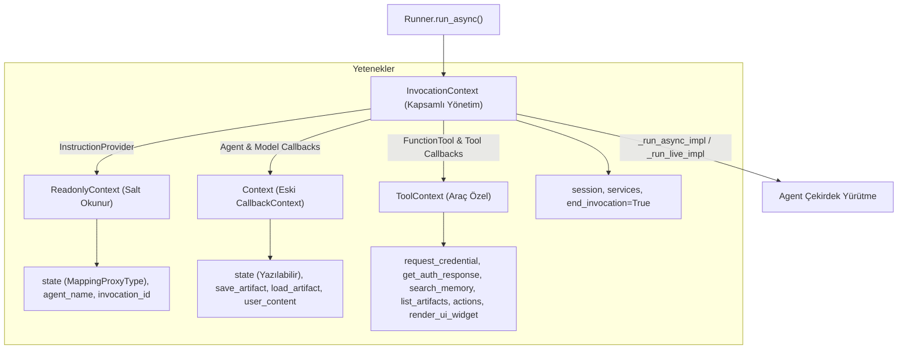

---
title: "ADK Agent Context Architecture & Lifecycle Flavors Guide"
description: "Comprehensive guide to Google ADK Context covering InvocationContext, ReadonlyContext, Context (CallbackContext), ToolContext, state scoping (temp:, user:, app:), memory search, auth, and UI widgets."
category: architecture
doc_type: guide
status: active
version: "2.0"
last_updated: "2026-10-04"
author: "Antigravity Engineering"
tags:
  - adk
  - context
  - invocation-context
  - tool-context
  - readonly-context
  - state-management
  - memory
  - artifacts
  - authentication
  - ui-widgets
  - python
  - java
  - typescript
  - go
  - architecture
---

# Google ADK Bağlam (`Context`) Mimarisi ve Türleri Rehberi

Google ADK'da **Context (Bağlam)**, tek bir kullanıcı isteğinden nihai yanıta kadar geçen tüm çağrı turu (invocation) boyunca ajana, kancalara (callbacks) ve araçlara (tools) sağlanan durum, kimlik, servis ve yaşam döngüsü denetim paketidir.

Context, bir bileşenin o anki görevi başarıyla yerine getirebilmesi için gereken tüm çalışma zamanı altyapısını soyutlayarak örtük (implicit) olarak enjekte eder.

---

## 1. Yaşam Döngüsü ve Bağlam Enjeksiyonu

Geliştirici doğrudan `InvocationContext` oluşturmaz. `Runner.run_async()` başlatıldığında framework tarafından otomatik olarak oluşturulur ve yaşam döngüsündeki her adıma uygun izin ve yetenek seviyesinde (flavors) aktarılır.



---

## 2. 4 Temel Bağlam Türü (Context Flavors)

ADK, yetki sınırlandırması ve tek sorumluluk prensibi gereği 4 farklı bağlam arayüzü sunar:

| Bağlam Türü | Kullanım Yeri | Değiştirilebilirlik | Temel Yetenekler |
| :--- | :--- | :--- | :--- |
| **`InvocationContext`** | Ajan çekirdeği (`_run_async_impl`, `_run_live_impl`) | Tam Erişim | `session`, `agent`, `artifact_service`, `memory_service`, `session_service`, `end_invocation = True`. |
| **`ReadonlyContext`** | `InstructionProvider` fonksiyonları | Salt-Okunur | `state` (değiştirilemez `MappingProxyType`), `agent_name`, `invocation_id`. |
| **`Context`** | Ajan ve Model Callback'leri | Yazılabilir Durum | Yazılabilir `state`, `save_artifact()`, `load_artifact()`, `user_content`. |
| **`ToolContext`** | `FunctionTool` gövdesi ve Araç Callback'leri | Genişletilmiş Araç | `Context` yeteneklerine ek olarak: `request_credential()`, `get_auth_response()`, `search_memory()`, `list_artifacts()`, `actions`, `render_ui_widget()`. |

> [!NOTE]
> **Uyumluluk Notu:** Python ve TypeScript SDK'larında `CallbackContext` sınıfı birleştirilerek **`Context`** sınıfı altına alınmıştır. Eski kodlarla geriye dönük uyumluluk için `CallbackContext` bir takma ad (alias) olarak korunmaktadır; ancak yeni geliştirmelerde doğrudan `Context` kullanılmalıdır.

---

## 3. Bağlam Türlerinin Ayrıntılı Anatomisi

### A. `InvocationContext` (En Kapsamlı Yönetim)
Ajanın en derin yürütme katmanında kullanılır. Tüm oturum durumunu ve arka plan bulut servislerini barındırır.
- **Erken Sonlandırma (Early Termination):** `ctx.end_invocation = True` atanarak kritik bir hata durumunda tüm çalışma döngüsü derhal durdurulabilir.

```python
from google.adk.agents import BaseAgent
from google.adk.agents.invocation_context import InvocationContext
from google.adk.events import Event
from google.genai import types
from typing import AsyncGenerator

class OrchestratorAgent(BaseAgent):
    async def _run_async_impl(self, ctx: InvocationContext) -> AsyncGenerator[Event, None]:
        # 1. Servis kontrolü
        if not ctx.memory_service:
            print("Uyarı: Bu oturumda MemoryService yapılandırılmamış.")

        # 2. Kritik hata kontrolü ve erken sonlandırma
        if ctx.session.state.get("security_breach"):
            ctx.end_invocation = True # Framework'e çalışmayı derhal kesmesi bildirilir
            yield Event(
                author=self.name,
                invocation_id=ctx.invocation_id,
                content=types.Content(parts=[types.Part.from_text(text="Güvenlik ihlali nedeniyle çağrı sonlandırıldı.")])
            )
            return

        yield Event(author=self.name, invocation_id=ctx.invocation_id)
```

---

### B. `ReadonlyContext` (Güvenli Dinamik Talimatlar)
Dinamik sistem prompt'ları üreten `instruction_provider` fonksiyonlarında kullanılır. Durumu kaza eseri değiştirmeyi engeller.

```python
from google.adk.agents.readonly_context import ReadonlyContext

def dynamic_tier_instruction(context: ReadonlyContext) -> str:
    # context.state üzerinde yazma işlemi TypeError fırlatır:
    # context.state["hata"] = 123 -> TypeError: 'mappingproxy' does not support assignment
    user_tier = context.state.get("user_tier", "standard")
    return f"Sen kurumsal bir asistansın. Müşteri seviyesi: {user_tier}."
```

---

### C. `Context` (Yaşam Döngüsü ve Model Kancaları)
Callback'ler içerisinde oturum durumunu okuma/yazma ve ikili dosya (artifact) kaydetme/yükleme imkanı sunar:

```python
from google.adk.agents.context import Context
from google.adk.models import LlmRequest
from typing import Optional

def before_model_telemetry(context: Context, llm_request: LlmRequest) -> None:
    # Durum okuma ve yazma (otomatik state_delta takibi)
    call_count = context.state.get("model_call_count", 0)
    context.state["model_call_count"] = call_count + 1
    
    # Kullanıcının bu turdaki ilk girdisine erişim
    if context.user_content and context.user_content.parts:
        print(f"İlk girdi: {context.user_content.parts[0].text}")
```

---

### D. `ToolContext` (Araçlara Özel Gelişmiş Yetenekler)
Fonksiyon araçlarına enjekte edilir. Standart `Context` yeteneklerine ek olarak 5 kritik özellik ekler:

1. **`request_credential(auth_config)` & `get_auth_response(auth_config)`:** Araç yürütmesini durdurup kullanıcıdan OAuth/API Key onayı isteme.
2. **`search_memory(query)`:** Kullanıcının geçmiş oturumlarındaki anılarını sorgulama.
3. **`list_artifacts()`:** Oturumdaki tüm aktif eserlerin adlarını listeleme.
4. **`actions` (`EventActions`):** `actions.skip_summarization = True` ile model özetlemesini atlatma.
5. **`render_ui_widget(widget: UiWidget)` (Python v1.27.0+):** İstemciye interaktif zengin UI (MCP iframe vb.) bileşeni gönderme.

---

## 4. Durum Yönetimi ve Kapsam Önekleri (State Scopes)

`context.state` veya `tool_context.state` üzerine yazılan her veri, arka planda `EventActions.state_delta` içine eklenir ve adım sonunda `SessionService` tarafından kalıcılaştırılır.

Çakışmaları önlemek ve veri ömrünü belirlemek için standart önekler kullanılır:

| Durum Öneki | Ad Alanı (Namespace) | Geçerlilik Süresi | Örnek Senaryo |
| :--- | :--- | :--- | :--- |
| `temp:` | Çağrı İçi Geçici | Yalnızca mevcut invocation turu. | Araç 1'in ürettiği işlem numarasını (`temp:tx_id`) Araç 2'ye taşıma. |
| `user:` | Kullanıcı Düzeyi | Oturumlar arası kalıcı (Kullanıcıya bağlı). | Kullanıcı dil tercihi (`user:language`), UI teması (`user:theme`). |
| `app:` | Uygulama Düzeyi | Uygulama genelinde paylaşılan. | Ortak API uç noktası (`app:api_endpoint`), feature flag'ler. |
| *(önek yok)* | Oturum Düzeyi | Yalnızca o oturum (`session_id`) boyunca. | Alışveriş sepeti, aktif bilet numarası. |

---

## 5. Kritik Üretim Görevleri (Code Patterns)

### Görev 1: Araçlar Arası Veri Aktarımı (State Hand-off)
```python
from google.adk.tools import ToolContext
import uuid

def generate_checkout_token(tool_context: ToolContext) -> dict:
    token = str(uuid.uuid4())
    # Geçici durumu kaydet
    tool_context.state["temp:checkout_token"] = token
    return {"status": "token_generated"}

def process_payment(tool_context: ToolContext, amount: float) -> dict:
    # Önceki araçtan gelen durumu oku
    token = tool_context.state.get("temp:checkout_token")
    if not token:
        return {"error": "Ödeme belirteci bulunamadı. Lütfen önce sepeti onaylayın."}
    return {"status": "success", "tx": f"TX_{token[:8]}", "amount": amount}
```

### Görev 2: Eser Saklama ve Başvuru (Artifact Reference Pattern)
Büyük dosyaların tüm içeriğini durum içine gömmek yerine URI/yolunu artifact olarak kaydedip talep anında okuma:
```python
from google.adk.tools import ToolContext
from google.genai import types

async def ingest_document_tool(tool_context: ToolContext, gcs_uri: str) -> dict:
    # 1. Dosya başvurusunu Part olarak kaydet
    part = types.Part.from_text(text=gcs_uri)
    version = await tool_context.save_artifact("active_doc.txt", part)
    tool_context.state["temp:doc_key"] = "active_doc.txt"
    return {"status": "saved", "version": version}

async def read_document_tool(tool_context: ToolContext) -> dict:
    doc_key = tool_context.state.get("temp:doc_key")
    # 2. Gerektiğinde eseri geri yükle
    part = await tool_context.load_artifact(doc_key)
    return {"file_uri": part.text}
```

### Görev 3: Uzun Vadeli Bellek Araması (Memory Search)
```python
from google.adk.tools import ToolContext

async def consult_past_interactions(tool_context: ToolContext, query: str) -> dict:
    try:
        results = await tool_context.search_memory(f"Kullanıcı geçmişi: {query}")
        if results.memories:
            top_memory = results.memories[0]
            text = top_memory.content.parts[0].text if top_memory.content.parts else ""
            return {"past_context": text}
        return {"message": "İlgili geçmiş anı bulunamadı."}
    except ValueError:
        return {"error": "MemoryService bu uygulamada etkinleştirilmemiş."}
```

### Görev 4: Zengin UI Bileşeni Gönderme (`render_ui_widget`)
ADK Python v1.27.0+ ile istemciye dinamik MCP App iframe veya grafik bileşeni sunma:
```python
from google.adk.tools import ToolContext
from google.adk.events.ui_widget import UiWidget

def show_analytics_dashboard(theme: str, tool_context: ToolContext) -> str:
    widget = UiWidget(
        id="analytics_dashboard",
        provider="mcp",
        payload={
            "resource_uri": "ui://dashboards/revenue",
            "tool": {"name": "get_revenue_metrics"},
            "tool_args": {"theme": theme}
        }
    )
    # İstemci olay akışına UI bileşenini enjekte et
    tool_context.render_ui_widget(widget)
    return f"Dashboard {theme} temasıyla ekrana yansıtıldı."
```

---

## 6. Çok Dilli SDK Karşılaştırması

| Özellik | Python | TypeScript | Go | Java |
| :--- | :--- | :--- | :--- | :--- |
| **Birincil Sınıf** | `google.adk.agents.context.Context` | `Context` (`@google/adk`) | `agent.Context` | `com.google.adk.agents.Context` |
| **Çekirdek Yürütme**| `InvocationContext` | `InvocationContext` | `agent.InvocationContext` | `InvocationContext` |
| **Salt Okunur** | `ReadonlyContext` (`MappingProxyType`) | `ReadonlyContext` | `agent.ReadonlyContext` | `ReadonlyContext` (`unmodifiableMap`) |
| **Araç Bağlamı** | `ToolContext` (veya `Context`) | `Context` | `agent.Context` | `ToolContext` |
| **Durum Yazma** | `ctx.state["key"] = val` | `ctx.state.set("key", val)` | `ctx.State().Set("key", val)` | `ctx.state().put("key", val)` |
| **Eser Metotları** | `await ctx.save_artifact()` | `await ctx.saveArtifact()` | `ctx.Artifacts().Save()` | `ctx.saveArtifact()` |
