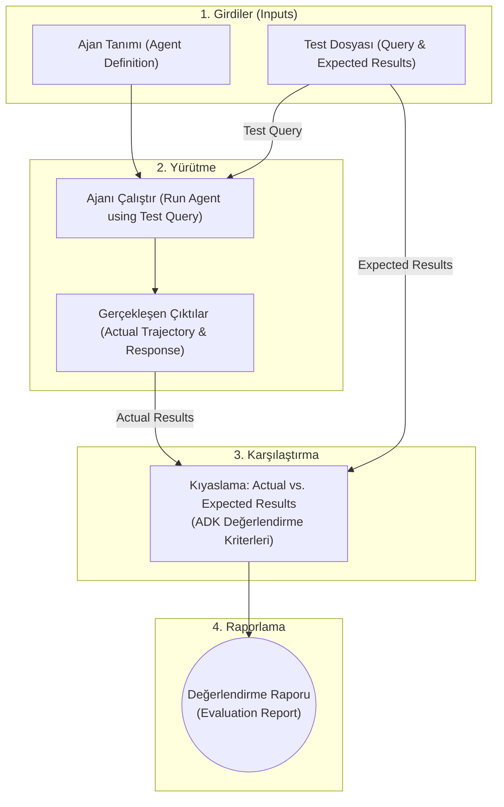

# Google ADK Ajan Değerlendirme (Evaluation) Rehberi

LLM ajanlarının olasılıksal doğası gereği klasik deterministik pass/fail birim testleri yetersiz kalır. ADK; ajanın hem nihai yanıtını hem de çözüme ulaşırken izlediği adım dizisini (trajectory & tool calls) ölçmek için kapsamlı bir değerlendirme altyapısı sunar (Python destekli).

---

## 1. Değerlendirme Mimarisi ve Akışı



### Değerlendirme Odak Noktaları:
1. **Yörünge ve Araç Kullanımı (Trajectory & Tool Use):**
   - Ajanın çözüme ulaşmak için izlediği adımlar, araç çağırma sırası ve karar mantığı.
   - Gerçek adımlar (`actual_steps`) ile beklenen altın yol (`expected_steps`) karşılaştırılır.
2. **Nihai Yanıt (Final Response):**
   - Üretilen yanıtın doğruluğu, alaka düzeyi, tonu ve güvenlik kurallarına uygunluğu.

---

## 2. Test Dosyası Formatları ve Pydantic Şemaları

ADK test verileri resmi Pydantic modellerine (`EvalSet` ve `EvalCase`) dayanır:

### A. Tekil Test Dosyaları (`*.test.json`)
Hızlı birim testleri için tek bir oturumu temsil eder:
```json
{
  "eval_set_id": "home_automation_light_test",
  "name": "Light control unit test",
  "description": "Cihaz acma/kapama karar kontrolu",
  "eval_cases": [
    {
      "eval_id": "case_bedroom_light_off",
      "conversation": [
        {
          "invocation_id": "b7982664-0ab6-47cc-ab13-326656afdf75",
          "user_content": {
            "role": "user",
            "parts": [{"text": "Yatak odasindaki device_2 yi kapat."}]
          },
          "final_response": {
            "role": "model",
            "parts": [{"text": "device_2 kapali duruma getirildi."}]
          },
          "intermediate_data": {
            "tool_uses": [
              {
                "name": "set_device_info",
                "args": {"location": "Bedroom", "device_id": "device_2", "status": "OFF"}
              }
            ],
            "intermediate_responses": []
          }
        }
      ],
      "session_input": {
        "app_name": "home_automation_agent",
        "user_id": "test_user",
        "state": {}
      }
    }
  ]
}
```

### B. Entegrasyon Test Setleri (`*.evalset.json`)
Birden çok, karmaşık ve çoklu tur oturumları içerir.
> [!NOTE]
> Eski şemadaki test dosyaları `AgentEvaluator.migrate_eval_data_to_new_schema` yardımcı metodu ile yeni Pydantic formatına otomatik dönüştürülebilir.

---

## 3. Uyumluluk ve Regresyon Testleri (`adk conformance`)

Ajan kodunda veya model sürümlerinde yapılan değişikliklerin regresyona yol açmadığını doğrulamak için altın referans (golden baseline) karşılaştırması yapar.

### Dizin Düzeni:
```text
tests/
└── category_name/
    └── test_case_name/
        ├── spec.yaml                  # Test senaryo tanımı
        ├── generated-recordings.yaml   # Referans LLM & Tool kayıtları
        └── generated-session.yaml      # Referans oturum durumu
```
*(SSE akışlı ajanlarda `generated-recordings-sse.yaml` kullanılır).*

### Baseline Kaydı Alma:
```powershell
# 1. Terminalde RecordingsPlugin ile web sunucusunu açın:
adk web -v --extra_plugins=google.adk.cli.plugins.recordings_plugin.RecordingsPlugin path/to/agents

# 2. İkinci terminalde altın referansı kaydedin:
adk conformance record tests/category/test_case none
```

### Uyumluluk Testini Çalıştırma (Replay Mode):
```powershell
# Tüm testleri çalıştırma ve Markdown raporu üretme:
adk conformance test --generate_report --report_dir=reports

# Belirli bir kategoriyi çalıştırma:
adk conformance test tests/category_name
```

---

## 4. Değerlendirme Kriterleri (Evaluation Criteria)

### 4.1. Temel Kriter Karşılaştırma Matrisi

| Kriter Adı | Açıklama | Referans Gerektirir | Rubrik Gerekir | LLM Hakemli | Kullanıcı Simülasyonu Desteği |
| --- | --- | --- | --- | --- | --- |
| **`tool_trajectory_avg_score`** | Araç çağrı yörüngesi tam/sıralı eşleşmesi | Evet | Hayır | Hayır | **Hayır** |
| **`response_match_score`** | Referans yanıta ROUGE-1 kelime benzerliği | Evet | Hayır | Hayır | **Hayır** |
| **`response_evaluation_score`** | Vertex AI yanıt tutarlılık skoru | Evet | Hayır | Evet | **Hayır** |
| **`final_response_match_v2`** | LLM hakemli anlamsal referans eşleşmesi | Evet | Hayır | Evet | **Hayır** |
| **`rubric_based_final_response_quality_v1`** | Özel rubriklere göre nihai yanıt kalitesi | Hayır | **Evet** | Evet | **Evet** |
| **`rubric_based_tool_use_quality_v1`** | Özel rubriklere göre araç kullanım kalitesi | Hayır | **Evet** | Evet | **Evet** |
| **`rubric_based_multi_turn_trajectory_quality_v1`** | Çoklu tur yörünge kalitesi (özel rubrik) | Hayır | **Evet** | Evet | **Evet** |
| **`hallucinations_v1`** | Bağlama dayalı doğruluk (groundedness) | Hayır | Hayır | Evet | **Evet** |
| **`safety_v1`** | Zararsızlık ve güvenlik politikaları uyumu | Hayır | Hayır | Evet | **Evet** |
| **`per_turn_user_simulator_quality_v1`** | Kullanıcı simülatörünün plana sadakati | Hayır | Hayır | Evet | **Evet** |
| **`multi_turn_task_success_v1`** | Konuşma hedef(ler)ine ulaşılma başarısı | Hayır | Hayır | Evet | **Evet** |
| **`multi_turn_trajectory_quality_v1`** | Çoklu tur konuşma yolunun verimliliği | Hayır | Hayır | Evet | **Evet** |
| **`multi_turn_tool_use_quality_v1`** | Çoklu tur araç/fonksiyon çağrı kalitesi | Hayır | Hayır | Evet | **Evet** |

> [!IMPORTANT]
> **Kullanıcı Simülasyonu Kısıtı:**
> Beklenen araç çağrısı veya referans yanıt gerektiren kriterler (`tool_trajectory_avg_score`, `response_match_score`, `final_response_match_v2`), dinamik kullanıcı simülasyonu ile **birlikte kullanılamaz**.

---

### 4.2. Yörünge Eşleşme Tipleri (`tool_trajectory_avg_score`)

Ajanın ürettiği araç çağrı dizisini 3 farklı eşleşme modunda denetler:
- **`EXACT` (Varsayılan):** Beklenen ve gerçekleşen çağrılar birebir aynı olmalı; fazla, eksik veya sıra farkı hata sayılır.
- **`IN_ORDER`:** Beklenen çağrılar belirtilen sırada gerçekleşmeli; araya başka ara araçlar girebilir.
- **`ANY_ORDER`:** Beklenen çağrılar gerçekleşmeli; sıra ve araya giren ek araçlar serbesttir (örn: 5 bağımsız arama sorgusu).

Yapılandırma Örneği (`test_config.json`):
```json
{
  "criteria": {
    "tool_trajectory_avg_score": {
      "threshold": 1.0,
      "match_type": "IN_ORDER"
    }
  }
}
```

---

### 4.3. Anlamsal Eşleşme (`final_response_match_v2`)

Birebir kelime eşleşmesi yerine, LLM hakemliğinde anlam eşdeğerliğini kontrol eder. Çoklu örnekleme (sampling) ve çoğunluk oyu (majority vote) kullanır:
```json
{
  "criteria": {
    "final_response_match_v2": {
      "threshold": 0.8,
      "judge_model_options": {
        "judge_model": "gemini-flash-latest",
        "num_samples": 5
      }
    }
  }
}
```

---

### 4.4. Rubrik Tabanlı Kriterler ve Tip Filtreleme

Referans yanıt olmadığında ton, sadelik veya özel iş kurallarını denetlemek için kullanılır.

#### Rubrik Seviyeleri ve Birleşim Kuralı:
1. **Kriter Seviyesi Rubrikler:** `EvalConfig` altında tanımlanır, tüm vakalara uygulanır.
2. **Vaka Seviyesi Rubrikler:** `EvalCase.rubrics` altında tanımlanır, **`type`** alanına göre filtrelenerek kriter rubriklerine eklenir (union).
   - `rubric_based_final_response_quality_v1` -> `type: "FINAL_RESPONSE_QUALITY"`
   - `rubric_based_tool_use_quality_v1` -> `type: "TOOL_USE_QUALITY"`
   - `rubric_based_multi_turn_trajectory_quality_v1` -> `type: "TRAJECTORY_QUALITY"` (ilk N-1 tur `NOT_EVALUATED` işaretlenir, son turda kümülatif puanlanır).

> [!CAUTION]
> Efektif rubrik listesi boş bırakılamaz; aksi halde değerlendirme anında `ValueError` fırlatılır.

---

### 4.5. Halüsinasyon Tespiti (`hallucinations_v1`)

Ajan yanıtının context (talimatlar, prompt, tool tanımları ve tool çıktıları) ile tutarlılığını iki aşamada ölçer:
1. **Segmenter:** Yanıtı bağımsız cümlelere böler.
2. **Sentence Validator:** Her cümleyi `supported`, `unsupported`, `contradictory`, `disputed` veya `not_applicable` olarak etiketler. Doğruluk skoru, `supported` ve `not_applicable` cümlelerin yüzdesidir.
- **Ara Yanıtları Denetleme:** `evaluate_intermediate_nl_responses: true` ile alt ajanların ürettiği ara metinler de halüsinasyon testine tabi tutulabilir:
```json
{
  "criteria": {
    "hallucinations_v1": {
      "threshold": 0.8,
      "evaluate_intermediate_nl_responses": true
    }
  }
}
```

---

### 4.6. Güvenlik ve Çok Turlu Kriterler
- **`safety_v1`:** Zararlı içerik, nefret söylemi ve tehlikeli içerikleri tespit eder. Vertex AI Agent Platform Eval SDK'sına delege edilir (`GOOGLE_CLOUD_PROJECT` gerektirir).
- **`per_turn_user_simulator_quality_v1`:** Kullanıcı simülatörünün `ConversationScenario` planına ve persona kurallarına sadakatini ölçer. `stop_signal: "</finished>"` parametresini destekler.
- **`multi_turn_task_success_v1`:** Yalnızca nihai hedefe odaklanır (nasıl ulaşıldığına bakmaz).
- **`multi_turn_trajectory_quality_v1`:** Hedefe giderken izlenen yolun verimliliğini değerlendirir.

---

### 4.7. Otomatik Verimlilik Kriterleri (Efficiency Criteria)

Ajanın operasyonel maliyetini ve hızını sessizce izler:
- `tool_call_count_v1`: Çalıştırmadaki araç çağrı sayısı.
- `inference_call_count_v1`: Model çıkarım çağrı adedi (döngü ve yeniden planlama tespiti).
- `token_usage_v1`: Harcanan tokenların hiyerarşik dökümü:
  ```text
  total_tokens
    input_tokens (prompt_tokens -> cached_tokens, tool_use_tokens)
    output_tokens (candidates_tokens, reasoning_tokens)
  ```
- `invocation_duration_v1`: Turun geçen gerçek süre (wall-clock) değeri (milisaniye hassasiyetinde).

> [!WARNING]
> **Verimlilik Kriteri Kuralları:**
> - Bu kriterlerin durumu her zaman `INFORMATIONAL`'dır.
> - Asla testi başarısız kılmaz (fail vermez).
> - Her çalıştırmada otomatik raporlanır, kapatılamaz.
> - `EvalConfig` içerisinde bunlara `threshold` atanması **HATA (Error)** üretir.

---

### 4.8. Özel Değerlendirme Metrikleri (Custom Metrics - v1.18.0+)

Yerleşik metriklerin kapsamadığı özel alan veya kurumsal kuralları doğrulamak için özel Python fonksiyonları ile kendi metriklerinizi tanımlayabilirsiniz.

#### 1. Metrik Fonksiyon İmzası ve Modeller:
Özel metrik fonksiyonu, her çalıştırma için bir `EvaluationResult` döndürür:

```python
from typing import Optional
from google.adk.evaluation.eval_case import Invocation
from google.adk.evaluation.eval_metrics import EvalMetric, EvalStatus
from google.adk.evaluation.conversation_scenarios import ConversationScenario
from google.adk.evaluation.evaluator import EvaluationResult, PerInvocationResult

def check_final_response_exact_match(
    eval_metric: EvalMetric,
    actual_invocations: list[Invocation],
    expected_invocations: Optional[list[Invocation]],
    conversation_scenario: Optional[ConversationScenario],
) -> EvaluationResult:
    """Tüm turlarda ajanın nihai yanıtının beklenen yanıtla birebir eşleşmesini denetler."""
    if not expected_invocations:
        return EvaluationResult(overall_score=0.0, overall_eval_status=EvalStatus.NOT_EVALUATED)

    per_invocation_results = []
    for actual, expected in zip(actual_invocations, expected_invocations):
        actual_text = "".join([part.text for part in actual.final_response.parts])
        expected_text = "".join([part.text for part in expected.final_response.parts])
        score = 1.0 if actual_text == expected_text else 0.0
        eval_status = EvalStatus.PASSED if score else EvalStatus.FAILED
        per_invocation_results.append(
            PerInvocationResult(
                actual_invocation=actual,
                expected_invocation=expected,
                score=score,
                eval_status=eval_status,
            )
        )

    avg_score = sum(r.score for r in per_invocation_results) / len(per_invocation_results)
    threshold = eval_metric.criterion.threshold
    overall_status = EvalStatus.PASSED if avg_score >= threshold else EvalStatus.FAILED

    return EvaluationResult(
        overall_score=avg_score,
        overall_eval_status=overall_status,
        per_invocation_results=per_invocation_results,
    )
```

#### 2. Eşzamansız (Async) Metrikler:
Harici bir doğrulama API'sine (örn: içerik denetimi veya harici hakem servisi) bağlanırken fonksiyon `async def` olarak tanımlanabilir:
```python
async def check_for_profanity(
    eval_metric: EvalMetric,
    actual_invocations: list[Invocation],
    expected_invocations: Optional[list[Invocation]],
    conversation_scenario: Optional[ConversationScenario],
) -> EvaluationResult:
    # Harici async API çağrısı ile doğrulama yapılır
    ...
```

#### 3. `EvalConfig` Yapılandırması ve Yürütme:
Özel metrik, `EvalConfig` JSON dosyasında hem `criteria` eşiğiyle hem de `custom_metrics` altındaki `code_config.name` Python modül yolu ile belirtilir:

```json
{
  "criteria": {
    "my_exact_match_metric": {
      "threshold": 0.8
    }
  },
  "custom_metrics": {
    "my_exact_match_metric": {
      "code_config": {
        "name": "my_agent.metrics.check_final_response_exact_match"
      },
      "metric_info": {
        "metric_name": "my_exact_match_metric",
        "description": "Checks exact match across turns with normalized whitespace.",
        "metric_value_info": {
          "interval": {
            "min_value": 0.0,
            "max_value": 1.0
          }
        }
      }
    }
  }
}
```
*`metric_info` belirtilmediğinde varsayılan olarak `min_value: 0.0` ve `max_value: 1.0` aralığı atanır.*

---

## 5. Dört Farklı Değerlendirme Yolu


### 1. Web UI (`adk web`)
- Sağ paneldeki **Eval** sekmesinden mevcut oturumu test senaryosuna dönüştürme (`Add current session`).
- Slider üzerinden eşik skorlarını ayarlayıp tek tıkla çalıştırma.
- **Trace Tab:** Model Request, Response ve Tool Graph dökümlerini interaktif inceleme.

### 2. Programatik Pytest Entegrasyonu
```python
import pytest
from google.adk.evaluation.agent_evaluator import AgentEvaluator

@pytest.mark.asyncio
async def test_agent_workflow():
    await AgentEvaluator.evaluate(
        agent_module="my_agent",
        eval_dataset_file_path_or_dir="tests/eval/my_test.test.json",
    )
```

### 3. Komut Satırı (`adk eval`)
```powershell
adk eval path/to/my_agent tests/eval/my_evalset.evalset.json --print_detailed_results

# Sadece belirli evalleri çalıştırma:
adk eval path/to/my_agent "tests/eval/my_evalset.evalset.json:eval_1,eval_2"
```

### 4. Conformance CLI (`adk conformance test`)
CI/CD süreçlerinde PR kontrollerini otomatikleştirmek ve regresyonu engellemek için kullanılır.

---

## 6. Dinamik Kullanıcı Simülasyonu (User Simulation - `user-sim`)

Çok turlu (multi-turn) serbest diyalog ajanlarında kullanıcının hangi sırada bilgi vereceği veya konuşmayı nereye yönlendireceği önceden bilinemez (örn: ajan iki parametreyi sırayla mı yoksa tek seferde mi isteyecek). Sabit istem listeleri bu senaryolarda kırılgandır. ADK; Generative AI modeliyle dinamik kullanıcı istemleri üreterek ajanın gerçek dünya davranışını test eden bir simülasyon motoru sunar (Python v1.18.0+).

---

### 6.1. `ConversationScenario` Anatomisi

Kullanıcı simülasyonunu çalıştırmak için kullanıcının hedeflerini tanımlayan bir `ConversationScenario` belirtilmelidir:

- **`starting_prompt`:** Kullanıcının ajanla konuşmayı başlattığı sabit ilk istem/soru.
- **`conversation_plan`:** Kullanıcının görüşme boyunca ulaşması gereken hedeflerin genel çerçevesi (örn: "Ajanın 20 yüzlü zar atmasını iste, çıkan sayının asal olup olmadığını kontrol ettir").
- **`user_persona`:** Kullanıcının teknik bilgi düzeyi, iletişim tarzı ve rolü (ön tanımlı `"NOVICE"`, `"EXPERT"`, `"EVALUATOR"` veya özel `UserPersona` nesnesi).

```json
{
  "starting_prompt": "What can you do for me?",
  "conversation_plan": "Ask the agent to roll a 20-sided die. After you get the result, ask the agent to check if it is prime.",
  "user_persona": "NOVICE"
}
```

> [!NOTE]
> `conversation_plan` **neyin** başarılacağını belirlerken; `user_persona` modelin soruları **nasıl** ifade edeceğini ve ajanın yanıtlarına nasıl tepki vereceğini yönetir.

---

### 6.2. Kullanıcı Personaları ve Davranış Modelleri (v1.26.0+)

`UserPersona`, simüle edilen kullanıcının büründüğü roldür. İletişim tarzını, hata tepkilerini ve bilgi paylaşım biçimini belirleyen `UserBehavior` kurallarından oluşur:

- **`id`:** Personanın benzersiz tanımlayıcısı (örn: `IMPATIENT_USER`).
- **`description`:** Kullanıcının kim olduğu ve genel profili.
- **`behaviors`:** Her biri şu alanları içeren `UserBehavior` listesi:
  - `name`: Davranış adı.
  - `description`: Beklenen davranışın özeti.
  - `behavior_instructions`: Simüle edilen kullanıcı LLM'ine verilen doğrudan davranış talimatları.
  - `violation_rubrics`: Değerlendiriciler tarafından kullanıcının bu kurala uyup uymadığını denetleyen rubrikler. **Bu rubriklerden HERHANGİ BİRİ sağlanırsa (`satisfied`), davranışın İHLAL EDİLDİĞİNE (`not followed`) karar verilir.**

#### Ön Tanımlı Personalar Karşılaştırma Matrisi:

| Davranış (Behavior) | **`EXPERT`** Persona | **`NOVICE`** Persona | **`EVALUATOR`** Persona |
| --- | --- | --- | --- |
| **Advance (İlerleme)** | Detay odaklı (proaktif detay sunar) | Hedef odaklı (detay sorulmasını bekler) | Detay odaklı |
| **Answer (Cevaplama)** | Yalnızca ilgili soruları cevaplar | Tüm soruları cevaplar | Yalnızca ilgili soruları cevaplar |
| **Correct Agent Inaccuracies** | Evet (ajan hatalarını düzeltir) | Hayır (düzeltmez) | Hayır |
| **Troubleshoot Agent Errors** | Bir kez (tekrar dener) | Asla | Asla |
| **Tone (Ton)** | Profesyonel (Professional) | Sohbet dili (Conversational) | Sohbet dili (Conversational) |

#### Özel Persona Tanımlama Örneği:
```json
{
  "starting_prompt": "I need help with my account.",
  "conversation_plan": "Ask the agent to reset your password.",
  "user_persona": {
    "id": "IMPATIENT_USER",
    "description": "A user who is in a rush and gets easily frustrated.",
    "behaviors": [
      {
        "name": "Short responses",
        "description": "The user should provide very short, sometimes incomplete responses.",
        "behavior_instructions": [
          "Keep your responses under 10 words.",
          "Omit polite phrases."
        ],
        "violation_rubrics": [
          "The user response is over 10 words.",
          "The user response is overly polite."
        ]
      }
    ]
  }
}
```

---

### 6.3. Kullanıcı Simülasyonu ile Değerlendirme İş Akışı ve Komutlar

#### 1. Senaryo Listesi ve Oturum Girdisi Hazırlama:
`conversation_scenarios.json`:
```json
{
  "scenarios": [
    {
      "starting_prompt": "What can you do for me?",
      "conversation_plan": "Ask the agent to roll a 20-sided die. After you get the result, ask the agent to check if it is prime.",
      "user_persona": "NOVICE"
    },
    {
      "starting_prompt": "Hi, I'm running a tabletop RPG in which prime numbers are bad!",
      "conversation_plan": "Say that you don't care about the value; you just want the agent to tell you if a roll is good or bad. Once the agent agrees, ask it to roll a 6-sided die. Finally, ask the agent to do the same with 2 20-sided dice.",
      "user_persona": "EXPERT"
    }
  ]
}
```

`session_input.json`:
```json
{
  "app_name": "hello_world",
  "user_id": "test_user"
}
```

#### 2. Senaryoları `EvalSet` İçine Ekleme:
```powershell
# İsteğe bağlı: Yeni bir EvalSet oluşturma
adk eval_set create path/to/my_agent eval_set_with_scenarios

# Senaryo dosyasını EvalSet içine yeni eval case olarak ekleme
adk eval_set add_eval_case \
  path/to/my_agent \
  eval_set_with_scenarios \
  --scenarios_file path/to/conversation_scenarios.json \
  --session_input_file path/to/session_input.json
```

#### 3. Değerlendirme Konfigürasyonu (`eval_config.json`):
Dinamik simülasyonda ajanın vereceği nihai yanıt önceden sabitlenemediği için, beklenen yanıt istemeyen serbest kriterler kullanılır:
```json
{
  "criteria": {
    "hallucinations_v1": {
      "threshold": 0.5,
      "evaluate_intermediate_nl_responses": true
    },
    "safety_v1": {
      "threshold": 0.8
    }
  }
}
```

#### 4. Değerlendirmeyi Çalıştırma:
```powershell
adk eval \
  path/to/my_agent \
  --config_file_path path/to/eval_config.json \
  eval_set_with_scenarios \
  --print_detailed_results
```

---

### 6.4. Kullanıcı Simülatörü Konfigürasyonu (`user_simulator_config`)

`EvalConfig` içerisinde `user_simulator_config` bloğu ile simülatör modeli, düşünme bütçesi ve etkileşim limitleri özelleştirilebilir:

```json
{
  "criteria": {
    "hallucinations_v1": { "threshold": 0.5 }
  },
  "user_simulator_config": {
    "model": "gemini-flash-latest",
    "model_configuration": {
      "thinking_config": {
        "include_thoughts": true,
        "thinking_budget": 10240
      }
    },
    "max_allowed_invocations": 20,
    "include_function_calls": false,
    "custom_instructions": "You are a customer. Plan: {{ conversation_plan }}. History: {{ conversation_history }}. When finished, emit {{ stop_signal }}."
  }
}
```

- **`model`:** Kullanıcı simülatörünü çalıştıran üretici model (örn: `gemini-flash-latest`).
- **`model_configuration`:** `GenerateContentConfig` parametreleri (`thinking_config`, temperature vb.).
- **`max_allowed_invocations`:** Konuşmanın zorla sonlandırılacağı maksimum kullanıcı-ajan etkileşim sayısı (ilk sabit istem de sayılır; `-1` sonsuz tur anlamına gelir ve önerilmez).
- **`include_function_calls`:** Kullanıcı simülatörünün istem geçmişine araç çağrılarını ve yanıtlarını dahil edip etmeyeceği (`false` varsayılan).
- **`custom_instructions`:** Simülatör talimatlarını Jinja şablonu ile ezme:
  - `{{ stop_signal }}`: Simülatör görüşmeyi bitirdiğinde üretilecek özel belirteç (örn: `</finished>`).
  - `{{ conversation_plan }}`: Simülatörün takip etmesi gereken hedef planı.
  - `{{ conversation_history }}`: O ana kadarki kullanıcı-ajan konuşma geçmişi.
  - `{{ persona }}`: `UserPersona` nesnesine erişim sağlar.

---

### 6.5. Otomatik Değerlendirme Senaryoları Üretimi (`generate_eval_cases`)

Senaryoları tek tek elle yazmak yerine, ADK'nın Vertex Gen AI Evaluation Service API entegrasyonuyla ajanın araç ve şemasına uygun senaryolar otomatik üretilebilir.

> [!NOTE]
> Bu özellik için GCP projesinde Agent Platform API'nin etkin olması ve ortamda geçerli Application Default Credentials (ADC) bulunması gerekir.

#### Komut Sözdizimi:
```powershell
adk eval_set generate_eval_cases \
  <AGENT_MODULE_FILE_PATH> \
  <EVAL_SET_ID> \
  --user_simulation_config_file=<PATH_TO_CONFIG_FILE>
```

#### Yapılandırma Dosyası Formatı (`ConversationGenerationConfig`):
```json
{
  "count": 5,
  "generation_instruction": "Generate scenarios where the user asks to control home devices under different conditions.",
  "environment_context": "Available devices: device_1 (Light), device_2 (Thermostat).",
  "model_name": "gemini-flash-latest"
}
```
- **`count` (Zorunlu):** Üretilecek senaryo sayısı.
- **`generation_instruction`:** Test edilmek istenen senaryoları yönlendiren doğal dil promptu.
- **`environment_context`:** Ajanın araçlarının erişebildiği durum/arka plan verisi (gerçekçi parametre ve ID üretimi sağlar).
- **`model_name` (Zorunlu):** Senaryo üretimi için kullanılacak Gemini modeli.

---

### 6.6. Canlı Sesli Ajanlar İçin Sesli Kullanıcı Simülasyonu (`llm_audio`)

Sesli / Canlı (Live voice) ajanlarda aynı `ConversationScenario` mantığı kullanılır; ancak simüle edilen kullanıcının ürettiği yanıtlar Text-to-Speech (TTS) ile sese dönüştürülüp çift yönlü akış (bidirectional streaming) ile ajana iletilir.

Bu mod, test konfigürasyonunda `llm_audio` tipi ile tanımlanır:

```json
{
  "criteria": {
    "tool_trajectory_avg_score": 1.0,
    "response_match_score": 0.5
  },
  "live_model_config": {
    "timeout_seconds": 300
  },
  "user_simulator_config": {
    "type": "llm_audio",
    "model": "gemini-2.5-flash",
    "audio_model": "cloud_tts",
    "audio_model_configuration": {
      "speech_config": {
        "voice_config": {
          "prebuilt_voice_config": { "voice_name": "en-US-Studio-O" }
        },
        "language_code": "en-US"
      }
    },
    "include_text_with_audio": true
  }
}
```

- **`type: "llm_audio"`:** Sesli simülatörü devreye alır.
- **`audio_model`:** Google Cloud Text-to-Speech (`cloud_tts`) veya Gemini TTS model adı (örn: `gemini-2.5-flash-preview-tts`).
- **`audio_model_configuration.speech_config`:** Kullanılacak ses ve dil kodunu belirler.
- **`include_text_with_audio`:** Üretilen sesin yanında metin parçasının da taşınmasını sağlar.

> [!CAUTION]
> **Canlı Mod Gereksinimleri:**
> 1. Canlı ajanlar tek yönlü `generateContent` yerine çift yönlü canlı akış (Live API) gerektirir. Bu nedenle yapılandırmada **`live_model_config`** bloğu mutlaka bulunmalıdır.
> 2. `use_live` dahili bir parametredir; konfigürasyon dosyasına elle yazılmamalıdır (etkisizdir).
> 3. `cloud_tts` kullanımı için `google-cloud-texttospeech` paketi (`google-adk[eval]` ile gelir) ve GCP Cloud TTS API erişimi gereklidir.

---

## 7. Ortam Simülasyonu (Environment Simulation - `environment_simulation`)

Ajanlar üçüncü taraf API'lara, veri tabanlarına veya mikroservislere bağımlı olduğunda canlı test yapmak yavaş, maliyetli ve kararsız olabilir. **Ortam Simülatörü** (Environment Simulator), ajan kodunu hiç değiştirmeden araç çağrılarını yakalar (intercept eder) ve kontrollü, deterministik yanıtlar döner (Supported in ADK Python v1.24.0, Experimental).

---

### 7.1. Çalışma Mantığı ve Karar Önceliği

Kullanıcı Simülasyonu (`user-sim`) diyalogu yönlendirirken, Ortam Simülasyonu ajanın arka plan sistemlerini taklit eder. Ajan bir aracı çağırdığında simülatör şu sırayla karar verir:

1. **Enjeksiyon Yapılandırmaları (Injection Configs):** Sırayla kontrol edilir. Argüman eşleşmesi (`match_args`) ve olasılık (`injection_probability`) tutarsa, tanımlanan hata veya yanıt derhal döndürülür.
2. **Mock Stratejisi (Mock Strategy):** Hiçbir enjeksiyon eşleşmezse devreye girer. LLM, araç şemalarını ve oturum içi bağımlılıkları analiz ederek gerçekçi bir yanıt üretir (`MOCK_STRATEGY_TOOL_SPEC`).
3. **No-op (Geçiş):** Araç yapılandırmada yer almıyorsa çağrıya müdahale edilmez (`None`), gerçek araç çalışır.

---

### 7.2. Entegrasyon Yöntemleri (`EnvironmentSimulationFactory`)

Simülatör, ajan kodunda mimari değişiklik gerektirmeden iki farklı yolla sisteme dahil edilir:

#### A. Ajan Callback Olarak (`before_tool_callback`):
```python
from google.adk.agents import LlmAgent
from google.adk.tools.environment_simulation import EnvironmentSimulationFactory
from google.adk.tools.environment_simulation.environment_simulation_config import (
    EnvironmentSimulationConfig,
    InjectedError,
    InjectionConfig,
    ToolSimulationConfig,
)

config = EnvironmentSimulationConfig(
    tool_simulation_configs=[
        ToolSimulationConfig(
            tool_name="get_user_profile",
            injection_configs=[
                InjectionConfig(
                    injected_error=InjectedError(
                        injected_http_error_code=503,
                        error_message="Service temporarily unavailable.",
                    )
                )
            ],
        )
    ]
)

agent = LlmAgent(
    name="customer_service_agent",
    model="gemini-flash-latest",
    tools=[get_user_profile],
    before_tool_callback=EnvironmentSimulationFactory.create_callback(config),
)
```

#### B. Uygulama Eklentisi Olarak (`create_plugin`):
```python
from google.adk.apps import App
from google.adk.tools.environment_simulation import EnvironmentSimulationFactory
from google.adk.tools.environment_simulation.environment_simulation_config import (
    EnvironmentSimulationConfig,
    MockStrategy,
    ToolSimulationConfig,
)

config = EnvironmentSimulationConfig(
    tool_simulation_configs=[
        ToolSimulationConfig(
            tool_name="search_products",
            mock_strategy_type=MockStrategy.MOCK_STRATEGY_TOOL_SPEC,
        )
    ]
)

app = App(
    name="ecommerce_app",
    root_agent=agent,
    plugins=[EnvironmentSimulationFactory.create_plugin(config)],
)
```

---

### 7.3. Yapılandırma Referansı

#### `EnvironmentSimulationConfig`:
- `tool_simulation_configs` (Zorunlu): Simüle edilecek araç listesi (`List[ToolSimulationConfig]`).
- `simulation_model`: Mock yanıtları üreten model (Varsayılan: `"gemini-flash-latest"`).
- `simulation_model_configuration`: İç model çalıştırma parametreleri (`GenerateContentConfig`).
- `environment_data`: Mock stratejisine bağlam sağlamak için JSON formatında veri tabanı anlık görüntüsü (`db_snapshot`).
- `tracing`: Tarihsel bağlam sağlamak için önceki çalıştırma izleri (`traces`).

#### `ToolSimulationConfig`:
- `tool_name` (Zorunlu): Kayıtlı araç adı.
- `injection_configs`: Sırayla denetlenecek enjeksiyon listesi (`List[InjectionConfig]`).
- `mock_strategy_type`: Enjeksiyon tutmadığında uygulanacak strateji (`MockStrategy.MOCK_STRATEGY_TOOL_SPEC`).

#### `InjectionConfig`:
- `injected_error` veya `injected_response`: Dönecek hata (`InjectedError`) ya da sözlük (`Dict[str, Any]`). Biri zorunludur.
- `injection_probability`: Çalışma olasılığı (`0.0` - `1.0`, varsayılan `1.0`).
- `match_args`: Yalnızca belirtilen argümanlar çağrıda mevcut olduğunda tetiklenme koşulu.
- `injected_latency_seconds`: Yapay gecikme simülasyonu (saniye cinsinden, $\le 120$ s).
- `random_seed`: Deterministik ve tekrarlanabilir testler için rastgelelik tohumu.

---

### 7.4. Enjeksiyon Modu Örnekleri

#### 1. HTTP Hata Enjeksiyonu:
```python
ToolSimulationConfig(
    tool_name="charge_payment",
    injection_configs=[
        InjectionConfig(
            injected_error=InjectedError(
                injected_http_error_code=402,
                error_message="Payment declined.",
            )
        )
    ],
)
```
*Ajan doğrudan `{"error_code": 402, "error_message": "Payment declined."}` yanıtını alır.*

#### 2. Sabit Yanıt ve Argüman Eşleştirme (`match_args`):
```python
InjectionConfig(
    match_args={"item_id": "ITEM-404"},
    injected_error=InjectedError(
        injected_http_error_code=404,
        error_message="Item not found.",
    ),
)
```

#### 3. Olasılıksal & Kararsız (Flaky) Servis Simülasyonu:
```python
InjectionConfig(
    injection_probability=0.3,
    random_seed=42,
    injected_error=InjectedError(
        injected_http_error_code=500,
        error_message="Internal server error.",
    ),
)
```

#### 4. Ağ Gecikmesi Simülasyonu (`injected_latency_seconds`):
```python
InjectionConfig(
    injected_latency_seconds=5.0,
    injected_response={"result": "slow but successful"},
)
```

---

### 7.5. Durum Hafızalı Mock Stratejisi (`MOCK_STRATEGY_TOOL_SPEC`)

Sabit değerler yerine esnek ve akıllı simülasyon gerektiğinde kullanılır:
1. **Bağımlılık Analizi:** LLM tüm araç şemalarını inceler (örn: `create_order` aracı `order_id` üretir, `get_order` veya `cancel_order` bu ID'yi tüketir).
2. **Durum Deposu (State Store):** Oturum boyunca üretilen ID ve kaynakları hafızada tutar. Olmayan bir ID istendiğinde mantıklı 404 benzeri hata döner.
3. **Gerçekçi Veri Desteği (`environment_data`):**
```python
import json

db_snapshot = {
    "products": [
        {"id": "P-001", "name": "Wireless Headphones", "price": 79.99, "stock": 12},
        {"id": "P-002", "name": "USB-C Hub", "price": 34.99, "stock": 0},
    ],
    "warehouse_location": "US-WEST-2",
}

config = EnvironmentSimulationConfig(
    tool_simulation_configs=[
        ToolSimulationConfig(
            tool_name="search_products",
            mock_strategy_type=MockStrategy.MOCK_STRATEGY_TOOL_SPEC,
        ),
    ],
    environment_data=json.dumps(db_snapshot),
)
```

---

### 7.6. Enjeksiyon ve Mock Stratejisinin Birlikte Kullanımı

Aynı araçta önce özel uç vakalar (edge-case) enjekte edilebilir, kalan çağrılar akıllı mock motoruna devredilebilir:
```python
ToolSimulationConfig(
    tool_name="send_notification",
    injection_configs=[
        # Geçersiz alıcı için kesin hata üret
        InjectionConfig(
            match_args={"recipient_id": "INVALID"},
            injected_error=InjectedError(
                injected_http_error_code=400,
                error_message="Invalid recipient.",
            ),
        ),
    ],
    # Kalan tüm durumlar için gerçekçi başarılı yanıt üret
    mock_strategy_type=MockStrategy.MOCK_STRATEGY_TOOL_SPEC,
)
```

---

## 8. Canlı ve Sesli Ajanlar İçin Değerlendirme (Live Agent Evaluation - ADK v2.6.0)

ADK Python v2.6.0+, canlı sesli ve çift yönlü (`run_live`) çalışan ajanlar için özel bir değerlendirme altyapısı sunar. Bu modda değerlendirme, metin enjekte etmek yerine ajanın ön ucuna simüle edilmiş bir ses akışı vererek uçtan uca VAD, konuşma sırası (`turn-taking`) ve transkripsiyon hattını test eder.

### 8.1 Ses Odaklı Kullanıcı Simülatörü (`llm_audio`)
Saf metin girdisi, bir sesli ajanın konuşma aktivite algılamasını (VAD), kesintiye uğrama (barge-in) kabiliyetini ve ses modellerinin aksan hassasiyetini test edemez. `llm_audio` simülatörü iki modeli koordineli çalıştırır:
1. **Diyalog Karar Modeli (`model`):** Kullanıcının ne söyleyeceğini belirler (örn: `gemini-3.7-flash`).
2. **Ses Sentez Modeli (`audio_model`):** Metni gerçek PCM ses akışına dönüştürür (örn: `gemini-3.1-flash-tts-preview`).

```json
{
  "user_simulator_config": {
    "type": "llm_audio",
    "model": "gemini-3.7-flash",
    "max_allowed_invocations": 10,
    "audio_model": "gemini-3.1-flash-tts-preview",
    "audio_model_configuration": {
      "response_modalities": ["AUDIO"],
      "speech_config": {
        "voice_config": {
          "prebuilt_voice_config": { "voice_name": "Kore" }
        },
        "language_code": "en-US"
      }
    }
  }
}
```

### 8.2 Konuşma Yanıtlarında Rubrik Hakemleri (Rubric-Based Judges)
Sözlü ifadelerde kelime çeşitliliği çok geniş olduğu için deterministik string eşleştirmesi (`exact match`) yerine doğal dille tanımlanmış rubrikler kullanılır:
- **`rubric_based_final_response_quality_v1`:** Tek bir dönüşteki ses/metin cevabının doğruluğu ve kalitesi.
- **`rubric_based_tool_use_quality_v1`:** Araç çağrılarının doğruluğu ve argüman hassasiyeti.
- **`rubric_based_multi_turn_trajectory_quality_v1`:** Uçtan uca konuşma yörüngesi; özellikle çoklu canlı ajan iş akışlarında (`Workflow`) devirlerin (`handoff`) kurallara uygunluğunu denetler.

### 8.3 Canlı Test Yapılandırması (`live_model_config`)
Canlı modeller `generateContent` yerine WebSocket streaming kullandığı için `test_config.json` içine `live_model_config` eklenmelidir:
```json
{
  "live_model_config": {
    "timeout_seconds": 300
  }
}
```

Detaylı canlı test örnekleri, CLI çalıştırma komutları ve Playground arayüzü için bkz: [`adk-live-guide.md` Bölüm 10](adk-live-guide.md#10-canl-ajanlar-in-deerlendirme--test-mimarisi-evaluation-for-live-agents---adk-python-v260).

---

## 9. İlgili Bağlantılar
- Resmi Dokümantasyon: [Why Evaluate Agents](https://adk.dev/evaluate/index.md)
- Canlı Değerlendirme Dokümantasyonu: [Evaluation for Live Agents](https://adk.dev/live/evaluation/index.md)
- Kriter Detayları: [Evaluation Criteria](https://adk.dev/evaluate/criteria/index.md)
- Kullanıcı Simülasyonu: [User Simulation](https://adk.dev/evaluate/user-sim/index.md)
- Ortam Simülasyonu: [Environment Simulation](https://adk.dev/evaluate/environment_simulation/index.md)
- Canlı Ajanlar Kapsamlı Kılavuzu: [`adk-live-guide.md`](adk-live-guide.md)


