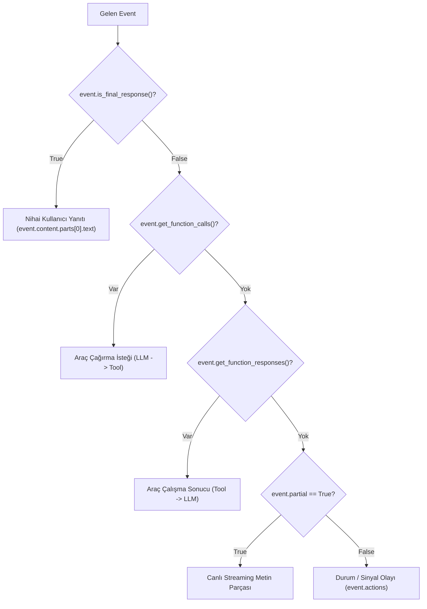

# Google ADK Olay Mimarisi Rehberi (`Events` & `EventActions`)

**Olaylar (Events)**, Google Agent Development Kit (ADK) mimarisindeki tüm bilgi akışının, durum değişikliklerinin ve orkestrasyon sinyallerinin temel atomik birimidir. Kullanıcı girdisinden nihai model yanıtına, araç çalıştırma isteklerinden ajanlar arası yetki devrine kadar her adım bir `Event` olarak üretilir, işlenir ve kaydedilir.

---

## 1. `Event` Nedir ve Neden Hayatidir?

Teknik olarak bir `Event`, `google.genai.types.LlmResponse` yapısını genişleten; üzerine ADK'ya özgü metaverileri ve eylem yüklerini (`EventActions`) ekleyen bir nesnedir.

ADK'da olayların 4 merkezi görevi vardır:
1. **İletişim Protokolü:** UI/İstemci, `Runner`, ajanlar, LLM ve araçlar arasındaki standart mesaj formatıdır.
2. **Durum ve Eser Sinyallemesi:** Bellek değişiklikleri doğrudan veritabanına yazılmaz; olay üzerindeki `actions.state_delta` ve `actions.artifact_delta` alanlarıyla taşınır.
3. **Akış Denetimi (Control Flow):** Ajan transferleri (`transfer_to_agent`), döngü sonlandırma (`escalate`) ve özet atlama (`skip_summarization`) olay sinyalleri ile yönetilir.
4. **Denetim ve Gözlemlenebilirlik (Audit & Observability):** `session.events` listesinde biriken olay dizisi, konuşmanın adım adım tam bir tarihçesini sunar.

---

## 2. `Event` Anatomisi ve Alanları

### Çok Dilli SDK Tipleri

```python
# Python: google.adk.events.Event
class Event(LlmResponse):
    id: str                         # Bu olaya özgü tekil kimlik
    invocation_id: str              # Kullanıcı girdisinden nihai yanıta kadar olan tüm çağrı turunun kimliği
    author: str                     # 'user' veya ajan adı (örn: 'BillingAgent')
    timestamp: float                # Oluşturulma Unix zaman damgası
    actions: EventActions           # Yan etkiler ve akış denetim sinyalleri
    content: Optional[types.Content]# Mesaj metni veya function call/response yükü
    partial: Optional[bool]         # Streaming token parçası mı? (True ise akış devam ediyor)
    turn_complete: Optional[bool]   # LLM turunun tamamlanıp tamamlanmadığı
    branch: Optional[str]           # Hiyerarşik dallanma yolu (alt ajanlar için)
    long_running_tool_ids: list[str]# Asenkron uzun süreli araç kimlikleri
```

```typescript
// TypeScript: Event interface (@google/adk)
export interface Event extends LlmResponse {
  id: string;
  invocationId: string;
  author?: string;
  actions: EventActions;
  timestamp: number;
  partial?: boolean;
  turnComplete?: boolean;
  branch?: string;
  longRunningToolIds?: string[];
  content?: Content;
}
```

```go
// Go: session.Event (google.golang.org/adk/v2/session)
type Event struct {
    model.LLMResponse
    Author       string
    InvocationID string
    ID           string
    Timestamp    time.Time
    Actions      EventActions
    Branch       string
}
```

```java
// Java: com.google.adk.events.Event
public class Event extends JsonBaseModel {
    private String id;
    private String invocationId;
    private String author;
    private long timestamp;
    private EventActions actions;
    private Optional<Content> content;
    private Optional<Boolean> partial;
    private Optional<String> branch;
}
```

---

## 3. `EventActions` (Yan Etki ve Orkestrasyon Yükü)

Bir olayın yalnızca ne söylediğini değil, sistemde ne tür yan etkiler oluşturduğunu `event.actions` yönetir:

| Alan | Tip | Açıklama ve Görevi |
| :--- | :--- | :--- |
| **`state_delta`** | `dict[str, Any]` | O adımda `session.state` içine eklenen veya güncellenen anahtar-değer çiftleri. |
| **`artifact_delta`** | `dict[str, int]` | Kaydedilen eserlerin dosya adı ve yeni sürüm numarası haritası (`{"report.pdf": 2}`). |
| **`transfer_to_agent`**| `str` (opsiyonel) | Kontrolün belirtilen ada sahip başka bir ajana devredilmesi gerektiğini bildirir. |
| **`escalate`** | `bool` | Bir döngünün (`LoopAgent`) kırılması veya insan operatöre eskalasyon sinyalidir. |
| **`skip_summarization`**| `bool` | Bir araç sonucunun LLM tarafından özetlenmeden doğrudan kullanıcıya iletilmesini sağlar. |

```python
# EventActions yapısı ve kullanımı
if event.actions:
    if event.actions.state_delta:
        print(f"Durum Değişikliği: {event.actions.state_delta}")
    if event.actions.transfer_to_agent:
        print(f"Yetki Devri: {event.actions.transfer_to_agent}")
    if event.actions.escalate:
        print("Döngü Sonlandırma / Eskalasyon Sinyali")
    if event.actions.skip_summarization:
        print("Araç yanıtı doğrudan aktarılacak (özetleme atlandı)")
```

---

## 4. Olay Tipi Tespiti ve Yardımcı Metotlar

`Runner` akışını dinlerken gelen olayın ne tür bir eylemi temsil ettiğini anlamak için yerleşik yardımcı metotlar kullanılmalıdır:



### Temel Filtreleme Sözdizimi (Python)

```python
async for event in runner.run_async(...):
    # 1. Nihai kullanıcı yanıtı (Ajan sözünü bitirdi)
    if event.is_final_response():
        print(f"[{event.author}]: {event.content.parts[0].text}")

    # 2. Araç çağırma talebi
    calls = event.get_function_calls()
    if calls:
        for call in calls:
            print(f"Araç İsteği: {call.name}(args={call.args})")

    # 3. Araç çalıştırma sonucu
    responses = event.get_function_responses()
    if responses:
        for resp in responses:
            print(f"Araç Sonucu: {resp.name} -> {resp.response}")

    # 4. Canlı akış (Streaming) parçası
    if event.partial and event.content and event.content.parts:
        print(event.content.parts[0].text, end="", flush=True)

    # 5. Hata durumu
    if event.error_code:
        print(f"HATA: {event.error_code} - {event.error_message}")
```

---

## 5. `Runner` ve `SessionService.append_event` Döngüsü

Durum değişikliklerinin ve olayların kalıcılık sırası son derece katıdır:

1. **Üretim:** Ajan veya araç `Event` nesnesini oluşturur. Durum değişiklikleri `event.actions.state_delta` içine paketlenir.
2. **Servise Teslim:** `Runner`, üretilen olayı anında `SessionService.append_event(session, event)` metoduna teslim eder.
3. **Delta Uygulaması:** `append_event`:
   - `event.actions.state_delta` içeriğini okur; `user:`, `app:`, `temp:` önek kurallarına göre `session.state` içine işler.
   - `event.actions.artifact_delta` içeriğini günceller.
   - Olayı `session.events` listesine kronolojik olarak ekler.
   - `session.last_update_time` damgasını günceller.
   - `DatabaseSessionService` kullanılıyorsa satır kilidi altında işlemi tek transaction ile kaydeder.
4. **Dışa Aktarma (Yield):** `Runner`, işlenmiş ve kalıcı hale getirilmiş olayı dışarıya (FastAPI SSE, terminal veya web arayüzüne) `yield` eder.

> [!CAUTION]
> Durum değişiklikleri `CallbackContext` veya `ToolContext` içinde yapıldığında diske anında yazılmaz; bir sonraki `Event` üretilene kadar bekler ve o olayın `state_delta`'sı ile birlikte `append_event` anında diske yazılır.

---

## 6. 8 Tipik Olay Deseni (Illustrative JSON Patterns)

### 1. Kullanıcı Girdisi (User Input)
```json
{
  "author": "user",
  "invocation_id": "inv_001",
  "content": {
    "role": "user",
    "parts": [{"text": "Londra uçuşlarını listele"}]
  }
}
```

### 2. Ajan Nihai Yanıtı (`is_final_response() == True`)
```json
{
  "author": "TravelAgent",
  "invocation_id": "inv_001",
  "content": {
    "role": "model",
    "parts": [{"text": "Londra için 3 uygun uçuş bulundu."}]
  },
  "partial": false,
  "turn_complete": true
}
```

### 3. Canlı Akış Metin Parçası (`partial == True`)
```json
{
  "author": "TravelAgent",
  "invocation_id": "inv_001",
  "content": {
    "role": "model",
    "parts": [{"text": "Londra için "}]
  },
  "partial": true,
  "turn_complete": false
}
```

### 4. Araç Çağırma İsteği (Tool Call Request)
```json
{
  "author": "TravelAgent",
  "invocation_id": "inv_001",
  "content": {
    "role": "model",
    "parts": [{
      "function_call": {
        "name": "search_flights",
        "args": {"destination": "LHR"}
      }
    }]
  }
}
```

### 5. Araç Çalıştırma Sonucu (Tool Result)
```json
{
  "author": "TravelAgent",
  "invocation_id": "inv_001",
  "content": {
    "role": "user",
    "parts": [{
      "function_response": {
        "name": "search_flights",
        "response": {"flights": ["BA142", "TK1984"]}
      }
    }]
  }
}
```

### 6. Yalnızca Durum ve Eser Güncelleme Olayı
```json
{
  "author": "OrderAgent",
  "invocation_id": "inv_001",
  "content": null,
  "actions": {
    "state_delta": {"order_status": "confirmed"},
    "artifact_delta": {"invoice.pdf": 1}
  }
}
```

### 7. Ajan Yetki Devri Sinyali (Transfer Signal)
```json
{
  "author": "TriageAgent",
  "invocation_id": "inv_001",
  "content": {
    "parts": [{
      "function_call": {
        "name": "transfer_to_agent",
        "args": {"agent_name": "BillingAgent"}
      }
    }]
  },
  "actions": {
    "transfer_to_agent": "BillingAgent"
  }
}
```

### 8. Döngü Kırma / Eskalasyon Sinyali (Loop Escalation)
```json
{
  "author": "ValidationAgent",
  "invocation_id": "inv_001",
  "content": {
    "parts": [{"text": "Maksimum deneme sınırına ulaşıldı."}]
  },
  "actions": {
    "escalate": true
  }
}
```

---

## 7. İleri Seviye Konular ve Kritik Kurallar

### 1. `ToolContext.function_call_id` Eşleştirmesi
Tek bir turda LLM aynı anda birden fazla aracı paralel çağırabilir (Parallel Function Calling). Bu senaryoda her araç çağrısının benzersiz bir kimliği (`function_call_id`) vardır. 
`ToolContext.function_call_id`, özellikle kimlik doğrulama (`adk_request_credential`) veya uzun süreli arka plan işlerinin sonucunu doğru çağrıya bağlamak için kullanılır.

### 2. Özel Ajanlarda (`BaseAgent`) Yazar Belirtme Kuralı
Kendi özel ajan sınıfınızı (`BaseAgent` alt sınıfı) yazarken olay üretmek için `yield` kullandığınızda mutlaka ajan adınızı `author` olarak atamalısınız:
```python
class CustomAuditorAgent(BaseAgent):
    async def _run_async(self, ctx: InvocationContext) -> AsyncGenerator[Event, None]:
        # Doğru yazar ataması:
        yield Event(
            author=self.name,
            invocation_id=ctx.invocation_id,
            content=types.Content(parts=[types.Part.from_text("Denetim tamamlandı.")]),
            turn_complete=True
        )
```

### 3. Hata Olayları (Error Events)
Model güvenlik filtreleri (`SAFETY_FILTER_TRIGGERED`), kaynak tükenmesi veya kritik araç hataları oluştuğunda framework özel bir hata olayı üretir:
```json
{
  "author": "LLMAgent",
  "invocation_id": "inv_error_123",
  "content": null,
  "error_code": "SAFETY_FILTER_TRIGGERED",
  "error_message": "İçerik güvenlik politikaları nedeniyle engellendi.",
  "actions": {}
}
```
Uygulama katmanında `if event.error_code:` kontrolü yapılarak kullanıcıya uygun hata mesajı gösterilmelidir.

> [!TIP]
> **Canlı İki Yönlü Ses ve Görüntü Olayları (`run_live`):** Canlı oturumlarda `Event` nesnesi ham ses baytları (`inline_data`), anlık transkripsiyonlar (`input_transcription`, `output_transcription`), söz kesme (`interrupted`) ve parçalı akış (`partial`) bayrakları ile zenginleşir. Canlı olayların UI durum makinesi ve işleme kuralları için bkz: [`adk-live-guide.md`](adk-live-guide.md#5-canlı-oturum-yürütme-runnerun_live-ve-olay-akışı-event).

