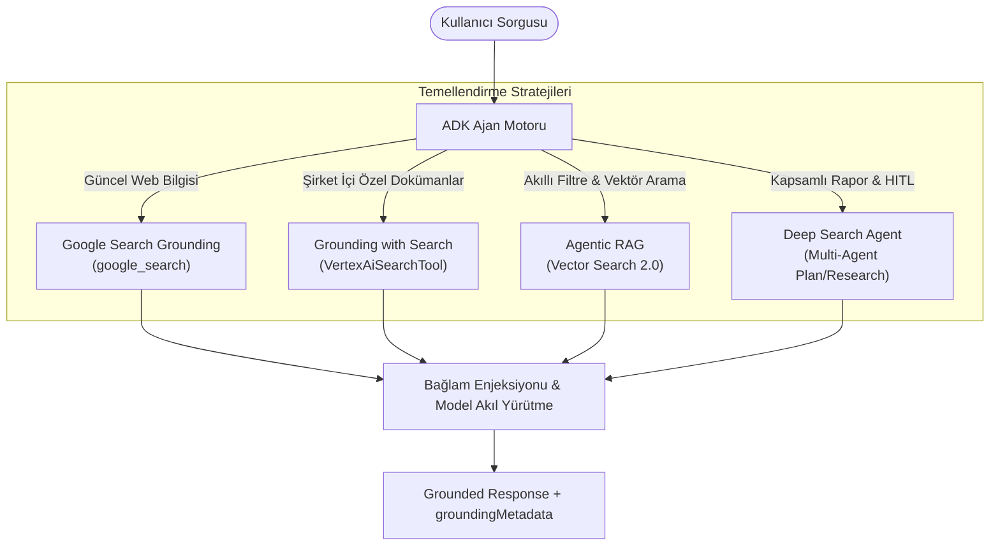
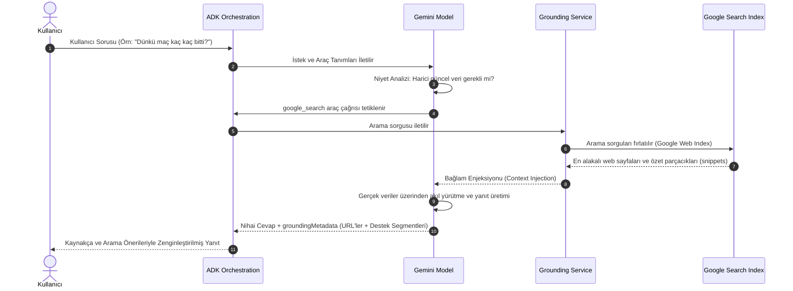
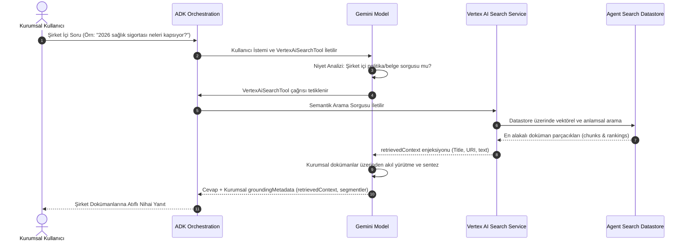

# Google ADK Ajan Temellendirme (Grounding) Rehberi

Kaynak: `https://adk.dev/grounding/index.md`  
Destek: Python v0.1.0+, TypeScript v0.2.0+, Java v0.1.0+, Kotlin v0.2.0+

Temellendirme (**Grounding**), yapay zeka ajanlarını harici ve yetkili bilgi kaynaklarına bağlayarak modellerin halüsinasyon görmesini (uydurmasını) engelleyen; güncel, doğrulanabilir ve kaynak gösterimli yanıtlar üretmesini sağlayan çekirdek mimari süreçtir.

---

## 1. Temellendirme Yaklaşımları ve Mimari Harita



### Strateji Karşılaştırma Matrisi

| Strateji | Veri Kaynağı | Kimlik Doğrulama | Temel Kullanım Senaryosu |
| :--- | :--- | :--- | :--- |
| **Google Search Grounding** | Canlı Açık Web | `GOOGLE_API_KEY` veya Cloud | Son dakika haberleri, güncel hava durumu, borsa, model eğitim kesim tarihi sonrası olaylar. |
| **Grounding with Search** | Şirket İçi İndekslenmiş Veri Ambarı | Google Cloud Enterprise IAM | Kurumsal politikalar, şirket içi kılavuzlar, tescilli PDF/Word/HTML dokümanları. |
| **Agentic RAG** | Hibrit Vektör & Metadata İndeksleri | Google Cloud / Özel Vektör DB | Kullanıcı niyetine göre sorgu ve filtreleri dinamik inşa eden akıllı seyahat/ürün arama. |
| **Deep Search Agent** | Çoklu Kaynak + İnsan Onayı | Google Cloud Enterprise | Derin araştırma raporları; planlama, araştırma, eleştiri ve derleme yapan çoklu ajan zinciri. |

---

## 2. Google Search Grounding (Web Tabanlı Temellendirme)

Model, kullanıcının sorduğu sorunun dinamik veya güncel bir olgu olduğunu tespit ettiğinde otomatik olarak `google_search` aracını tetikler. Bu araç; canlı spor skorları, hava durumu, hisse senedi fiyatları, seçim sonuçları veya modelin eğitim kesim tarihinden sonra meydana gelen tüm olayları Google Search İndeksi'nden çeker.

### 2.1 7 Aşamalı Uçtan Uca Veri Akışı (End-to-End Data Flow)



#### Adım Adım Açıklama:
1. **Kullanıcı Sorgusu (User Query):** Kullanıcı güncel bir soru sorar.
2. **ADK Orkestrasyonu (ADK Orchestration):** Kullanıcı mesajını bağlamla birlikte ajanın çekirdeğine iletir.
3. **LLM Analizi ve Araç Çağrısı (Tool-Calling):** Model sorguyu inceler. Bilginin eğitim verisi dışında kaldığını saptarsa `google_search` aracını çağırır.
4. **Temellendirme Servisi Etkileşimi (Grounding Service):** Arama sorgularını formüle eder ve Google Arama İndeksi'ne iletir.
5. **Bağlam Enjeksiyonu (Context Injection):** Alakalı web sayfaları ve özet parçacıkları modelin çalışma bağlamına dahil edilir.
6. **Temellendirilmiş Yanıt Üretimi (Grounded Response Generation):** Model taze gerçek veriler üzerinde akıl yürüterek yanıt metnini üretir.
7. **Kaynaklı Yanıt Sunumu (Response Presentation):** Yanıt, kaynak URL'leri (`groundingChunks`), cümle segment haritaları (`groundingSupports`) ve Google arama önerileri (`searchEntryPoint`) ile birlikte kullanıcıya sunulur.

---

### 2.2 Ajan Tanımları (Çoklu Dil Desteği)

#### Python:
```python
from google.adk.agents import Agent
from google.adk.tools import google_search

root_agent = Agent(
    name="google_search_agent",
    model="gemini-flash-latest",
    instruction="Soruları gerektiğinde Google Search kullanarak yanıtla. Her zaman kaynak göster.",
    description="Google Search yeteneklerine sahip profesyonel araştırma asistanı.",
    tools=[google_search],
)
```

#### TypeScript:
```typescript
import { LlmAgent, GOOGLE_SEARCH } from '@google/adk';

export const rootAgent = new LlmAgent({
    name: "google_search_agent",
    model: "gemini-flash-latest",
    instruction: "Answer questions using Google Search when needed. Always cite sources.",
    description: "Professional search assistant with Google Search capabilities",
    tools: [GOOGLE_SEARCH],
});
```

#### Java:
```java
import com.google.adk.agents.LlmAgent;
import com.google.adk.tools.GoogleSearchTool;

LlmAgent rootAgent = LlmAgent.builder()
    .name("google_search_agent")
    .model("gemini-flash-latest")
    .instruction("Answer questions using Google Search when needed. Always cite sources.")
    .description("Professional search assistant with Google Search capabilities")
    .tools(GoogleSearchTool.INSTANCE)
    .build();
```

---

### 2.3 Google Arama Önerileri (`searchEntryPoint` / Search Suggestions)

Google Search Grounding yanıtlarında dönen `searchEntryPoint` nesnesi, son kullanıcı arayüzünde Google logolu ve tıklanabilir arama çipleri (**Search Suggestions Chips**) oluşturmak için önceden biçimlendirilmiş HTML/CSS taşır.

- **Kullanıcı Güveni ve Şeffaflık:** Kullanıcının yanıttaki bilgiyi Google üzerinde tek tıkla doğrulamasına olanak tanır.
- **Entegrasyon:** Web ön ucunda `event.grounding_metadata.search_entry_point.rendered_content` doğrudan güvenli HTML olarak render edilebilir.

---

## 3. Kurumsal Arama ile Temellendirme (Grounding with Search / Agent Search)

Şirketinizin intranetinde, Google Cloud Storage kovalarında veya kurumsal veri depolarında indekslenmiş özel dokümanları (PDF, Word, HTML, veritabanı kayıtları) Gemini modellerine bağlar. Ajan, kurum içi bilgi gerektiğinde veri ambarını otomatik olarak sorgular ve yanıtları şirket içi belgelere dayandırır.

### 3.1 Kurumsal Temellendirme Veri Akışı (Enterprise Sequence Diagram)



---

### 3.2 Kimlik Doğrulama ve Ortam Kurulumu (Authentication Setup)

> [!CAUTION]
> **API Key ile Çalışmaz:** `VertexAiSearchTool`, Google AI Studio API anahtarıyla **KULLANILAMAZ**. Google Cloud kurumsal kimlik doğrulaması (`GOOGLE_GENAI_USE_ENTERPRISE=TRUE`) zorunludur.

#### Ortam Yapılandırması:
1. **gcloud CLI Girişi:** Terminalden `gcloud auth login` ve `gcloud auth application-default login` çalıştırın.
2. **Python `.env` Yapılandırması:**
   ```text
   GOOGLE_GENAI_USE_ENTERPRISE=TRUE
   GOOGLE_CLOUD_PROJECT=your-project-id
   GOOGLE_CLOUD_LOCATION=us-central1
   ```
3. **Java ve Kotlin:** Ortamda `GOOGLE_APPLICATION_CREDENTIALS` servis hesabı anahtarı tanımlanmalı ve ortam değişkenleri sistem düzeyinde verilmelidir.

#### Datastore Kaynak Yolu (DATASTORE_ID Syntax):
```text
projects/{PROJECT_ID}/locations/{LOCATION}/collections/default_collection/dataStores/{DATASTORE_ID}
```

---

### 3.3 Kurumsal Ajan Tanımları (Çoklu Dil)

#### Python:
```python
from google.adk.agents import Agent
from google.adk.tools import VertexAiSearchTool

DATASTORE_ID = "projects/YOUR_PROJECT_ID/locations/global/collections/default_collection/dataStores/YOUR_DATASTORE_ID"

root_agent = Agent(
    name="enterprise_search_agent",
    model="gemini-flash-latest",
    instruction="Kurumsal belgeleri Agent Search ile tarayarak soruları yanıtla. Daima kaynak dokümanlara atıf yap.",
    description="Kurumsal doküman arama asistanı",
    tools=[VertexAiSearchTool(data_store_id=DATASTORE_ID)],
)
```

#### Java:
```java
import com.google.adk.agents.LlmAgent;
import com.google.adk.tools.VertexAiSearchTool;

String datastoreId = "projects/YOUR_PROJECT_ID/locations/global/collections/default_collection/dataStores/YOUR_DATASTORE_ID";

LlmAgent rootAgent = LlmAgent.builder()
    .name("enterprise_search_agent")
    .model("gemini-flash-latest")
    .instruction("Answer questions using Agent Search to find information from internal documents. Always cite sources when available.")
    .description("Enterprise document search assistant with Agent Search capabilities")
    .tools(VertexAiSearchTool.builder().dataStoreId(datastoreId).build())
    .build();
```

#### Kotlin:
```kotlin
import com.google.adk.kt.agents.Instruction
import com.google.adk.kt.agents.LlmAgent
import com.google.adk.kt.models.Gemini
import com.google.adk.kt.tools.VertexAiSearchTool

val datastoreId = "projects/YOUR_PROJECT_ID/locations/global/collections/default_collection/dataStores/YOUR_DATASTORE_ID"

val rootAgent = LlmAgent(
    name = "enterprise_search_agent",
    model = Gemini(name = "gemini-flash-latest"),
    instruction = Instruction("Answer questions using Agent Search to find information from internal documents. Always cite sources when available."),
    description = "Enterprise document search assistant with Agent Search capabilities",
    tools = listOf(VertexAiSearchTool(dataStoreId = datastoreId)),
)
```

---

### 3.4 İstemci Tarafında Kurumsal Alıntı Gösterimi (Client Citation Implementations)

Kurumsal aramada `searchEntryPoint` zorunlu değildir; ancak cevapların hangi belgelere dayandığını göstermek kurumsal güven inşa eder:

#### Minimal Sayaç Gösterimi (Minimal Display):
```python
# Python
for event in events:
    if event.is_final_response() and event.content and event.content.parts:
        print(event.content.parts[0].text)
        if event.grounding_metadata and event.grounding_metadata.grounding_chunks:
            print(f"\n[Dayanak: {len(event.grounding_metadata.grounding_chunks)} kurumsal doküman]")
```

```java
// Java
for (Event event : events) {
    if (event.finalResponse()) {
        System.out.println(event.content().parts().get(0).text());
        if (event.groundingMetadata().isPresent()) {
            System.out.println("\n[Dayanak: " + event.groundingMetadata().get().groundingChunks().size() + " kurumsal doküman]");
        }
    }
}
```

```kotlin
// Kotlin
events.collect { event ->
    if (event.isFinalResponse) {
        println(event.content?.parts?.firstOrNull()?.text)
        val chunks = event.groundingMetadata?.groundingChunks
        if (!chunks.isNullOrEmpty()) {
            println("\n[Dayanak: ${chunks.size} kurumsal doküman]")
        }
    }
}
```

---

### 3.5 Üretim Öncesi Kontrol Listesi (Production Considerations)

1. **Belge Erişim Güvenliği (IAM & ACL):** Yanıtta atıf yapılan dokümanların son kullanıcı tarafından okunabilir olup olmadığı kontrol edilmelidir.
2. **URI Çözümleme (Internal Links):** `groundingMetadata` içinde dönen GCS URI'ları (`gs://...`), kullanıcıların tarayıcıda açabileceği intranet portalı bağlantılarına veya süreli imzalı URL'lere (Signed URL) dönüştürülmelidir.
3. **Sorgu Telemetrisi:** `event.grounding_metadata.retrieval_queries` dizisi loglanarak veri ambarında aranan konular ve bilgi açıkları analiz edilmelidir.

---

## 4. Temellendirme Metaverisi ve Kaynak Gösterimi (`groundingMetadata`)

Ajan temellendirilmiş bir yanıt ürettiğinde model çıktısıyla birlikte zengin bir `groundingMetadata` nesnesi döner. Bu nesne üretilen metnin hangi cümlelerinin hangi doküman parçalarına dayandığını matematiksel segment aralıklarıyla belgeler.

### 4.1 Metaveri JSON Şeması

```json
{
  "groundingMetadata": {
    "groundingChunks": [
      {
        "web": {
          "title": "Türkiye Cumhuriyet Merkez Bankası",
          "uri": "https://www.tcmb.gov.tr"
        }
      },
      {
        "retrievedContext": {
          "title": "2026 Para Politikası Raporu.pdf",
          "uri": "https://storage.googleapis.com/sirket-arsiv/rapor.pdf",
          "documentName": "projects/.../dataStores/.../documents/rapor-01",
          "text": "Politika faizi yüzde 35 seviyesinde sabit tutulmuştur..."
        }
      }
    ],
    "groundingSupports": [
      {
        "groundingChunkIndices": [0, 1],
        "segment": {
          "startIndex": 0,
          "endIndex": 84,
          "text": "Merkez Bankası son toplantısında politika faizini piyasa beklentileri doğrultusunda sabit tuttu."
        }
      }
    ],
    "retrievalQueries": [
      "TCMB politika faiz kararı 2026",
      "Merkez Bankası faiz metni"
    ],
    "searchEntryPoint": {
      "renderedContent": "<div class='google-search-chip'>...</div>"
    }
  }
}
```

### 4.2 Alan Açıklamaları ve Yorumlama

1. **`groundingChunks`:** Modelin başvurduğu harici kaynakların listesidir:
   - Web için `web.title` ve `web.uri`.
   - Kurumsal arama için `retrievedContext.title`, `retrievedContext.uri`, `documentName` ve ham `text`.
2. **`groundingSupports`:** Nihai yanıttaki belirli cümleleri kaynak indekslerine (`groundingChunkIndices`) bağlayan haritadır.
3. **`segment`:** Metin içerisindeki karakter aralığını (`startIndex`, `endIndex`) ve cümlenin kendisini belirtir.
4. **`retrievalQueries`:** Modelin harici veri tabanına fırlattığı optimize edilmiş arama sorgularıdır.
5. **`searchEntryPoint`:** Google arama logolu tıklanabilir öneri çipleri (`Search Suggestions`) için hazır HTML/CSS kodunu içerir.

### 4.3 İstemcide Kaynakları Render Etme (UI/Client Display)

```python
async for event in runner.run_async(session=session, user_input="Faiz kararı ne oldu?"):
    if event.is_final_response() and event.content and event.content.parts:
        print(event.content.parts[0].text)

        # Temellendirme kaynaklarını ekrana bas
        if event.grounding_metadata and event.grounding_metadata.grounding_chunks:
            print("\n--- Kaynaklar ---")
            for idx, chunk in enumerate(event.grounding_metadata.grounding_chunks):
                title = chunk.web.title if chunk.web else chunk.retrieved_context.title
                uri = chunk.web.uri if chunk.web else chunk.retrieved_context.uri
                print(f"[{idx + 1}] {title} -> {uri}")
```

---

## 5. İleri Düzey Desenler & Kritik Kurallar

### 5.1 Interactions API & Temellendirme Birlikteliği
> [!IMPORTANT]
> **Çoklu Araç Çakışması (`bypass_multi_tools_limit`):** Eğer ajanınızda durum bilgili `use_interactions_api=True` kullanıyorsanız, yerleşik `GoogleSearchTool` ile özel fonksiyon araçlarını (custom Python functions) aynı anda doğrudan kullanamazsınız. Google Search aracını fonksiyon aracına dönüştürmek için:
> ```python
> GoogleSearchTool(bypass_multi_tools_limit=True)
> ```
> bayrağı zorunludur.

### 5.2 Agentic RAG (Vector Search 2.0)
Basit "ara ve getir" (retrieve-then-generate) yerine ajan; kullanıcının sorgusundaki kısıtları inceler, dinamik metadata filtreleri (fiyat aralığı, lokasyon, tarih) üretir ve hibrit anlamsal arama (dense vector + lexical keyword) gerçekleştirir.

### 5.3 Deep Search Agent (İnsan Onaylı Çok Ajanlı Araştırma)
Karmaşık pazar araştırmaları için tasarlanan kurumsal desendir:
1. **Planner Agent:** Araştırma planı çıkarır.
2. **Human-in-the-Loop (HITL):** Kullanıcı araştırma planını inceler ve onaylar (`plan_approved`).
3. **Research Agent:** Alt başlıkları Google Search ve kurumsal depolarda paralel arar.
4. **Critique Agent:** Bilgilerin tutarlılığını ve kaynak sağlamlığını denetler.
5. **Composer Agent:** Dipnotlu ve doğrulanmış nihai raporu üretir.

---

## 6. İlgili Bağlantılar
- Resmi Dokümantasyon: [Grounding agents with data](https://adk.dev/grounding/index.md)
- Google Search Grounding: [Understanding Google Search Grounding](https://adk.dev/grounding/google_search_grounding/index.md)
- Grounding with Search: [Understanding Grounding with Search](https://adk.dev/grounding/grounding_with_search/index.md)
- Deep Search Örneği: [Deep Search Sample Repository](https://github.com/google/adk-samples/tree/main/core/python/deep-search)
- Agentic RAG Yazısı: [10-minute Agentic RAG with Vector Search 2.0](https://medium.com/google-cloud/10-minute-agentic-rag-with-the-new-vector-search-2-0-and-adk-655fff0bacac)
