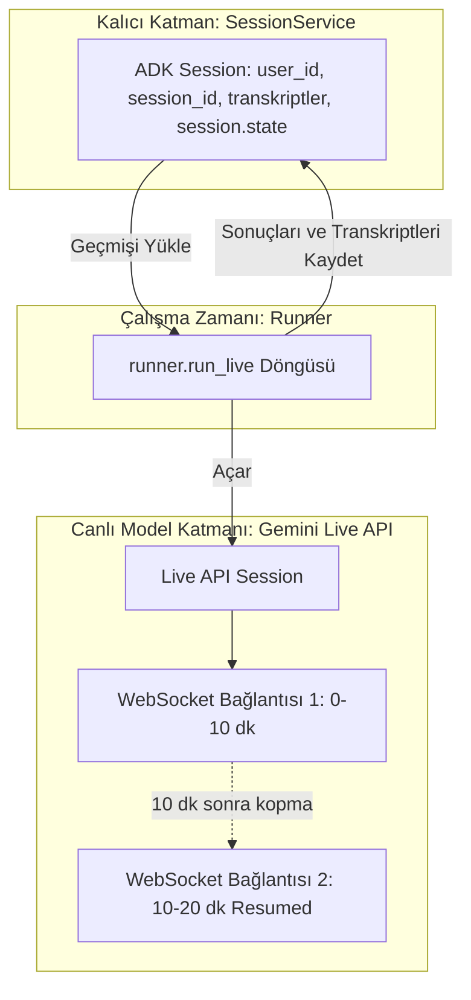
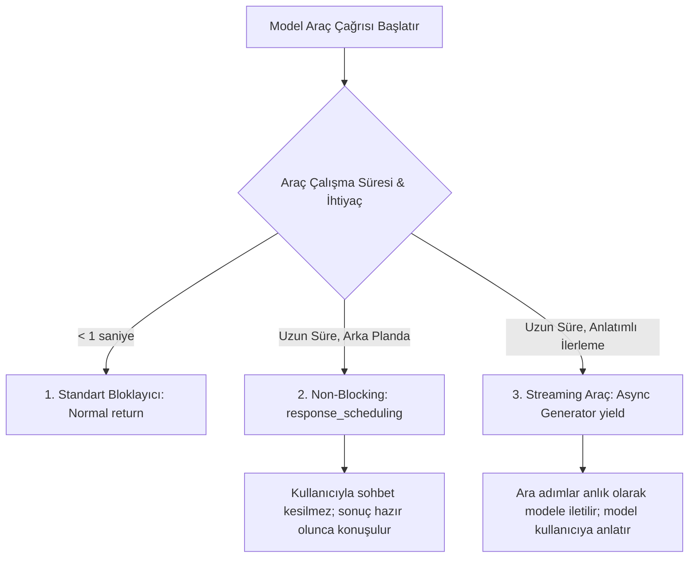
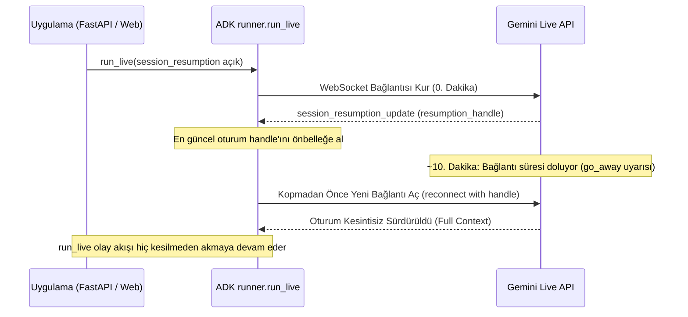
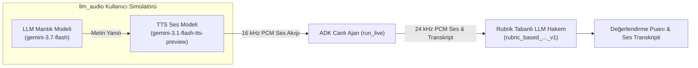
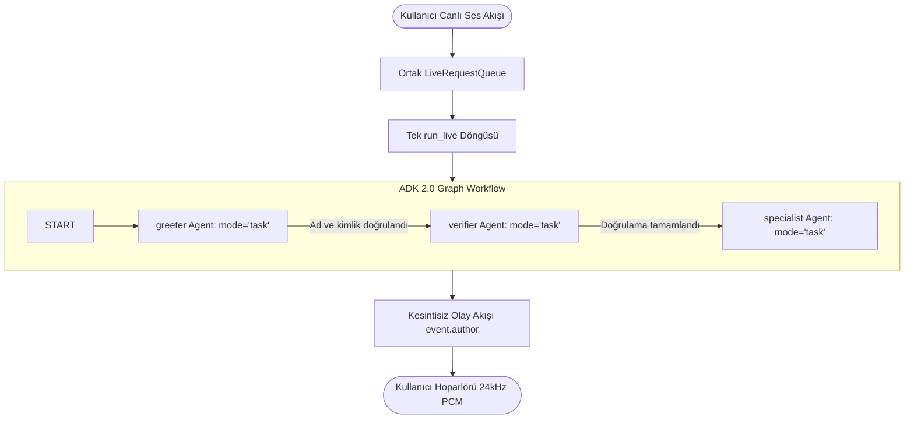

# Google ADK Live & Voice Agents (Canlı Ses ve Görüntü Ajanları) Mimari Rehberi

Google Agent Development Kit (ADK), klasik soru-cevap (request/response) döngülerinin ötesine geçerek kullanıcı ile model arasında sürekli açık, çift yönlü (bidirectional) ve ultra düşük gecikmeli ses/görüntü akışı sağlayan **Live & Voice Agents** mimarisini tam olarak destekler.

Canlı bir ajan; kullanıcının konuşmasını dinlerken aynı anda konuşabilir, kullanıcı araya girdiğinde (**barge-in / interruption**) konuşmasını anında kesip dinlemeye geçebilir ve araçları arka planda konuşmayı dondurmadan çalıştırabilir.

---

## 1. Mimari Karar: İstek/Yanıt (Request/Response) vs. Canlı Çift Yönlü Akış (Live Streaming)

```mermaid
graph TD
    subgraph RequestResponsePattern [Klasik İstek/Yanıt (run_async / SSE)]
        UserA([Kullanıcı]) -->|Tam Metin Gönder| ServerA[ADK Runner]
        ServerA -->|LLM Çağrısı| ModelA[Gemini API]
        ModelA -->|Tamamlanmış Yanıt / Token Akışı| ServerA
        ServerA -->|Yanıtı İstemciye İlet| UserA
        NoteA[Kullanıcı konuşurken model dinleyemez; araya girilemez.]
    end

    subgraph LiveStreamingPattern [Canlı Çift Yönlü Akış (run_live / WebSocket)]
        UserB([Kullanıcı: Mikrofon / Kamera]) <-->|Sürekli 16kHz PCM & Olay Akışı| Queue[LiveRequestQueue]
        Queue <-->|WebSocket Bidi-Stream| RunnerB[ADK Runner.run_live]
        RunnerB <-->|Gemini Live API| LiveModel[Gemini 2.5 Flash Native Audio]
        RunnerB -->|Paralel Araç Çağrısı| ToolExec[Tool Execution Worker]
        NoteB[Doğal insansı diyalog: Aynı anda konuşma, dinleme ve anında söz kesme (barge-in).]
    end
```

### Karşılaştırma Matrisi

| Kriter | Klasik İstek/Yanıt (`run_async`) | Canlı Çift Yönlü Akış (`run_live`) |
| :--- | :--- | :--- |
| **Bağlantı Protokolü** | HTTP POST / Server-Sent Events (SSE). | **Çift Yönlü WebSocket (Bidi-Streaming)**. |
| **İletişim Modu** | Sıralı (Half-duplex: Önce kullanıcı, sonra model). | **Tam Çift Yönlü (Full-duplex: Eş zamanlı konuşma/dinleme)**. |
| **Söz Kesme (Barge-in)** | İstemci seviyesinde iptal gerektirir; model farkında değildir. | **Protokol düzeyinde yerleşik (`interrupted=True`)**; model anında susar. |
| **Varsayılan Çıktı** | Metin (`TEXT`) veya yapılandırılmış JSON. | **Doğal Ses (`AUDIO` - 24 kHz PCM)**. |
| **Gecikme (Latency)** | 800ms - 2500ms (cümle tamamlanma süresi). | **Ultra düşük: 150ms - 400ms** (anlık ses üretimi). |
| **Kullanım Alanları** | Raporlama, metin sohbeti, kodlama, analitik. | Çağrı merkezi asistanı, araç içi navigasyon, canlı video analizi, simültane çeviri. |

---

### 1.1 Desteklenen Canlı Modeller ve Arka Uçlar (Supported Live Models & Backends)

Canlı ajanlar, çift yönlü akış bağlantısını açık tutabilen ve sesi aracı bir metinden-sese (TTS) katmanı olmaksızın **doğrudan uçtan uca (native audio)** işleyen modeller gerektirir. Standart istek/yanıt Gemini modelleri çift yönlü canlı akışı desteklemez.

#### 1.1.1 Canlı Model Matrisi (Gemini 2.5 vs. 3.1 Flash Live)

| Model Ailesi | Google AI Studio Kimliği | Agent Platform Kimliği | Durum & Öne Çıkan Özellikler |
| :--- | :--- | :--- | :--- |
| **Gemini 2.5 Flash Live** | `gemini-2.5-flash-native-audio-preview-12-2025` | `gemini-live-2.5-flash-native-audio` | **GA (Genel Kullanım)**. ADK'nın varsayılan modelidir (`LlmAgent.DEFAULT_LIVE_MODEL`). Proaktivite, duygulanım ve non-blocking araçları tam destekler. |
| **Gemini 3.1 Flash Live** | `gemini-3.1-flash-live-preview` | *Henüz Desteklenmiyor* | **Preview (Yalnızca AI Studio)**. Çok daha düşük gecikme (ultra-low latency); ancak proaktivite ve asenkron araç zamanlaması henüz desteklenmez. |

> [!IMPORTANT]
> **Canlı Modeller YALNIZCA SES Üretir (`AUDIO ONLY`):** Canlı modeller model mimarisi seviyesinde `TEXT` yanıt modalitesini desteklemez (`response_modalities=["AUDIO"]` zorunludur). Sesin yanında eşzamanlı metin transkripsiyonu elde etmek için `output_audio_transcription` yapılandırması etkinleştirilmelidir.

---

#### 1.1.2 Arka Uç Seçimi: AI Studio vs. Agent Platform

ADK, her iki arka uçla da aynı istemci kodu üzerinden konuşur. Geçiş tek bir ortam değişkeniyle yönetilir:

| Kriter | Google AI Studio | Gemini Enterprise Agent Platform |
| :--- | :--- | :--- |
| **Hedef Ortam** | Hızlı prototipleme, yerel geliştirme ve POC. | Kurumsal üretim (Production), SLA ve yüksek ölçek. |
| **Kimlik Doğrulama** | `GOOGLE_API_KEY` | `GOOGLE_CLOUD_PROJECT`, `GOOGLE_CLOUD_LOCATION` |
| **Geçiş Bayrağı** | `GOOGLE_GENAI_USE_ENTERPRISE="FALSE"` | `GOOGLE_GENAI_USE_ENTERPRISE="TRUE"` |
| **Bölge Desteği** | Genel bulut uç noktası | **Bölgesel uç nokta zorunludur (`us-central1`, `us-east1` vb.)** |

> [!CAUTION]
> **Agent Platform'da `global` Konum Yasağı:** Canlı modeller `GOOGLE_CLOUD_LOCATION=global` uç noktasında bulunmaz! Canlı oturum başlatırken mutlaka `us-central1`, `us-east1` veya `asia-northeast1` gibi desteklenen bölgesel bir lokasyon tanımlanmalıdır.

---

#### 1.1.3 Model Bazlı Özellik ve Yükseltme Matrisi

Gemini 2.5'ten 3.1'e geçerken API ve yapılandırma farkları:

| Yetenek / Yapılandırma | Gemini 2.5 Flash Live | Gemini 3.1 Flash Live |
| :--- | :--- | :--- |
| **Proaktivite ve Duygulanım** | `RunConfig` üzerinden opt-in desteklenir. | **Desteklenmiyor** (tanımlanırsa oturum başlatma hatası verir). |
| **Araç Yanıt Zamanlaması (`response_scheduling`)** | `WHEN_IDLE`, `INTERRUPT`, `SILENT` desteklenir. | **Desteklenmiyor**; araç çağrıları senkrondur, model yanıt dönene kadar susar. |
| **Düşünme Bütçesi (Thinking Control)** | `thinking_budget` parametresi | `thinking_level` (`minimal`, `low`, `medium`, `high`) |
| **Olay Parçaları (Event Parts)** | Genelde tek parça taşır. | Tek bir olay birden fazla parça taşıyabilir; `parts[0]` yerine `for part in event.content.parts` döngüsü zorunludur. |
| **Sürekli Video Maliyeti** | Seçici kare yakalama | Saptanan tüm ses aktivitesini ve video karelerini varsayılan olarak kapsar (token tüketimi artabilir). |

---

#### 1.1.4 Platform Limitleri, Süreler ve Kotalar

| Sınır / Kota Türü | Google AI Studio | Gemini Enterprise Agent Platform |
| :--- | :--- | :--- |
| **Oturum Süresi (Yalnızca Ses)** | 15 dakika | 15 dakika (varsayılan konuşma oturumu sınırı ayrıca 10 dk ile sınırlanabilir) |
| **Oturum Süresi (Ses + Video)** | 2 dakika | 2 dakika |
| **Bağlantı Ömrü (Connection Lifetime)** | ~10 dakika | ~10 dakika |
| **Eşzamanlı Canlı Oturumlar** | Hız sınırlarına tabidir | Kullandıkça-öde: 1.000 oturum/proje; Provisioned Throughput ile limitsiz. |

> [!TIP]
> - **Süre Sınırını Aşma:** Oturum süresi sınırlarını aşmak ve konuşmayı kesintisiz sürdürmek için `context_window_compression` aktif edilmelidir.
> - **Kota Artırımı:** Agent Platform'da eşzamanlı oturum kotasını artırmak için Google Cloud Console Quotas sayfasında **"Bidi generate content concurrent requests"** kotası yükseltilmelidir.

---

#### 1.1.5 Model Adlarını Yönetme ve Python Import Sırası Tuzağı

Model adını koda hardcode etmek mimari bir hatadır. Arka uçlar arası model kimlikleri farklı olduğundan ve modeller güncellendiğinden model adı mutlaka ortam değişkeninden okunmalıdır:

```python
import os
from google.adk.agents import Agent

agent = Agent(
    name="live_voice_agent",
    model=os.getenv("LIVE_MODEL", "gemini-live-2.5-flash-native-audio"),
    instruction="Sen yardımsever bir sesli asistansın.",
)
```

> [!CAUTION]
> **Python `load_dotenv` Yükleme Sırası Tuzağı:** Python'da bir modül import edildiğinde üst düzey kodları derhal çalıştırılır. Eğer agent modülünüzü import etmeden önce `.env` dosyasını belleğe yüklemezseniz, `os.getenv()` `None` döner ve ajan gizlice varsayılan modele düşer!
>
> ```python
> # DOĞRU SIRA (main.py):
> from dotenv import load_dotenv
> from pathlib import Path
> 
> # 1. Önce .env dosyasını yükle
> load_dotenv(Path(__file__).parent / ".env")
> 
> # 2. Ortam değişkeni yüklendikten SONRA ajanı import et
> from google_search_agent.agent import agent
> ```

---

## 2. Hızlı Başlangıç: Yerel Geliştirme & Test (Get Started - Python & Java)

Canlı ses ve video ajanlarını test etmek için sıfırdan bir Web UI yazmanıza gerek yoktur. ADK, tarayıcı mikrofonunu otomatik yakalayan, modelin ses yanıtlarını çalan ve çift yönlü transkripsiyonu ekrana basan yerleşik bir geliştirici arayüzü (**Dev UI / `adk web`**) sunar.

> [!CAUTION]
> **Yalnızca Geliştirme Amaçlıdır:** `adk web` ve Java `AdkWebServer` yalnızca yerel geliştirme ve hata ayıklama içindir; üretim ortamında doğrudan istemcilere sunulmamalıdır.

### 2.1 Python ile Hızlı Başlangıç (`adk web`)

1. **Sanal Ortam ve Kurulum:**
   ```powershell
   python -m venv .venv
   .venv\Scripts\Activate.ps1
   pip install google-adk
   ```

2. **Proje Klasör Yapısı:**
   ```text
   adk-streaming/
   └── app/
       ├── .env                     # API anahtarları
       └── google_search_agent/
           ├── __init__.py          # Paket dışa aktarımı
           └── agent.py             # Ajan tanımı (root_agent)
   ```

3. **Çevre Değişkenleri (`app/.env`):**
   ```text
   GOOGLE_API_KEY=YOUR_GEMINI_API_KEY
   ```

4. **Paket Giriş Noktası (`app/google_search_agent/__init__.py`):**
   ```python
   from . import agent
   ```

5. **Ajan Tanımı ve Google Search Grounding (`app/google_search_agent/agent.py`):**
   ADK, `root_agent` adında bir ana ajan nesnesi arar. `google_search` aracı, modelin konuşma anında web'de arama yaparak yanıtlarını güncel verilerle doğrulamasına (**grounding**) olanak tanır:

   ```python
   from google.adk.agents import Agent
   from google.adk.tools import google_search

   root_agent = Agent(
       name="basic_search_agent",
       # Canlı iki yönlü ses API'sini destekleyen Gemini modeli:
       model="gemini-2.0-flash-exp",
       description="Google Search kullanarak soruları yanıtlayan canlı ses ajanı.",
       instruction="Sen uzman bir araştırmacısın. Her zaman gerçeklere sadık kalarak konuş.",
       tools=[google_search],
   )
   ```

6. **Dev UI ile Çalıştırma:**
   ```powershell
   adk web app
   ```
   Tarayıcıda otomatik olarak `http://localhost:8000` açılır; mikrofon izni verilerek modelle gecikmesiz sesli diyalog başlatılır.

---

### 2.2 Java ile Hızlı Başlangıç (Maven & `AdkWebServer` Dev UI)
Java ortamında canlı ses ajanları Java 17+ ve Maven ile derlenir.

1. **Gereksinimler:** Java 17+ (`java -version`) ve Apache Maven (`mvn -v`).
2. **Proje Yapısı:**
   ```text
   adk-agents/
   ├── pom.xml
   └── src/main/java/agents/
       └── ScienceTeacherAgent.java
   ```
3. **Java Sınıf Kuralları (`ScienceTeacherAgent.java`):**
   Java Dev UI'ın ajanı dinamik sınıf yükleyicisiyle (classloader) otomatik tanıması için iki katı kural vardır:
   - Sınıf içinde `public static final BaseAgent ROOT_AGENT = initAgent();` şeklinde tanımlanmalıdır.
   - Ajan tanımı `public static BaseAgent initAgent() { ... }` şeklinde bir `static` metot olmalıdır.

   ```java
   package samples.liveaudio;

   import com.google.adk.agents.BaseAgent;
   import com.google.adk.agents.LlmAgent;

   public class ScienceTeacherAgent {
       // Dev UI'ın ajanı dinamik yükleyebilmesi için zorunlu alan:
       public static final BaseAgent ROOT_AGENT = initAgent();

       public static BaseAgent initAgent() {
           return LlmAgent.builder()
               .name("science-app")
               .description("Science teacher live voice agent")
               .model("gemini-2.0-flash-exp")
               .instruction("You are a helpful science teacher that explains science concepts clearly.")
               .build();
       }
   }
   ```
4. **Ortam Değişkenleri & Derleme:**
   ```powershell
   $env:GOOGLE_GENAI_USE_ENTERPRISE="FALSE"
   $env:GOOGLE_API_KEY="YOUR_GEMINI_API_KEY"
   mvn compile
   ```
5. **Java Dev UI Başlatma:**
   ```powershell
   mvn exec:java `
       -Dexec.mainClass="com.google.adk.web.AdkWebServer" `
       -Dexec.args="--adk.agents.source-dir=." `
       -Dexec.classpathScope="compile"
   ```
   Tarayıcıda `http://localhost:8080` açılır; sol üstteki açılır menüden `science-app` seçilerek mikrofon/kamera üzerinden sesli ve görüntülü canlı test yapılır.

---

### 2.3 Java Yerel Canlı Ses Uygulaması (`LiveAudioRun` - Java Sound & RxJava 3)

Tarayıcı arayüzü olmadan, doğrudan konsol üzerinden bilgisayarın mikrofon ve hoparlörünü bağlayarak iki yönlü canlı ses oturumu çalıştırmak için `Java Sound API` (`javax.sound.sampled`) ve ADK Java SDK'sının RxJava 3 tabanlı `Flowable<Event>` yapısı kullanılır.

#### Proje Dosya Düzeni
```text
adk-agents/
├── pom.xml
└── src/
    └── main/
        └── java/
            ├── agents/
            │   └── ScienceTeacherAgent.java
            └── samples/liveaudio/
                └── LiveAudioRun.java
```

#### 1. Maven Yapılandırması (`pom.xml`)
ADK Java 1.11.0, Google Cloud Libraries BOM ve AutoValue derleme işlemcisi bağımlılıkları:

```xml
<?xml version="1.0" encoding="UTF-8"?>
<project xmlns="http://maven.apache.org/POM/4.0.0"
  xmlns:xsi="http://www.w3.org/2001/XMLSchema-instance"
  xsi:schemaLocation="http://maven.apache.org/POM/4.0.0 http://maven.apache.org/xsd/maven-4.0.0.xsd">
  <modelVersion>4.0.0</modelVersion>

  <groupId>com.google.adk.samples</groupId>
  <artifactId>google-adk-sample-live-audio</artifactId>
  <version>0.1.0</version>
  <name>Google ADK - Sample - Live Audio</name>
  <packaging>jar</packaging>

  <properties>
    <project.build.sourceEncoding>UTF-8</project.build.sourceEncoding>
    <java.version>17</java.version>
    <auto-value.version>1.11.0</auto-value.version>
    <exec.mainClass>samples.liveaudio.LiveAudioRun</exec.mainClass>
    <google-adk.version>1.11.0</google-adk.version>
  </properties>

  <dependencyManagement>
    <dependencies>
      <dependency>
        <groupId>com.google.cloud</groupId>
        <artifactId>libraries-bom</artifactId>
        <version>26.53.0</version>
        <type>pom</type>
        <scope>import</scope>
      </dependency>
    </dependencies>
  </dependencyManagement>

  <dependencies>
    <dependency>
      <groupId>com.google.adk</groupId>
      <artifactId>google-adk</artifactId>
      <version>${google-adk.version}</version>
    </dependency>
    <dependency>
      <groupId>commons-logging</groupId>
      <artifactId>commons-logging</artifactId>
      <version>1.2</version>
    </dependency>
  </dependencies>

  <build>
    <plugins>
      <plugin>
        <groupId>org.apache.maven.plugins</groupId>
        <artifactId>maven-compiler-plugin</artifactId>
        <version>3.13.0</version>
        <configuration>
          <source>${java.version}</source>
          <target>${java.version}</target>
          <parameters>true</parameters>
          <annotationProcessorPaths>
            <path>
              <groupId>com.google.auto.value</groupId>
              <artifactId>auto-value</artifactId>
              <version>${auto-value.version}</version>
            </path>
          </annotationProcessorPaths>
        </configuration>
      </plugin>
      <plugin>
        <groupId>org.codehaus.mojo</groupId>
        <artifactId>build-helper-maven-plugin</artifactId>
        <version>3.6.0</version>
        <executions>
          <execution>
            <id>add-source</id>
            <phase>generate-sources</phase>
            <goals>
              <goal>add-source</goal>
            </goals>
            <configuration>
              <sources>
                <source>.</source>
              </sources>
            </configuration>
          </execution>
        </executions>
      </plugin>
      <plugin>
        <groupId>org.codehaus.mojo</groupId>
        <artifactId>exec-maven-plugin</artifactId>
        <version>3.2.0</version>
        <configuration>
          <mainClass>${exec.mainClass}</mainClass>
          <classpathScope>runtime</classpathScope>
        </configuration>
      </plugin>
    </plugins>
  </build>
</project>
```

#### 2. Java Ses Sözleşmesi (Audio Contract)
| Hat | Tip | Örnekleme Oranı | Bit Derinliği | Kanal | PCM Formatı |
| :--- | :--- | :--- | :--- | :--- | :--- |
| **Giriş (Mikrofon)** | `TargetDataLine` | **16,000 Hz (16 kHz)** | 16-bit | 1 (Mono) | Signed, Little-Endian (`AudioFormat(16000.0f, 16, 1, true, false)`) |
| **Çıkış (Hoparlör)** | `SourceDataLine` | **24,000 Hz (24 kHz)** | 16-bit | 1 (Mono) | Signed, Little-Endian (`AudioFormat(24000.0f, 16, 1, true, false)`) |

#### 3. Tam Uygulama Kodu (`LiveAudioRun.java`)

```java
package samples.liveaudio;

import agents.ScienceTeacherAgent;
import com.google.adk.agents.LiveRequestQueue;
import com.google.adk.agents.RunConfig;
import com.google.adk.events.Event;
import com.google.adk.runner.Runner;
import com.google.adk.sessions.InMemorySessionService;
import com.google.common.collect.ImmutableList;
import com.google.genai.types.Blob;
import com.google.genai.types.Modality;
import com.google.genai.types.Part;
import com.google.genai.types.PrebuiltVoiceConfig;
import com.google.genai.types.SpeechConfig;
import com.google.genai.types.VoiceConfig;
import io.reactivex.rxjava3.core.Flowable;
import java.util.UUID;
import java.util.concurrent.ConcurrentHashMap;
import java.util.concurrent.ConcurrentMap;
import java.util.concurrent.ExecutorService;
import java.util.concurrent.Executors;
import java.util.concurrent.Future;
import java.util.concurrent.TimeUnit;
import java.util.concurrent.atomic.AtomicBoolean;
import javax.sound.sampled.AudioFormat;
import javax.sound.sampled.AudioSystem;
import javax.sound.sampled.DataLine;
import javax.sound.sampled.LineUnavailableException;
import javax.sound.sampled.SourceDataLine;
import javax.sound.sampled.TargetDataLine;

/** Canlı sesli diyalog için Java konsol uygulaması. */
public final class LiveAudioRun {
  private final String userId;
  private final String sessionId;
  private final Runner runner;

  private static final AudioFormat MIC_AUDIO_FORMAT =
      new AudioFormat(16000.0f, 16, 1, true, false);

  private static final AudioFormat SPEAKER_AUDIO_FORMAT =
      new AudioFormat(24000.0f, 16, 1, true, false);

  private static final int BUFFER_SIZE = 4096;

  public LiveAudioRun() {
    this.userId = "test_user";
    String appName = "LiveAudioApp";
    this.sessionId = UUID.randomUUID().toString();

    InMemorySessionService sessionService = new InMemorySessionService();
    this.runner = new Runner(ScienceTeacherAgent.ROOT_AGENT, appName, null, sessionService);

    ConcurrentMap<String, Object> initialState = new ConcurrentHashMap<>();
    sessionService.createSession(appName, userId, initialState, sessionId).blockingGet();
  }

  public void runConversation() throws Exception {
    System.out.println("Initializing microphone input and speaker output...");

    RunConfig runConfig =
        RunConfig.builder()
            .setStreamingMode(RunConfig.StreamingMode.BIDI)
            .setResponseModalities(ImmutableList.of(new Modality("AUDIO")))
            .setSpeechConfig(
                SpeechConfig.builder()
                    .voiceConfig(
                        VoiceConfig.builder()
                            .prebuiltVoiceConfig(
                                PrebuiltVoiceConfig.builder().voiceName("Aoede").build())
                            .build())
                    .languageCode("en-US")
                    .build())
            .build();

    LiveRequestQueue liveRequestQueue = new LiveRequestQueue();

    // RxJava 3 Flowable akışı:
    Flowable<Event> eventStream =
        this.runner.runLive(
            runner.sessionService().createSession(userId, sessionId).blockingGet(),
            liveRequestQueue,
            runConfig);

    AtomicBoolean isRunning = new AtomicBoolean(true);
    AtomicBoolean conversationEnded = new AtomicBoolean(false);
    ExecutorService executorService = Executors.newFixedThreadPool(2);

    // Görev 1: Mikrofondan ses oku ve LiveRequestQueue'ya bas
    Future<?> microphoneTask =
        executorService.submit(() -> captureAndSendMicrophoneAudio(liveRequestQueue, isRunning));

    // Görev 2: Modellerden gelen ses bloklarını oku ve hoparlöre bas
    Future<?> outputTask =
        executorService.submit(
            () -> {
              try {
                processAudioOutput(eventStream, isRunning, conversationEnded);
              } catch (Exception e) {
                System.err.println("Error processing audio output: " + e.getMessage());
                isRunning.set(false);
              }
            });

    System.out.println("Conversation started. Press Enter to stop...");
    System.in.read();

    System.out.println("Ending conversation...");
    isRunning.set(false);

    try {
      microphoneTask.get(2, TimeUnit.SECONDS);
      outputTask.get(2, TimeUnit.SECONDS);
    } catch (Exception e) {
      System.out.println("Stopping tasks...");
    }

    liveRequestQueue.close();
    executorService.shutdownNow();
    System.out.println("Conversation ended.");
  }

  private void captureAndSendMicrophoneAudio(
      LiveRequestQueue liveRequestQueue, AtomicBoolean isRunning) {
    TargetDataLine micLine = null;
    try {
      DataLine.Info info = new DataLine.Info(TargetDataLine.class, MIC_AUDIO_FORMAT);
      if (!AudioSystem.isLineSupported(info)) {
        System.err.println("Microphone line not supported!");
        return;
      }

      micLine = (TargetDataLine) AudioSystem.getLine(info);
      micLine.open(MIC_AUDIO_FORMAT);
      micLine.start();

      System.out.println("Microphone initialized. Start speaking...");

      byte[] buffer = new byte[BUFFER_SIZE];
      int bytesRead;

      while (isRunning.get()) {
        bytesRead = micLine.read(buffer, 0, buffer.length);
        if (bytesRead > 0) {
          byte[] audioChunk = new byte[bytesRead];
          System.arraycopy(buffer, 0, audioChunk, 0, bytesRead);

          Blob audioBlob = Blob.builder().data(audioChunk).mimeType("audio/pcm").build();
          liveRequestQueue.realtime(audioBlob);
        }
      }
    } catch (LineUnavailableException e) {
      System.err.println("Error accessing microphone: " + e.getMessage());
    } finally {
      if (micLine != null) {
        micLine.stop();
        micLine.close();
      }
    }
  }

  private void processAudioOutput(
      Flowable<Event> eventStream, AtomicBoolean isRunning, AtomicBoolean conversationEnded) {
    SourceDataLine speakerLine = null;
    try {
      DataLine.Info info = new DataLine.Info(SourceDataLine.class, SPEAKER_AUDIO_FORMAT);
      if (!AudioSystem.isLineSupported(info)) {
        System.err.println("Speaker line not supported!");
        return;
      }

      final SourceDataLine finalSpeakerLine = (SourceDataLine) AudioSystem.getLine(info);
      finalSpeakerLine.open(SPEAKER_AUDIO_FORMAT);
      finalSpeakerLine.start();

      System.out.println("Speaker initialized.");

      for (Event event : eventStream.blockingIterable()) {
        if (!isRunning.get()) {
          break;
        }

        event.content().ifPresent(content ->
            content.parts().ifPresent(parts ->
                parts.forEach(part -> playAudioData(part, finalSpeakerLine))));
      }

      speakerLine = finalSpeakerLine;
    } catch (LineUnavailableException e) {
      System.err.println("Error accessing speaker: " + e.getMessage());
    } finally {
      if (speakerLine != null) {
        speakerLine.drain();
        speakerLine.stop();
        speakerLine.close();
      }
      conversationEnded.set(true);
    }
  }

  private void playAudioData(Part part, SourceDataLine speakerLine) {
    part.inlineData().ifPresent(inlineBlob ->
        inlineBlob.data().ifPresent(audioBytes -> {
          if (audioBytes.length > 0) {
            speakerLine.write(audioBytes, 0, audioBytes.length);
          }
        }));
  }

  public static void main(String[] args) throws Exception {
    LiveAudioRun liveAudioRun = new LiveAudioRun();
    liveAudioRun.runConversation();
    System.out.println("Exiting Live Audio Run.");
  }
}
```

#### 4. Konsol Uygulamasını Çalıştırma
```powershell
mvn compile exec:java
```

> [!TIP]
> **Yankı Döngüsü (Acoustic Echo Feedback) Önlemi:** Test sırasında hoparlörden çıkan ses mikrofona geri girerek ajanın kendi sesini duyup durmaksızın konuşmasına sebep olabilir. Yerel testlerde kulaklık kullanılması şiddetle önerilir.

---

## 3. Yaşam Döngüsü ve Mimari Bileşenler (Live Sessions & Scopes)

Canlı sesli diyaloglarda oturum kavramı geleneksel web uygulamalarından farklıdır. Burada sistem üç katmanlı bir modelle çalışır:

### 3.1 Üç Katmanlı Mimari Ayrımı

| Kavram | Yöneten / Konum | Yaşam Süresi | İşlevi |
| :--- | :--- | :--- | :--- |
| **ADK `Session`** | `SessionService` (Veritabanı / Vertex AI) | Kalıcı (Günler/Aylar) | Kullanıcının konuşma geçmişini, transkriptlerini ve durumunu saklar. Sunucu yeniden başlasa bile yaşar. |
| **Live API Session** | Gemini Backend Motoru | Geçici (Oturum boyunca) | Canlı modelin arka plandaki akış bağlamıdır. `run_live()` bittiğinde yok edilir. |
| **WebSocket Connection** | İstemci <-> ADK <-> Gemini | ~10 Dakika (Protokol limiti) | Canlı ses baytlarının aktığı fiziksel TCP bağlantısıdır. Süre dolunca kapanır, resumption ile yenilenir. |



---

### 3.2 Nesne Kapsamları (Scopes)

Canlı bir ADK uygulamasında nesneler iki kategoriye ayrılır:

```mermaid
graph LR
    subgraph SingletonScope [Uygulama Genelinde Tek Seferlik (Create Once)]
        AgentObj[Agent Tanımı: Talimatlar, Model, Araçlar]
        SessionSvc[SessionService: Veritabanı / Bellek Deposu]
        RunnerObj[Runner: Çalışma Zamanı Motoru]
    end

    subgraph PerSessionScope [Oturum / İstemci Başına Özel (Create Per Session)]
        Sess[Session: get_session veya create_session]
        Cfg[RunConfig: Ses, Transkripsiyon, Sıkıştırma]
        Queue[LiveRequestQueue: İstemci Girdi Kanalı]
    end

    SingletonScope -->|Enjekte Edilir| PerSessionScope
    PerSessionScope --> RunLiveExec[runner.run_live]
```

1. **Tek Seferlik (Create Once, Reuse Everywhere):**
   - **`Agent`:** Model adı, araçlar ve sistem talimatları. Durumsuz (stateless) ve tüm kullanıcılar için paylaşımlıdır.
   - **`SessionService`:** Oturum geçmişini ve durumunu saklar (`InMemorySessionService`, `DatabaseSessionService` veya Google Cloud üzerinde `VertexAiSessionService`).
   - **`Runner`:** Ajanı çalıştıran ve olay üreten ana çalışma zamanı motoru.

2. **Oturum Başına (Create Fresh Per Session):**
   - **`Session`:** `session_service.get_session()` veya `create_session()` ile elde edilen tekil oturum nesnesi. `run_live()` çağrılmadan önce mutlaka oluşturulmalıdır; aksi takdirde `ValueError: Session not found` hatası fırlatılır.
   - **`RunConfig`:** Kullanıcıya özel ses tonu, transkripsiyon ayarları, yeniden bağlanma ve sıkıştırma limitleri.
   - **`LiveRequestQueue`:** Kullanıcı girdilerinin (ses, metin, görüntü) ajana aktarıldığı kuyruk kanalı.

> [!CAUTION]
> **Kuyruk Tekrar Kullanım Yasağı:** Asla aynı `LiveRequestQueue` nesnesini birden fazla oturumda tekrar kullanmayın! Bir oturum kapandığında kuyruğa yazılan `close` sinyali kuyruk içinde kalıcı kalır ve yeni oturumu başlatır başlatmaz anında sonlandırarak bozar. Her `run_live()` için mutlaka yeni bir kuyruk oluşturulmalıdır.

---

### 3.3 `run_live()` Çıkış Koşulları ve Zombi Oturum (Zombie Session) Tuzağı

`run_live()` asenkron üreteci şu durumlarda sonlanır:

| Çıkış Nedeni | Tetikleyici | Zarif Kapanış (Graceful) |
| :--- | :--- | :--- |
| **Manuel Kapanış** | `live_request_queue.close()` çağrısı | Evet |
| **İş Akışı Tamamlama** | Canlı graf akışındaki son ajan `task_completed()` çağırır | Evet |
| **Erken Çıkış** | Bir araç veya callback içinde `context.end_invocation = True` yapılır | Evet |
| **Oturum Zaman Aşımı** | Sıkıştırma (compression) kapalıyken platform süresi biter | Bağlantı kesilir |
| **Hata / İstisna** | Ağ kopması veya yakalanmamış Python istisnası | Hayır |

> [!WARNING]
> **Zombi Oturum ve Kota Tüketimi (Zombie Sessions):** Oturum ister normal tamamlansın ister bir istisna ile çöksün, `finally` bloğu içinde mutlaka `live_request_queue.close()` çağrılmalıdır! Kapatılmayan oturumlar Gemini sunucularında açık kalır ve zaman aşımına uğrayana kadar eşzamanlı oturum kotanızdan (**concurrent session quota**) yemeye devam eder.

```python
try:
    await asyncio.gather(upstream_audio_task(), downstream_audio_task())
except WebSocketDisconnect:
    pass
finally:
    # Her durumda kuyruğu kapatarak zombi oturum oluşmasını engelle:
    live_request_queue.close()
```

---

### 3.4 Oturumda Saklananlar vs Uçucu Veriler (Persisted vs Ephemeral)

Oturum kapandığında ADK `Session` nesnesine nelerin kaydedildiği maliyet ve bellek açısından kritiktir:

- **Kalıcı Olarak Kaydedilenler (Persisted):**
  - Nihai metin transkriptleri (hem kullanıcının hem ajanın cümleleri).
  - Tüketilen token ve maliyet kullanım sayaçları (`usage_metadata`).
  - Modelin çağırdığı araçlar ve dönen yanıtlar (`function_call` / `function_response`).
  - Ses dosyaları **yalnızca** `save_live_blob=True` yapılandırılmışsa veritabanına/bloba kaydedilir.
- **Uçucu Olarak Atılanlar (Ephemeral):**
  - Ham anlık ses baytları (`inline_data`) ve anlık kısmi transkriptler (`partial=True`) sadece gerçek zamanlı oynatma için akıtılır, oturum veritabanına kaydedilmez.

---

## 4. İstemci İletişim Kanalı: `LiveRequestQueue` ve Medya Sözleşmesi

`LiveRequestQueue`, istemciden canlı ajana akan tüm girdilerin tek giriş kapısıdır. Arka planda bir `asyncio.Queue` sarmalar.

### 4.1 Kuyruk Mimarisi ve Eşzamanlılık Kuralları

1. **Senkron Gönderim:** Gönderim metotları (`send_content`, `send_realtime`, `close`) içeride doğrudan `put_nowait()` çalıştırır. Asla bloklamaz ve `await` gerektirmez.
2. **FIFO Sıralama:** Girdiler gönderildiği sırada sırayla modele iletilir.
3. **Sınırsız Kuyruk Uyarısı (Unbounded Memory):** Kuyruk varsayılan olarak sınırsızdır. İstemci, modelin tükettiğinden daha hızlı ses/video basarsa bellek sürekli büyür. Bu yüzden video ve seste gönderme hızını istemci tarafında sabitleyin.
4. **İş Parçacığı Güvenliği (Thread Safety):** `LiveRequestQueue` oluşturulduğu asenkron olay döngüsüne (`event loop`) bağlanır. Farklı bir OS thread'inden kuyruğa veri basmak gerekirse `loop.call_soon_threadsafe()` kullanılmalıdır.

### 4.2 `LiveRequest` Metot Referansı

| Metot | Gönderilen Veri Tipi | Çalışma Biçimi | Kullanım Amacı |
| :--- | :--- | :--- | :--- |
| **`send_realtime(blob)`** | Ham ses, resim veya video baytları | Sürekli gerçek zamanlı akış | Mikrofon sesi, kamera kareleri |
| **`send_content(content)`** | `types.Content` (Metin) | Tekil tur (turn-by-turn) | Kullanıcının metin mesajı yazması |
| **`send_activity_start()`** | `ActivityStart` | Manuel tur başlangıç sinyali | VAD kapalıyken konuşma başlangıcı |
| **`send_activity_end()`** | `ActivityEnd` | Manuel tur bitiş sinyali | VAD kapalıyken konuşma bitişi |
| **`close()`** | Kapanış bayrağı (`close=True`) | Zarif sonlandırma | Oturumu ve WebSocket'i kapatma |

> [!IMPORTANT]
> **Tek Metin Part Kuralı:** `send_content()` kullanırken `Content.parts` listesi içinde yalnızca tek bir metin `Part`ı gönderilmelidir. Bazı canlı modeller çok parçalı içerikleri yanıt verilecek bir kullanıcı mesajı yerine "geçmiş bağlam tohumlama" (history priming) olarak yorumlayabilir.

---

### 4.3 Medya Format Sözleşmesi (Audio/Video Contract)

> [!CAUTION]
> **Sıfır Dönüştürme Sözleşmesi (No Media Conversion):** ADK, gelen veya giden ses/video baytlarını **otomatik olarak dönüştürmez**. Format, örnekleme oranı (sample rate) veya MIME tipindeki en ufak uyumsuzluk model tarafından sessizlik, beyaz gürültü (statik hışırtı) veya doğrudan bağlantı çökmesi olarak sonuçlanır. Standartlara harfiyen uyulması istemcinin sorumluluğundadır.

#### 1. Ses Giriş Özellikleri (Mikrofon - İstemciden Modele)
Mikrofon sesi `send_realtime()` üzerinden ham baytlar olarak aktarılır:

| Özellik | Zorunlu Standart Değer |
| :--- | :--- |
| **Kodlama (Encoding)** | 16-bit PCM, signed, little-endian |
| **Örnekleme Frekansı (Sample Rate)** | **16,000 Hz (16 kHz)** |
| **Kanal Sayısı** | **Mono (1 Kanal)** |
| **MIME Tipi** | `audio/pcm;rate=16000` |

```python
from google.genai import types

# İstemciden gelen mikrofon bloğunu doğrudan kuyruğa bas:
live_request_queue.send_realtime(
    types.Blob(mime_type="audio/pcm;rate=16000", data=pcm_audio_chunk)
)
```

#### Ses Paketleme Boyutları (Chunking Granularity):
- **Ultra Düşük Gecikme:** Paket başına 10-20 ms ses verisi.
- **Dengeli (Önerilen):** Paket başına 50-100 ms ses verisi. (16 kHz'de 100 ms: `16000 × 0.1 × 2 = 3200 bayt`).
- **Düşük Ağ Yükü:** Paket başına 100-200 ms ses verisi.
- **Kesintisiz Akış Kuralı:** Modelin yanıt vermesini beklemeden ses paketleri sürekli olarak akıtılmalıdır. VAD (Voice Activity Detection) açıkken API konuşma sınırlarını otomatik saptar.

---

#### 2. Ses Çıkış Özellikleri (Hoparlör - Modelden İstemciye)
`response_modalities=["AUDIO"]` yapılandırıldığında model ses yanıtlarını `inline_data` olarak iletir:

| Özellik | Model Çıkış Değeri |
| :--- | :--- |
| **Kodlama (Encoding)** | 16-bit PCM, signed, little-endian |
| **Örnekleme Frekansı (Sample Rate)** | **24,000 Hz (24 kHz)** — Giriş frekansından (16 kHz) farklıdır! |
| **Kanal Sayısı** | **Mono (1 Kanal)** |
| **MIME Tipi** | `audio/pcm;rate=24000` |

> [!WARNING]
> **Frekans Uyuşmazlığı Tuzağı:** Model çıktısı **24 kHz** PCM'dir. İstemci tarafında ses oynatıcı (AudioContext) 16 kHz veya 48 kHz olarak yapılandırılırsa modelin sesi yavaş/boğuk (canavar sesi) ya da aşırı tiz/hızlı (sincap sesi) duyulur. İstemci hoparlör bağlamı kesinlikle **24.000 Hz** olarak başlatılmalıdır!

```python
async for event in runner.run_live(...):
    if event.content and event.content.parts:
        for part in event.content.parts:
            # 24 kHz ham ses baytları oynatıcıya gönderilir:
            if part.inline_data and part.inline_data.mime_type.startswith("audio/pcm"):
                await audio_player.play(part.inline_data.data)
```

- **Kalıcı Ses Kaydı (`save_live_blob=True`):** Ham ses baytları varsayılan olarak uçucudur. `save_live_blob=True` ayarlandığında ADK sesleri Artifact Service içinde dosyalara dönüştürür ve olay akışında baytlar yerine `file_data` nesnesi döner.

---

#### 3. Görüntü ve Video Çerçeveleri (Camera / Screen)
Canlı video akışında video kodeki (MP4, H.264, WebM) **kullanılmaz**. Video akışı, arka arkaya gönderilen bağımsız durağan JPEG karelerinden ibarettir:

| Özellik | Zorunlu / Önerilen Değer |
| :--- | :--- |
| **Format** | JPEG (`image/jpeg`) |
| **Kare Hızı (Frame Rate)** | **~1 FPS (Saniyede 1 kare - Önerilen maksimum)** |
| **Çözünürlük** | **768×768 piksel** (Bant genişliği ve token dengesi için ideal) |

```python
from google.genai import types

# Kamera veya ekran görüntüsünden alınan JPEG karesi:
live_request_queue.send_realtime(
    types.Blob(mime_type="image/jpeg", data=jpeg_bytes)
)
```

- **Yetkinlik Sınırları:** 1 FPS hızı modelin kullanıcının tuttuğu nesneleri, belgeleri, ekranı veya ortamı anlaması için idealdir. Ancak spor analizi, hızlı hareket takibi veya aksiyon tanıma gibi yüksek zamansal çözünürlük gerektiren işler için uygun değildir.

---

## 5. Canlı Oturum Yürütme: `Runner.run_live()` ve Olay Akışı (`Event`)

Ajanın ürettiği her veri parçası (kısmi metin, düşünce özetleri, ham ses baytları, çift yönlü transkripsiyonlar, araç çağrıları, token sayaçları ve hata kodları) `run_live()` asenkron üreteci üzerinden kesintisiz bir `Event` akışı olarak uygulamanıza ulaşır. Tek bir sesli cümle dahi onlarca olay paketine bölünebilir; bu olayları doğru yönetmek gecikmesiz ve akıcı bir ses deneyiminin anahtarıdır.

### 5.1 `Event` Veri Alanları Referansı

`Event`, ADK genelinde kullanılan temel Pydantic modelidir (`LlmResponse` sınıfını genişletir). Canlı oturumlarda şu alanlar kullanılır:

| Alan | Tip | Canlı Oturumdaki Anlamı |
| :--- | :--- | :--- |
| **`content.parts[].text`** | `str` | Modelin ses dışı düşünce özetleri (thought summaries) veya ara metin blokları. |
| **`content.parts[].inline_data`** | `Blob` | İstemcide gecikmesiz oynatılacak ham **24 kHz PCM** ses baytları (uçucu/ephemeral). |
| **`content.parts[].file_data`** | `FileData` | `save_live_blob=True` olduğunda Artifact Service'e kaydedilen ses dosyasının referansı. |
| **`content.parts[].function_call`** | `FunctionCall` | Modelin başlattığı araç çağrıları (ADK otomatik çalıştırır). |
| **`content.parts[].function_response`** | `FunctionResponse` | Çalıştırılan aracın dönen sonucu. |
| **`input_transcription`** | `Transcription` | Kullanıcının mikrofona söylediği sözlerin anlık metin dökümü (`.text`, `.finished`). |
| **`output_transcription`** | `Transcription` | Modelin sesli yanıtının eş zamanlı metin dökümü (`.text`, `.finished`). |
| **`partial`** | `bool` | `True`: Anlık parçalı metin/ses paketi. `False`: `StreamingResponseAggregator` tarafından birleştirilmiş nihai segment. |
| **`turn_complete`** | `bool` | Modelin ilgili turdaki tüm ses ve metin üretimini eksiksiz tamamladığını bildirir. |
| **`interrupted`** | `bool` | Kullanıcı model konuşurken araya girdiğinde (`barge-in`) `True` döner. |
| **`usage_metadata`** | `UsageMetadata` | `prompt_token_count`, `candidates_token_count`, `total_token_count`, `cached_content_token_count`. |
| **`error_code` / `error_message`** | `str` | Model veya oturum seviyesindeki hata tanısı (`SAFETY`, `RESOURCE_EXHAUSTED`, vb.). |
| **`author`** | `str` | Olayı üreten taraf: Kullanıcı transkripsiyonunda `"user"`, model çıktısında ise doğrudan **ajanın adı** (asla `"model"` değil). |

---

### 5.2 Yazarlık (Authorship) ve Çoklu Ajan Ayrımı

Canlı oturumlarda `event.author` alanı asla genel bir `"model"` etiketi taşımaz:
- Kullanıcının konuşma transkripsiyonlarında: `author = "user"`.
- Ajanın konuşma veya araç çıktılarında: `author = agent.name` (Örn: `"greeter"`, `"billing_specialist"`).

Bu sayede çok ajanlı canlı iş akışlarında olay akışını doğrudan ajana göre filtreleyebilirsiniz:

```python
# Yalnızca fatura uzmanının konuşmalarını filtrele:
billing_events = [e for e in stream if e.author == "billing_specialist"]
```

---

### 5.3 Kritik Tasarım Kuralı: `parts` Üzerinde Döngü Kurun (`parts[0]` Tuzağı)

> [!CAUTION]
> **`parts[0]` Veri Kaybı Hatası:** Canlı Gemini modelleri rutin olarak tek bir `Event` içinde birden fazla parçayı bir arada gönderir (örneğin düşünce özeti + ses baytı + fonksiyon çağrısı). Kodunuzda doğrudan `event.content.parts[0]` okumak diğer tüm parçaları sessizce çöpe atar veya ilk parça ses olmadığında çöker. Her zaman `parts` listesinde döngü kurup alan tipine göre dallanın!

```python
async for event in runner.run_live(...):
    if event.content and event.content.parts:
        for part in event.content.parts:
            # 1. Ses Çıktısı (Ham PCM 24 kHz)
            if part.inline_data:
                await audio_player.queue_chunk(part.inline_data.data)
            # 2. Düşünce Özeti (Modelin seslendirmeden düşündüğü metin)
            elif part.text and not event.partial:
                print(f"[Düşünce: {event.author}]: {part.text}")
```

> [!NOTE]
> **Sesli Yanıt Metni Nerededir?** Canlı modellerde modelin seslendirdiği yanıt `part.text` içinde **değildir**! Spoken reply daima `event.output_transcription.text` alanından okunur. `part.text` yalnızca modelin düşünce izleri ve seslendirilmeyecek ara çıktılar içindir.

---

### 5.4 Akış Bayrakları ve Kullanıcı Arayüzü Durum Makinesi (UI State Machine)

Canlı arayüzlerin (Web/Mobil) durumu üç temel bayrakla yönetilir: `partial`, `turn_complete` ve `interrupted`.

ADK, arka planda `StreamingResponseAggregator` çalıştırır; bu nedenle `partial=False` olayları, kendisinden önce gelen tüm `partial=True` parçalarının birleşmiş nihai halini taşır.

```text
Event 1: partial=True,  text="Hava",         turn_complete=False
Event 2: partial=True,  text=" bugün",       turn_complete=False
Event 3: partial=False, text="Hava bugün",   turn_complete=False  <-- Birleşmiş Cümle
Event 4: partial=False, text="",             turn_complete=True   <-- Tur Bitti
```

#### UI Durum Karar Matrisi
| `turn_complete` | `interrupted` | UI / İstemci Eylemi |
| :--- | :--- | :--- |
| **`True`** | **`False`** | Model konuşmasını bitirdi: Girişi aç, "dinliyor / hazır" durumuna geç. |
| **`False`** | **`True`** | **Kullanıcı araya girdi (Barge-in):** Çalmakta olan sesi ve kuyruğu anında temizle (`stop_audio()`), kısmi metni ekrandan kaldır. |
| **`True`** | **`True`** | Tur kesintiye uğrayarak tamamlandı: Temiz durumu koru, kullanıcıyı dinle. |
| **`False`** | **`False`** | Konuşma devam ediyor: Anlık transkripti ekrana bas, ses paketlerini hoparlöre kuyrukla. |

```python
async for event in runner.run_live(...):
    # Söz Kesme (Barge-in)
    if event.interrupted:
        await audio_player.clear_and_stop()  # Kuyruktaki eski sesi kes!
        ui.clear_interrupted_text()

    # Tur Tamamlandı
    if event.turn_complete:
        ui.show_ready_indicator()
        mic.enable()
```

---

### 5.5 Hata Kodları ve İyileşme Stratejileri (Error Handling)

Hata durumunda karar tektir: **Model üretimi durdurdu mu (`break`), yoksa hata geçici olup akış devam edebilir mi (`continue`)?**

| Hata Kodu (`event.error_code`) | Kategori | İyileşme Eylemi | Açıklama |
| :--- | :--- | :--- | :--- |
| **`SAFETY`, `PROHIBITED_CONTENT`, `BLOCKLIST`** | Güvenlik Politikası | **`break`** | Model güvenlik filtresine takıldı; o turda daha fazla içerik üretilmez. |
| **`MAX_TOKENS`** | Limit Aşımı | **`break`** | Üretim token sınırına ulaştı ve durdu. |
| **`UNAVAILABLE`, `DEADLINE_EXCEEDED`** | Geçici Ağ Sorunu | **`continue`** | Geçici zaman aşımı veya mikro kopma; akış kendiliğinden toparlanabilir. |
| **`RESOURCE_EXHAUSTED`** | Hız Limiti (429) | **`continue` (Backoff)** | Exponential backoff ile beklenmeli ve retry sayısı sınırlandırılmalıdır. |
| **`CANCELLED`** | İstemci İptali | **`break`** | İstemci isteği iptal etti; temiz kapanış yap. |
| **`UNKNOWN`** | Sistem Hatası | **`continue`** | Logla ve akışı gözlemle. |

```python
try:
    async for event in runner.run_live(...):
        if event.error_code:
            logger.error(f"Live API Hatası: {event.error_code} - {event.error_message}")
            if event.error_code in ("SAFETY", "PROHIBITED_CONTENT", "BLOCKLIST", "MAX_TOKENS"):
                break  # Model kapandı, döngüden çık
            continue   # Geçici hata, akış devam edebilir
        
        # Olayları işle...
finally:
    live_request_queue.close()  # Hata olsa da olmasa da kuyruğu mutlaka kapat!
```

---

## 6. Canlı Araç Yürütme (Tools for Live Agents)

Canlı sesli bir diyalogda aracın yavaş çalışması kullanıcı deneyimini doğrudan bozar. Kullanıcının hatta spinner izleme şansı yoktur; modelin 5-10 saniye sessiz kalması kullanıcının bağlantının koptuğunu sanmasına yol açar. ADK, canlı oturumlarda araç çalıştırmayı otomatikleştirir ve 3 temel yanıt verme stratejisi sunar.

### 6.1 Otomatik Araç Yürütme (Automatic Tool Execution)

Geliştirici ham Live API'deki karmaşık işlev çağırma protokolünü (handshake plumbing) yazmak zorunda değildir. Ajan üzerine tanımlanan araçlar (`tools=[...]`) `run_live()` döngüsü içinde ADK tarafından otomatik olarak yönetilir:
- Model işlev çağrısı (`function_call`) ürettiğinde ADK bunu anında tespit eder.
- Araçları gerektiğinde paralel çalıştırır, varsa `before_tool_callback` ve `after_tool_callback` kancalarını tetikler.
- Sonucu biçimlendirip modele iletir ve hem çağrıyı hem sonucu olay akışına (`event`) yansıtır:

```python
async for event in runner.run_live(...):
    # Modelin başlattığı araç çağrılarını gözlemle:
    if event.get_function_calls():
        for fc in event.get_function_calls():
            print(f">> Model araç çağırıyor: {fc.name}({fc.args})")
    
    # Araçların ürettiği sonuçları gözlemle:
    if event.get_function_responses():
        for fr in event.get_function_responses():
            print(f">> Araç yanıtı: {fr.response}")
```

---

### 6.2 Yanıt Verme Stratejileri Karşılaştırma Matrisi



| Durum / Senaryo | Önerilen Strateji | Uygulama Biçimi |
| :--- | :--- | :--- |
| **< 1 saniye süren hızlı sorgular** | **Bloklayıcı (Blocking - Varsayılan)** | Standart `return` döndüren normal senkron/asenkron fonksiyon. |
| **Uzun süren ama ara bildirim gerektirmeyen işler** (Analitik sorgu, rapor üretimi) | **Non-Blocking Araçlar** | `FunctionTool` üzerinde `response_scheduling` yapılandırması. |
| **Uzun süren ve ara ilerlemenin söylenmesi gereken işler** (RAG, canlı video analizi) | **Streaming Araçlar (Akışkan)** | Python'da `yield` eden `AsyncGenerator`, Java'da `Flowable`. |

---

### 6.3 Non-Blocking Araçlar ve `response_scheduling` (ADK 2.4+)

Bazı uzun işlemlerde (veri ambarı ihracı, PDF üretimi vb.) kullanıcıya sürekli ara adım anlatmak gerekmez. Ajanın konuşmayı kilitlemeden arka planda çalışması ve sonuç gelene kadar kullanıcının başka sorularını yanıtlaması sağlanır.

`FunctionTool.response_scheduling` üç farklı teslimat politikası sunar:

| Politika Değeri | Davranış | Kullanım Alanı |
| :--- | :--- | :--- |
| **`WHEN_IDLE`** | Kullanıcının konuşmasında doğal bir sessizlik/duraklama olana kadar bekler; ardından sonucu aktarır. | Rapor sorguları, veritabanı kayıtları (varsayılan ve en dengeli tercih). |
| **`INTERRUPT`** | Sonuç üretildiği anda model konuşuyor olsa dahi lafını keser ve bilgiyi hemen iletir. | Yangın alarmı, ani borsa düşüşü, ödeme veya işlem başarısızlığı. |
| **`SILENT`** | Sonuç modelin bağlamına sessizce eklenir; model kullanıcı özellikle sormadıkça sonucu seslendirmez. | Arka plan önbellek güncellemeleri, gizli bağlam verileri. |

```python
from google.adk.tools import FunctionTool
from google.genai import types

async def export_quarterly_report(region: str) -> dict:
    """Çeyrek satış raporunu arka planda hazırlar."""
    await run_heavy_export(region)
    return {"status": "completed", "region": region, "rows": 45000}

report_tool = FunctionTool(export_quarterly_report)
# Kullanıcı durakladığında sonucu bildir:
report_tool.response_scheduling = types.FunctionResponseScheduling.WHEN_IDLE

alarm_tool = FunctionTool(check_security_perimeter)
# Acil bir durumda lafı anında kes:
alarm_tool.response_scheduling = types.FunctionResponseScheduling.INTERRUPT
```

---

### 6.4 Akışkan Araçlar (Streaming Tools: `yield` Mimarisi)

Ajanın uzun süren bir işlemi adım adım kullanıcıya aktarması gerektiğinde (örneğin: *"Veritabanına bağlanıyorum... satırlar toplanıyor... tamamlandı, Avrupa bölgesi %12 büyüdü"*), fonksiyon bir `AsyncGenerator` olarak yazılır. 

ADK, `yield` kullanan tüm asenkron üreteç araçlarını **otomatik olarak non-blocking** kabul eder. Model her bir `yield` sonucunu canlı bir güncelleme olarak alır ve sesli olarak kullanıcıya aktarır:

```python
import asyncio
from typing import AsyncGenerator

async def query_sales_pipeline(region: str) -> AsyncGenerator[str, None]:
    """Çeyrek satış verilerini aşamalı olarak çeker ve güncellemeleri akıtır."""
    yield "Veri ambarına bağlanılıyor..."
    await asyncio.sleep(3)
    yield "Ürün gruplarına göre kırılımlar hesaplanıyor..."
    await asyncio.sleep(3)
    yield f"Analiz tamamlandı: {region} bölgesi 4.8M$ ciro ile hedefin %12 üzerinde."
```

#### İptal Mekanizması: Ayrılmış `stop_streaming` Aracı
Kullanıcı akış sürerken *"Tamam vazgeçtim, raporu iptal et"* dediğinde akışı durdurabilmek için boş gövdeli `stop_streaming` aracı ajana eklenir. ADK bu aracı **ismiyle yakalar (intercept by name)** ve arka plandaki akışı sonlandırır:

```python
from google.adk.tools.function_tool import FunctionTool

# ADK bu fonksiyonu ismiyle tanır; gövdesi boş bırakılır:
def stop_streaming(function_name: str):
    """Çalışmakta olan bir akışkan aracı durdurur."""
    pass
```

---

### 6.5 Canlı Video ve Medya Akış Araçları (`input_stream: LiveRequestQueue`)

Canlı kamera veya ekran paylaşımı oturumlarında araca `input_stream: LiveRequestQueue` parametresi eklendiğinde, ADK kullanıcının anlık girdi akışını doğrudan aracın içine enjekte eder!

Bu sayede araç, kullanıcının kamerasından gelen kareleri (frames) okuyabilir, eski/bayat kareleri atıp yalnızca en son kareyi analiz edebilir ve yalnızca sonuç değiştiğinde `yield` ederek ajanın gereksiz konuşmasını önler:

#### Python Örneği (Kare Havuzu Boşaltma & Yalnızca Değişimde Yield)
```python
import asyncio
from typing import AsyncGenerator
from google.adk.agents import LiveRequestQueue, Agent
from google.adk.tools.function_tool import FunctionTool
from google.genai import Client, types

PROMPT = "Bu görselde kaç kişi görüyorsun? Yalnızca rakamla yanıt ver."

async def monitor_video_stream(
    input_stream: LiveRequestQueue,
) -> AsyncGenerator[str, None]:
    """Kamera akışındaki insan sayısını izler ve sadece sayı değiştiğinde raporlar."""
    client = Client()
    last_count = None

    while True:
        # Kuyruktaki eski/bayat kareleri at, sadece en son kareyi al:
        latest = None
        while input_stream._queue.qsize() != 0:
            req = await input_stream.get()
            if req.blob and req.blob.mime_type == "image/jpeg":
                latest = req

        if latest is not None:
            # Hafif/hızlı yardımcı model ile anlık tek kare analizi:
            response = client.models.generate_content(
                model="gemini-2.0-flash",
                contents=types.Content(
                    role="user",
                    parts=[
                        types.Part.from_bytes(data=latest.blob.data, mime_type=latest.blob.mime_type),
                        types.Part.from_text(text=PROMPT),
                    ],
                ),
            )
            count = response.candidates[0].content.parts[0].text.strip()
            # Yalnızca kişi sayısı değiştiğinde bildir (ajanın suskunluğunu koru):
            if count != last_count:
                last_count = count
                yield count

        await asyncio.sleep(0.5)

# Ajan Tanımı
video_agent = Agent(
    model="gemini-live-2.5-flash-native-audio",
    name="video_guard_agent",
    instruction="Kamera akışını izle. monitor_video_stream aracını bir kere başlat, gelen güncellemeleri kullanıcıya aktar.",
    tools=[monitor_video_stream, FunctionTool(stop_streaming)],
)
```

#### Java Örneği (RxJava 3 `Flowable` & `sample` / `distinctUntilChanged`)
Java ADK'da aynı video izleme deseni reaktif RxJava 3 akışları ile kurulur:

```java
package samples.livevideo;

import com.google.adk.agents.LiveRequestQueue;
import com.google.adk.tools.Annotations.Schema;
import com.google.genai.Client;
import com.google.genai.types.Content;
import com.google.genai.types.GenerateContentConfig;
import com.google.genai.types.Part;
import io.reactivex.rxjava3.core.Flowable;
import java.util.Arrays;
import java.util.Map;
import java.util.concurrent.TimeUnit;

public class VideoStreamingTools {
    private static final String PROMPT = "How many people are visible? Return number only.";

    // inputStream ayrılmış bir parametredir; ADK canlı video akışını enjekte eder:
    @Schema(description = "Canlı videodaki kişi sayısını değiştikçe raporlar.")
    public static Flowable<Map<String, Object>> monitorVideoStream(
            @Schema(name = "inputStream") LiveRequestQueue inputStream) {
        Client client = Client.builder().build();

        return inputStream.get()
            .filter(req -> req.blob().isPresent() && "image/jpeg".equals(req.blob().get().mimeType()))
            .sample(500, TimeUnit.MILLISECONDS) // Her 500ms'de en son kareyi al
            .map(req -> client.models().generateContent(
                    "gemini-2.0-flash",
                    Content.builder().parts(Arrays.asList(
                        Part.builder().inlineData(req.blob().get()).build(),
                        Part.fromText(PROMPT))).build(),
                    GenerateContentConfig.builder().build()).text())
            .distinctUntilChanged() // Yalnızca sonuç değiştiğinde akıt
            .map(count -> Map.of("person_count", (Object) count));
    }

    // ADK ismiyle yakalar; gövde boştur:
    @Schema(description = "Çalışan video izleme akışını sonlandırır.")
    public static void stopStreaming(
            @Schema(name = "functionName") String functionName) {}
}
```

---

### 6.6 Canlı Araç Yürütme Bağlamı (`InvocationContext` in Live Mode)

Klasik istek/yanıt ajanlarında `InvocationContext` nesnesi tek bir kullanıcı turu (turn) için üretilip sonlandırılır. Ancak canlı oturumlarda:
- **Tüm Döngüyü Kapsar:** Tek bir `InvocationContext`, `run_live()` çağrıldığı andan oturum tamamen kapanana kadar canlı kalır ve tüm alt ajanlar ile turlar boyunca paylaşılır.
- **Canlı Oturumu İptal Etme (`end_invocation`):** Bir güvenlik aracı veya çıkış komutu (örn: *"Görüşmeyi sonlandır"*), oturumu anında kapatmak için `context.end_invocation = True` bayrağını set edebilir.
- **Oturum Ayarlarına Erişim:** `context.run_config` üzerinden o anki oturumun konuşmacı sesi, transkripsiyon ayarları ve kısıtları okunabilir.

| Bağlam Alanı | Tip | Canlı Moddaki İşlevi |
| :--- | :--- | :--- |
| **`context.run_config`** | `RunConfig` | Canlı oturumun ses, modalite ve transkripsiyon konfigürasyonunu verir. |
| **`context.end_invocation`** | `bool` | `True` yapıldığı anda tüm canlı WebSocket oturumu anında sonlandırılır. |
| **`context.session`** | `Session` | Kullanıcının kalıcı durumuna (`session.state`) doğrudan erişim sağlar. |

---

## 7. Oturum Yapılandırması: `RunConfig` Kılavuzu

`RunConfig`, `Runner.run_live()` oturumunun ses perdesini, dilini, transkripsiyonunu, ağ kopmalarına karşı dayanıklılığını, aktivite tespitini ve sınırsız konuşma süresini belirler. `RunConfig` oturuma özeldir; aynı ajanı kullanan iki farklı kullanıcı tamamen farklı ses ve transkripsiyon ayarlarıyla çalıştırılabilir.

### 7.1 `RunConfig` Parametre Referans Tablosu

| Parametre | Tip | Canlı Moddaki (`run_live`) Görevi ve Davranışı |
| :--- | :--- | :--- |
| **`response_modalities`** | `list[str]` | Model çıktısı. Canlı modellerde kesinlikle `["AUDIO"]` olmalıdır (`["TEXT"]` kabul edilmez). |
| **`streaming_mode`** | `StreamingMode` | Python'da `run_live()` tarafından **yoksayılır** (çift yönlü akışı `run_live()` çağrısı seçer). Java'da `StreamingMode.BIDI` zorunludur. |
| **`speech_config`** | `types.SpeechConfig` | Konuşmacı sesi (`voice_name`) ve dil kodu (`language_code`). Ajan seviyesindeki ses oturumunkine baskındır. |
| **`input_audio_transcription`** | `AudioTranscriptionConfig` | Kullanıcı mikrofon sesinin metne dökülmesi. Varsayılan olarak açıktır. |
| **`output_audio_transcription`** | `AudioTranscriptionConfig` | Modelin sesli yanıtının metne dökülmesi. Varsayılan olarak açıktır. |
| **`realtime_input_config`** | `RealtimeInputConfig` | Ses Aktivite Tespiti (VAD) yapılandırması. Otomatik algılama kapatıldığında manuel sinyal gerekir. |
| **`session_resumption`** | `SessionResumptionConfig` | 10 dakikalık bağlantı süre sınırında arka planda kesintisiz yeniden bağlanma sağlar. |
| **`context_window_compression`** | `ContextWindowCompressionConfig` | Kayan pencere ile eski konuşmaları özetler; oturum süresi sınırını tamamen kaldırır. |
| **`history_config`** | `types.HistoryConfig` | Önceki turların sunucuya yeniden oynatılması (`initial_history_in_client_content=True`). |
| **`proactivity`** | `types.ProactivityConfig` | Modelin kendiliğinden konuşma başlatması (Gemini 2.5 Flash Live destekler). |
| **`enable_affective_dialog`** | `bool` | Kullanıcının ses tonundaki duyguya göre yanıt tonunu uyarlama. |
| **`save_live_blob`** | `bool` | Oturumdaki ses akışlarını Artifact Service'e dosya olarak kaydeder (~1.92 MB/dk). |
| **`custom_metadata`** | `dict[str, Any]` | Oturum boyunca üretilen her `Event`e basılan özel metaveri sözlüğü. |
| **`model_input_context`** | `list[types.Content]` | Kalıcı geçmişe yazılmadan sadece o anki tura enjekte edilen geçici bağlam/döküman. |
| **`explicit_vad_signal`** | `bool` | Modelin `event.voice_activity` üzerinden açık konuşma başlangıç/bitiş sinyali vermesi. |
| **`translation_config`** | `types.TranslationConfig` | Gerçek zamanlı sesten sese simültane çeviri (`gemini-3.5-live-translate-preview`). |
| **`avatar_config`** | `types.AvatarConfig` | Canlı sesli animasyonlu avatar render ayarları (`avatar_name`, bit hızları). |
| **`max_llm_calls`** | `int` | **`run_live()` altında ÇALIŞMAZ.** Yalnızca `run_async()` HTTP çağrılarını korur. |

---

### 7.2 Ses ve Dil Yapılandırması (`SpeechConfig`)

Ses yapılandırması iki farklı seviyede yapılabilir:
1. **Ajan Seviyesinde (`Agent.model = Gemini(speech_config=...)`):** Ajanın kendine has sesidir.
2. **Oturum Seviyesinde (`RunConfig.speech_config = ...`):** Oturum genelindeki varsayılan sestir.

> [!IMPORTANT]
> **Öncelik Kuralı (Agent-Level Wins):** Hem ajan üzerinde hem de `RunConfig` üzerinde ses tanımlıysa, **ajan seviyesindeki ses kazanır**. Bu sayede çok ajanlı iş akışlarında (Customer Service, Tech Support, Billing) her ajan kendi farklı ses karakteriyle konuşabilir!

```python
from google.genai import types
from google.adk.agents import Agent
from google.adk.models.google_llm import Gemini
from google.adk.agents.run_config import RunConfig

# 1. Ajan Seviyesinde Ses Tanımı (Öncelikli)
billing_agent = Agent(
    name="billing_agent",
    model=Gemini(
        model="gemini-live-2.5-flash-native-audio",
        speech_config=types.SpeechConfig(
            voice_config=types.VoiceConfig(
                prebuilt_voice_config=types.PrebuiltVoiceConfig(voice_name="Puck")
            ),
            language_code="tr-TR",
        ),
    ),
    instruction="Sen fatura uzmanısın.",
)

# 2. Oturum Seviyesinde Varsayılan Ses (Ajan sesi yoksa kullanılır)
run_config = RunConfig(
    response_modalities=["AUDIO"],
    speech_config=types.SpeechConfig(
        voice_config=types.VoiceConfig(
            prebuilt_voice_config=types.PrebuiltVoiceConfig(voice_name="Aoede")
        ),
    ),
)
```

#### Desteklenen 8 Doğal Ses Karakteri:
- **`Aoede`**, **`Puck`**, **`Charon`**, **`Fenrir`**, **`Kore`**, **`Leda`**, **`Orus`**, **`Zephyr`**.
- Ayrıca genişletilmiş Cloud Text-to-Speech ses kütüphanesi de desteklenmektedir.

---

### 7.3 Ses Aktivite Tespiti (VAD) ve Manuel Tur Sinyalleri

VAD, kullanıcının ne zaman konuşmaya başladığını ve ne zaman sustuğunu tespit ederek modelin doğal sıralı konuşmasını ve söz kesme (barge-in) refleksini yönetir. Canlı modellerde varsayılan olarak açıktır.

#### Otomatik VAD'yi Devre Dışı Bırakma (Push-to-Talk / İstemci VAD)
Bas-konuş (push-to-talk) veya istemcinin kendi gürültü filtreli VAD motorunu kullandığı senaryolarda sunucu tarafı VAD kapatılır:

```python
run_config = RunConfig(
    response_modalities=["AUDIO"],
    realtime_input_config=types.RealtimeInputConfig(
        automatic_activity_detection=types.AutomaticActivityDetection(disabled=True)
    ),
)
```

> [!WARNING]
> **Manuel Sinyal Zorunluluğu:** Otomatik VAD kapatıldığında model kullanıcının ne zaman sustuğunu anlayamaz. İstemci bas-konuş butonuna basıldığında `live_request_queue.send_activity_start()`, butondan el çekildiğinde ise `send_activity_end()` sinyallerini göndermekle yükümlüdür.

---

### 7.4 Çift Yönlü Ses Transkripsiyonu

ADK, harici bir Speech-to-Text (STT) servisine ihtiyaç duymaksızın hem kullanıcının mikrofona söylediklerini hem modelin sesli cevabını eş zamanlı olarak metne dönüştürür.
- Varsayılan olarak her iki yön de açıktır.
- Kapatmak için `input_audio_transcription=None` veya `output_audio_transcription=None` atanabilir.

> [!CAUTION]
> **Çok Ajanlı Oturumlarda Zorunlu Transkripsiyon:** Kök ajanın alt ajanları (`sub_agents`) veya iş akışı devirleri varsa, geliştirici `None` ayarlasa dahi ADK transkripsiyonu **otomatik olarak açık tutar**. Çünkü diyalog devrinde (`transfer_to_agent`) konuşma geçmişi sonraki ajana metin transkripti olarak aktarılmak zorundadır.

---

### 7.5 Proaktivite ve Duygusal Diyalog (Affective Dialog)

- **Proaktif Ses (`proactivity`):** Modelin kullanıcının soru sormasını beklemeden uygun anlarda kendiliğinden söze girmesini veya ilgisiz arka plan seslerini yoksaymasını sağlar.
- **Duygusal Diyalog (`enable_affective_dialog`):** Modelin kullanıcının ses tonundaki heyecan, üzüntü veya öfkeyi sezerek kendi ses tonunu ve empati seviyesini bu duyguya göre uyarlamasını sağlar.

```python
run_config = RunConfig(
    response_modalities=["AUDIO"],
    proactivity=types.ProactivityConfig(proactive_audio=True),
    enable_affective_dialog=True,
)
```

> [!NOTE]
> **Model Uyumluluğu:** Bu özellikler Gemini 2.5 Flash Live tarafından desteklenir; ancak Gemini 3.1 Flash Live sürümünde bulunmaz. Sürüm yükseltmelerinde bu bayrakların açık bırakılması bağlantı hatasına sebep olabilir.

---

### 7.6 Oturum Geçmişi Replay Yönetimi (`history_config`)

Mevcut bir `Session` için taze bir Live API bağlantısı açıldığında, önceki konuşma geçmişi sunucuya yeniden oynatılır (seeding). Sunucunun geçmiş turlara tekrar yanıt vermesini engellemek için ADK varsayılan olarak `initial_history_in_client_content = True` ayarlar:

```python
run_config = RunConfig(
    history_config=types.HistoryConfig(
        initial_history_in_client_content=True,
    ),
)
```

---

### 7.7 Kesintisiz Yeniden Bağlanma (Session Resumption Mimarisi)

Gemini Live API'de her fiziksel WebSocket bağlantısı platform tarafından yaklaşık **10 dakika** sonra otomatik olarak kapatılır. `session_resumption` açıldığında ADK tüm yeniden bağlanma sürecini arka planda şeffaf olarak yönetir:



1. **Önbelleklenen Handle:** Model `session_resumption_update` mesajlarıyla dinamik bir handle iletir; ADK bunu saklar.
2. **Kopmadan Önce Devir (`go_away`):** Live API süre dolmadan önce `go_away` uyarısı yollar; ADK bağlantı düşmeden önce yeni soketi açarak el sıkışır (kullanıcı kesinti hissetmez).
3. **Maksimum 5 Ardışık Yeniden Deneme:** ADK varsayılan olarak art arda en fazla 5 başarısız bağlantıyı dener (`DEFAULT_MAX_RECONNECT_ATTEMPTS = 5`). Her başarılı bağlantıda bu sayaç sıfırlanır; dolayısıyla toplamda saatlerce süren bir oturum kesintisiz çalışabilir.

---

### 7.8 Bağlam Penceresi Sıkıştırması (Context Window Compression)

Uzun canlı oturumlarda iki büyük sınır devreye girer:
1. Platformun oturum süresi tavanı (15-30 dk).
2. Modelin bağlam penceresi (örn. 128k token).

`context_window_compression` etkinleştirildiğinde, **platformun oturum süresi tavanı tamamen ortadan kalkar!** Sistem konuşmanın en eski turlarını otomatik olarak özetleyerek sıkıştırır; en güncel turları ise birebir korur.

#### Boyutlandırma Formülü:
- **`trigger_tokens`:** Model bağlam sınırının **%70 - %80**'ine ayarlanmalıdır (Örn: 128k modelde `100.000` token).
- **`sliding_window.target_tokens`:** Sıkıştırma sonrası hedef bağlam büyüklüğünün **%60 - %70**'ine ayarlanmalıdır (Örn: `80.000` token). Böylece her sıkıştırma adımı onlarca yeni konuşma turu için yer açar.

---

### 7.9 Eşzamanlı Oturum Tavanı (Concurrent Sessions) ve Havuzlama (Session Pool)

Her kullanıcı için arka planda bağımsız bir Gemini Live API oturumu açılır. Platform seviyesinde projenin eşzamanlı canlı oturum kotası (**concurrent sessions ceiling**) vardır.

- **Kullanıcı Başına Bir Oturum (Birebir):** Tepe trafik kotanın altındayken en ideal ve standart modeldir.
- **Oturum Havuzu (Session Pooling):** Tepe trafik kotayı aştığında, bağlantıların kota hatasıyla reddedilmesini önlemek için uygulama katmanında bir oturum havuzu ve bekleme kuyruğu (queue) oluşturulur. Oturum havuza iade edilirken `session.state` temizlenmelidir.
- **Kota Hatası Önleme:** Kota aşımları ağ kopması gibi görünür; bu yüzden aktif oturum sayısını uygulama tarafında takip etmek ve kota aşımında kullanıcıyı bilgilendirmek en iyi uygulamadır.

---

### 7.10 Yardımcı Denetimler ve Maliyet Yönetimi

1. **Kalıcı Ses Kaydı (`save_live_blob`):** `True` yapıldığında sesler Artifact Service'e dosya olarak yazılır. 16 kHz ses dakikada yaklaşık **1.92 MB** üretir; üretimde kota maliyetini şişirmemek için örnekleme usulü (%5 trafik) kullanılmalı ve saklama politikası (retention policy) belirlenmelidir.
2. **Metaveri Damgalaması (`custom_metadata`):** Oturum süresince üretilen tüm `Event` paketlerine kullanıcı sınıfı (`tier=premium`), çağrı ID'si gibi özel veriler eklenir. Şifrelenmemiş PII (kişisel veri) koyulmamalıdır.
3. **Geçici Bağlam Enjeksiyonu (`model_input_context`):** Sadece o anki konuşma turuna etki eden, ancak oturum veritabanına kaydedilmeyen geçici belgeler veya ekran bilgileri bu alanla iletilir.
4. **Maliyet Güvenliği (`max_llm_calls`):** `max_llm_calls` parametresi canlı WebSocket döngülerinde **devre dışıdır**. Canlı oturumlarda maliyet kontrolü için oturum süresine süre sınırı koyulmalı ve `event.usage_metadata` sayaçları izlenmelidir.

---

## 8. Canlı Oturumlarda Güvenlik ve Denetim (Guardrails for Live Agents)

Canlı sesli bir bağlantıda ses baytları sürekli akar ve model milisaniyeler içinde konuşmaya başlar. Kullanıcının kötü niyetli istem enjeksiyonu yapması veya modelin politika dışı ifadeler seslendirmesi durumunda müdahale etmek, klasik web arayüzlerine göre çok daha yüksek hız ve hassasiyet gerektirir. ADK Python v2.8+ ile canlı oturumlar, konuşma gecikmesini (latency) artırmadan çalışan çok katmanlı bir savunma (**defense in depth**) mimarisi sunar.

### 8.1 Çok Katmanlı Savunma Matrisi (Defense in Depth)

| Güvenlik Katmanı | Görevi ve Sorumluluğu | Koruma Alanı | Gecikme (Latency) Maliyeti |
| :--- | :--- | :--- | :--- |
| **1. Sistem Talimatları (`instruction`)** | Konuşma tonunu, sınırları ve senaryo kurallarını çizer. | Davranışsal Rehberlik | **Sıfır ek uygulama gecikmesi** (Yerleşik) |
| **2. Platform Güvenlik Ayarları (`safety_settings`)** | Gemini platform eşiklerini (`HarmCategory`) uygular. | Platform Zarar Filtreleri | **Sıfır ek uygulama gecikmesi** (Model motoru) |
| **3. Kullanıcı Girdi Doğrulaması (`before_model_callback`)** | Prompt injection ve yasaklı konuları yakalar. | Kullanıcı Girdisi Filtreleme | **Minimal** (Tur başına hafif kontrol) |
| **4. Ajan Yanıt Doğrulaması (`after_model_callback`)** | Ajanın yanıtlarını kurumsal politikalara göre tarar. | Model Çıktısı Doğrulama | Kontrolün tipine bağlıdır |
| **5. Araç Güvenliği (`before_tool_callback`)** | Araç çağrılarını ve parametre sınırlarını denetler. | Harici Sistem & Veri Güvenliği | **Minimal** (Araç çağrısı başına) |

Bu katmanlar birbirini tamamlar: Sistem talimatları akışı yönlendirir; platform filtreleri temel güvenlik barajını çizer; bağımsız geri çağırma kancaları (callbacks) ise kaçabilecek uç durumları (edge cases) uygulama katmanında yakalar.

---

### 8.2 Sistem Talimatları ve Platform Güvenlik Ayarları

Temel güvenlik oturum başında `Agent` tanımında kurulur ve oturum süresince sabit kalır:

```python
from google.adk.agents import Agent
from google.genai import types

root_agent = Agent(
    model="gemini-live-2.5-flash-native-audio",
    name="customer_support_agent",
    instruction=(
        "Müşterilere fatura ve abonelik konularında destek ol. "
        "Asla kesin fiyat teklifi verme; gerekirse satış ekibine devret. "
        "Rakipler hakkında asla olumsuz yorum veya kıyaslama yapma."
    ),
    generate_content_config=types.GenerateContentConfig(
        safety_settings=[
            types.SafetySetting(
                category=types.HarmCategory.HARM_CATEGORY_DANGEROUS_CONTENT,
                threshold=types.HarmBlockThreshold.BLOCK_MEDIUM_AND_ABOVE,
            ),
            types.SafetySetting(
                category=types.HarmCategory.HARM_CATEGORY_HARASSMENT,
                threshold=types.HarmBlockThreshold.BLOCK_MEDIUM_AND_ABOVE,
            ),
        ]
    ),
)
```

> [!NOTE]
> **Sabit Oturum Kuralı:** Canlı WebSocket bağlantısı açıldığında bu ayarlar model motoruna kilitlenir. Oturum durumuyla dinamik olarak birleştirilen talimatlar oturum başlangıcında tek sefer derlenir; bağlantı kopsa ve yeniden bağlansa (`session_resumption`) dahi aynı kilitli talimat kullanılır.

---

### 8.3 Kullanıcı Girdi Doğrulaması (`before_model_callback`)

`before_model_callback` kancası, kullanıcının girdisi modele ulaşmadan önce çalışır:
- **Yazılı Metin Girdisi:** Kullanıcı metin gönderdiğinde (`send_content`), callback metni inceler. Zararlı bir içerik tespit edilirse mesajın modelin bağlamına girmesi engellenir; WebSocket bağlantısı ise açık kalır.
- **Canlı Ses Girdisi:** Canlı seste baytlar modele zaten anlık olarak akmaktadır. Callback kullanıcının transkripsiyonu tamamlandığında devreye girer. Bir ihlal saptanırsa ADK canlı oturumu tazeleyerek havadaki (in-flight) ses yanıtını iptal eder.

İhlal durumunda `LlmResponse` nesnesi dönülerek kullanıcının mesajı güvenli bir yedek yanıtla (fallback) değiştirilir:

```python
from typing import Optional
from google.adk.agents.callback_context import CallbackContext
from google.adk.models.llm_request import LlmRequest
from google.adk.models.llm_response import LlmResponse
from google.genai import types

def block_competitor_input(
    callback_context: CallbackContext,
    llm_request: LlmRequest,
) -> Optional[LlmResponse]:
    """Rakip firma isimleri geçtiğinde modeli tetiklemeden reddeder."""
    text = "".join(
        part.text or ""
        for content in llm_request.contents
        for part in content.parts or []
    )

    if "rakip_firma" in text.lower():
        # Güvenli yedek yanıt dönülerek model çalıştırılması engellenir:
        return LlmResponse(
            content=types.Content(
                role="model",
                parts=[types.Part(text="Bu konu hakkında kurumsal politikamız gereği bilgi veremiyorum.")],
            )
        )
    return None
```

---

### 8.4 Ajan Yanıt Doğrulaması (`after_model_callback`)

Modelin ürettiği yanıtın kullanıcıya ulaşmadan önce veya üretildiği anda denetlenmesini sağlar. Spoken turn sırasında biriken transkripsiyon parçaları (`output_transcription`) taranır:

```python
def block_unauthorized_pricing(
    callback_context: CallbackContext,
    llm_response: LlmResponse,
) -> Optional[LlmResponse]:
    """Model yetkisiz kesin fiyat bilgisi verirse yanıtı keser."""
    transcription = llm_response.output_transcription
    text = transcription.text if transcription else ""

    # Fiyat işareti veya yasaklı kelime denetimi:
    if "$" in text or "TL" in text:
        return LlmResponse(
            content=types.Content(
                role="model",
                parts=[types.Part(text="Fiyatlandırma detayları için sizi doğrudan satış temsilcimize aktarıyorum.")],
            )
        )
    return None
```

> [!IMPORTANT]
> **Bağlamın Temizlenmesi (Turn Clearing):** `after_model_callback` içerisinden alternatif bir `LlmResponse` dönüldüğü anda modelin üretimi anında durdurulur ve alternatif yanıt seslendirilir. ADK, reddedilen bu hatalı içeriği oturum geçmişinden otomatik olarak temizler; böylece yasaklı ifade konuşma geçmişinde kalıcı hale gelmez.

---

### 8.5 Canlı Araç Güvenliği (`before_tool_callback` & HITL Kısıtı)

Araç kancaları harici veritabanlarını ve API'leri korur. `before_tool_callback` parametreleri çalıştırılmadan önce inceler; yetkisiz bir istekte aracı çalıştırmadan hata dönebilir:

```python
from typing import Any, Optional
from google.adk.tools import BaseTool, ToolContext

def validate_refund_limit(
    tool: BaseTool,
    args: dict[str, Any],
    tool_context: ToolContext,
) -> Optional[dict[str, Any]]:
    """Otomatik onay sınırını aşan iadeleri engeller."""
    if tool.name == "issue_refund" and args.get("amount", 0) > 250:
        # Aracı çalıştırma, modele doğrudan hata mesajı dön:
        return {"error": "İade tutarı otomatik onay sınırını (250 TL) aşıyor. Yetkili onayı gerekli."}
    return None
```

> [!CAUTION]
> **Canlı Modda İnteraktif İnsan Onayı (HITL) Yasağı:** Canlı ses akışı, tarayıcıda bir kullanıcının modal kutusuna tıklayıp beklemesini (interaktif HITL) bekleyemez; ses hattında bu durum sessizliğe ve bağlantı kopmasına neden olur. Canlı bir ajanda yüksek yetki gerektiren işlemler ya callback içinde otomatik kurallarla doğrulanmalı ya da çağrı doğrudan bir insan temsilciye aktarılmalıdır (`transfer_to_agent`).

---

### 8.6 Kurumsal Güvenlik: Google Cloud Model Armor Eklentisi

Kurumsal ölçekte prompt injection, hassas veri (PII) ve sızıntı denetimlerini kod yazmadan merkezi şablonlarla yönetmek için ADK'nın Model Armor entegrasyonu kullanılır. Model Armor eklentisi doğrudan `App` seviyesinde kaydedilerek uygulamadaki tüm canlı ajanlara ortak bir güvenlik şemsiyesi sağlar.

---

### 8.7 Canlı Güvenlik İçin En İyi Uygulamalar

1. **Transkripsiyonu Asla Kapatmayın:** Metin tabanlı güvenlik kancaları (`before_model_callback`, `after_model_callback`, Model Armor) ses transkripsiyonuna bağımlıdır. `input_audio_transcription` veya `output_audio_transcription` kapatılırsa güvenlik denetleyicileri kör kalır.
2. **Kancaları Ultra Hafif Tutun:** Geri çağırma kancaları ses alma döngüsüyle satır içi (inline) çalışır. Ağır API çağrıları veya derin öğrenme modelleri ses paketlerinde gecikmeye ve kesintiye (audio jitter/stutter) yol açar. Denetimler hafif regex veya yerel kurallarla yapılmalıdır.
3. **Erken Çıkış İmkanı:** Kritik bir ihlal durumunda aracı çalıştırmadan veya döngüyü sürdürmeden canlı oturumu tamamen kapatmak için `callback_context.invocation_context.end_invocation = True` ayarlanabilir.

---

## 9. Üretim Seviyesinde Özel Sunucu ve İstemci Köprüsü (Custom Server & Client Bridge)

Geliştirme aşamasında kullanılan `adk web` aracı, tarayıcıda mikrofonu/kamerayı yakalayan, model sesini çalan ve transkriptleri render eden hazır bir test istemcisi sunar. Ancak üretim ortamında (production), istemcileri (mobil, web, IoT, WebRTC veya telefon santrali) `run_live()` motoruna bağlayan **özel bir sunucu köprüsü (custom server bridge)** inşa edilmelidir.

---

### 9.1 Özel Köprü Mimarisi (FastAPI Implementation)

Aşağıdaki mimaride sunucu, uygulama başlangıcında singleton olarak `Runner` ve `SessionService` bileşenlerini ayağa kaldırır. Her bağlanan kullanıcı oturumu için ise bağımsız bir `LiveRequestQueue` açar ve iki asenkron döngüyü eş zamanlı (`asyncio.gather`) yürütür:

```python
import asyncio
import os
from fastapi import FastAPI, WebSocket, WebSocketDisconnect
from google.adk.runners import Runner
from google.adk.agents.run_config import RunConfig
from google.adk.agents.live_request_queue import LiveRequestQueue
from google.adk.sessions import InMemorySessionService
from google.genai import types
from google_search_agent.agent import agent

# 1. Uygulama Başlangıcı (Singleton Kurulumu - Tek Kez Çalışır)
APP_NAME = "live-production-service"

app = FastAPI(title="ADK Live Custom Server Bridge")

session_service = InMemorySessionService()  # Üretimde DatabaseSessionService tercih edilmelidir
runner = Runner(
    app_name=APP_NAME,
    agent=agent,
    session_service=session_service,
)

@app.websocket("/ws/{user_id}/{session_id}")
async def websocket_endpoint(websocket: WebSocket, user_id: str, session_id: str) -> None:
    await websocket.accept()

    # 2. Oturum Başına Kurulum: RunConfig, Session ve Taze LiveRequestQueue
    run_config = RunConfig(
        response_modalities=["AUDIO"],
        input_audio_transcription=types.AudioTranscriptionConfig(),
        output_audio_transcription=types.AudioTranscriptionConfig(),
        session_resumption=types.SessionResumptionConfig(),
    )

    session = await session_service.get_session(
        app_name=APP_NAME,
        user_id=user_id,
        session_id=session_id,
    )
    if not session:
        session = await session_service.create_session(
            app_name=APP_NAME,
            user_id=user_id,
            session_id=session_id,
        )

    # Her WebSocket bağlantısı için YENİ VE İZOLE BİR KUYRUK zorunludur
    live_request_queue = LiveRequestQueue()

    async def upstream_task() -> None:
        """İstemciden gelen mesajları (ses baytları veya metin) okur ve LiveRequestQueue'ya basar."""
        try:
            while True:
                message = await websocket.receive()
                if "bytes" in message:
                    # Gelen 16 kHz ham PCM ses paketi
                    live_request_queue.send_realtime(
                        types.Blob(mime_type="audio/pcm;rate=16000", data=message["bytes"])
                    )
                elif "text" in message:
                    # Gelen metin girdisi
                    content = types.Content(parts=[types.Part(text=message["text"])])
                    live_request_queue.send_content(content)
        except WebSocketDisconnect:
            pass  # İstemci ayrıldı; finally bloğu kuyruğu kapatacaktır

    async def downstream_task() -> None:
        """run_live() motorundan gelen olayları (Event) okur ve istemciye WebSocket üzerinden akıtır."""
        async for event in runner.run_live(
            session=session,
            live_request_queue=live_request_queue,
            run_config=run_config,
        ):
            # İstemci bağlantısının hala açık olduğunu doğrula
            if websocket.client_state.name != "CONNECTED":
                break

            # Olayı Pydantic üzerinden camelCase formatında serileştirip JSON olarak gönder
            await websocket.send_text(
                event.model_dump_json(exclude_none=True, by_alias=True)
            )

    # 3. İki Görevi Eşzamanlı Olarak Koştur
    try:
        await asyncio.gather(
            upstream_task(),
            downstream_task(),
            return_exceptions=True,
        )
    finally:
        # Hata durumunda bile kuyruk MUTLAKA kapatılmalıdır (zombi oturum engeli)
        live_request_queue.close()
```

---

### 9.2 Asenkron Bağlam Zorunluluğu (Async Context Required)

Tüm ADK çift yönlü canlı akış uygulamaları **kesinlikle bir asenkron bağlamda (`async def`)** koşmalıdır:
- **`run_live()`:** ADK'nın canlı akış motoru bir `AsyncGenerator` nesnesidir ve `run()` metodunun aksine senkron bir sarmalayıcısı (`synchronous wrapper`) yoktur.
- **Oturum Operasyonları:** `get_session()` ve `create_session()` asenkron metotlardır.
- **WebSocket Operasyonları:** `websocket.accept()`, `receive()`, `send_text()` ve `send_bytes()` asenkrondur.
- **Eşzamanlı Yürütme:** Yukarı akış ve aşağı akış döngüleri `asyncio.gather()` ile eşzamanlı çalıştırılmalıdır.

---

### 9.3 Neden Çift Eşzamanlı Görev? (Upstream & Downstream Concurrency)

Canlı köprüyü çift yönlü (`bidirectional`) yapan şey iki asenkron döngünün aynı anda koşmasıdır:
1. **Upstream (Yukarı Akış):** WebSocket'ten okur ve `LiveRequestQueue`'ya basar. Bu sayede kullanıcı **ajan konuşurken dahi (mid-sentence)** istediği an ses veya metin gönderebilir.
2. **Downstream (Aşağı Akış):** `run_live()` motorundan gelen yanıtları, ses paketlerini ve transkript parçalarını anında WebSocket'e basar.

> [!CAUTION]
> **Sıralı Döngü Felaketi (Loss of Interruption):** Eğer bu iki görev sıralı (sequential) çalıştırılırsa, sunucu modelin çıktısını okurken istemciden gelen sesi okuyamaz (bloklanır). Sonuç olarak **kullanıcının ajanın sözünü kesme (barge-in / interruption) yeteneği tamamen kaybolur**.

#### `finally: live_request_queue.close()` ve Kota Güvenliği
`live_request_queue.close()` ifadesi her çıkış yolunda (istisnalar dahil) mutlaka çalıştırılmalıdır. Kapatılmayan bir kuyruk, Live API'ye sonlandırma sinyali gönderemez ve oturumu askıda (zombi) bırakır. Bu durum oturum zaman aşımına uğrayana kadar projenizin **eşzamanlı oturum kotasını (concurrent-session quota)** işgal eder.

`asyncio.gather(..., return_exceptions=True)` istisnaları anında yükseltmek yerine bir dizi olarak toplar. Temiz bir bağlantı kopması (`WebSocketDisconnect`) ile beklenmedik bir sistem hatasını ayırt etmek için dönen değerler denetlenmelidir.

---

### 9.4 Üretim Mimarisi İçin Kritik Gereksinimler

| Alan | Risk & Zorluk | Üretim Çözümü |
| :--- | :--- | :--- |
| **ADK Hata Yönetimi** | Kapanış anında görev iptalleri | `asyncio.CancelledError` yakalanmalı; `return_exceptions=True` ile dönen istisnalar loglanmalıdır. |
| **WebSocket Hataları** | İstemcinin aniden kopması | `WebSocketDisconnect`, `ConnectionClosedError` ve `RuntimeError` yakalanmalı; gönderim öncesi `websocket.client_state` doğrulanmalıdır. |
| **Kalıcı Oturum Servisi** | Sunucu yeniden başladığında durum kaybı | `InMemorySessionService` yerine `DatabaseSessionService` veya `VertexAiSessionService` kullanılmalıdır. |
| **Güvenlik & Yetkilendirme** | Yetkisiz WebSocket erişimi | WebSocket el sıkışması (`handshake`) öncesinde JWT / OAuth token doğrulaması yapılmalıdır. |
| **Hız Sınırlama (Rate Limiting)** | Aşırı ses paketi veya DDOS | Kullanıcı başına eş zamanlı canlı oturum ve bant genişliği sınırlamaları konmalıdır. |

---

### 9.5 İstemci Sözleşmesi: `adk web` vs. Özel İstemci

Geliştirmede kullanılan `adk web` ile üretimde yazacağınız özel istemcinin kabiliyet karşılaştırması:

| Yetenek | `adk web` (Geliştirme İstemcisi) | Özel İstemci (Production Client) |
| :--- | :--- | :--- |
| **Mikrofon** | 16 kHz mono PCM yakalar ve `audio/pcm;rate=16000` olarak akıtır. | İstemcinin Web Audio API veya yerel SDK ile 16 kHz PCM sağlaması gerekir. |
| **Hoparlör** | 24 kHz mono PCM sesi boşluksuz (gapless) çalar. | Web Audio `AudioBufferSourceNode` ile kesintisiz tamponlama yönetilmelidir. |
| **Kamera** | Yaklaşık 1 fps hızında JPEG (`image/jpeg`) gönderir. | İsteğe bağlı olarak 1 fps JPEG veya video kareleri gönderilebilir. |
| **Transkripsiyon** | Gelen parça transkriptleri (`parts`) otomatik birleştirir. | İstemci `event.inputTranscription` ve `event.outputTranscription` render eder. |
| **Barge-in Tepkisi** | `event.interrupted=True` geldiğinde oynatmayı anında keser. | İstemci yerel ses tamponunu anında durdurmalı ve temizlemelidir. |
| **Ekran Paylaşımı** | **Desteklenmez** (yalnızca kamera). | Özel istemcide ekran yakalama JPEG karelerine dönüştürülüp gönderilebilir. |
| **Proaktivite / VAD Ayarı** | UI üzerinden ayarlanamaz (sunucu `RunConfig`'e bağımlı). | Sunucu `RunConfig` parametreleri dinamik olarak yapılandırılabilir. |

> [!TIP]
> **WebRTC ve Telefon Santrali (SIP) Entegrasyonu:** Eğer bir mobil WebRTC odası veya telefon santrali (telephony bridge) kuruyorsanız, sıfırdan WebSocket köprüsü yazmak yerine resmi **LiveKit Runner** entegrasyonu (`adk.dev/integrations/livekit`) kullanılabilir. LiveKit, WebRTC ses/video tamponlamasını, SIP el sıkışmasını ve barge-in mekanizmasını oda seviyesinde hazır çözer.

---

### 9.6 Hat Protokolü (Wire Protocol) ve İstemci JavaScript Mantığı

ADK ile Live API arasındaki `/run_live` protokolü **yalnızca JSON metin çerçeveleri (JSON text frames)** konuşur. İstemci `LiveRequest` nesneleri gönderir ve `Event` nesneleri alır. İkili medya verileri (ses ve görüntü baytları) JSON içinde **base64** kodludur.

İstemci tarafında gelen olayları işleyen JavaScript mantığı:

```javascript
websocket.onmessage = (message) => {
    const adkEvent = JSON.parse(message.data);

    // 1. Kullanıcı Araya Girdi mi? (Barge-in)
    if (adkEvent.interrupted) {
        stopAudioPlayback();       // Hoparlör kuyruğundaki bekleyen sesleri çöpe at
        finishCurrentBubble();      // Mevcut konuşma balonunu kapat
        return;
    }

    // 2. Model Konuşma Turunu Tamamladı mı?
    if (adkEvent.turnComplete) {
        finishCurrentBubble();
        return;
    }

    // 3. İçerik Parçalarını Tüket
    for (const part of adkEvent.content?.parts ?? []) {
        if (part.text) {
            appendText(part.text);  // Transkripsiyon metnini UI'ya ekle
        }
        if (part.inlineData && part.inlineData.mimeType.startsWith("audio/")) {
            enqueueAudio(part.inlineData.data); // Base64 sesi çöz ve ses kartına bas
        }
    }
};
```

---

### 9.7 İkili Veri Optimizasyonu: Base64 Yükünü Kaldırma (Binary Separation)

ADK ile Live API arasındaki hat JSON-only olsa da; **özel sunucunuz ile istemciniz arasındaki taşıma katmanı tamamen sizin kontrolünüzdedir**.

JSON içerisindeki base64 ses verisi ağ trafiğini yaklaşık **%33 oranında şişirir**. Yüksek bant genişliği ve düşük gecikme gerektiren üretim ortamlarında, ses paketlerini ikili WebSocket çerçevesi (`binary frames`), metaverileri ise JSON metin çerçevesi (`text frames`) olarak ayrı ayrı göndermek en iyi uygulamadır:

```python
async for event in runner.run_live(session=session, live_request_queue=queue, run_config=run_config):
    parts = event.content.parts if event.content else []
    audio_parts = [p for p in parts if p.inline_data]

    if audio_parts:
        # A. Ham ses baytlarını ikili (binary) olarak gönder (Base64 ek yükü %0)
        for part in audio_parts:
            await websocket.send_bytes(part.inline_data.data)

        # B. Ses verisi filtrelenmiş hafif metaveri JSON'ını gönder
        await websocket.send_text(
            event.model_dump_json(
                exclude={"content": {"parts": {"__all__": {"inline_data"}}}},
                by_alias=True,
            )
        )
    else:
        # Ses içermeyen saf durum ve transkripsiyon olaylarını normal JSON gönder
        await websocket.send_text(
            event.model_dump_json(exclude_none=True, by_alias=True)
        )
```

---

## 10. Canlı Ajanlar İçin Değerlendirme & Test Mimarisi (Evaluation for Live Agents - ADK Python v2.6.0)

ADK Python v2.6.0+, canlı sesli ajanları üretimde gerçekten kullanıldıkları ortam ve akışla test etme imkanı sunar: simüle edilen yapay zeka kullanıcısı diyalog turlarını **ses olarak söyler**, canlı ajan çift yönlü gerçek zamanlı oturum üzerinden yanıt üretir ve sistem ajanın söylediklerini rubriklerle puanlar.

Klasik metin değerlendirme kümeleri (`evalset`), değerlendirme kriterleri ve `adk eval` komut döngüsü, canlı ajan testlerinde de birebir yeniden kullanılır.

---

### 10.1 Neden Saf Metin Değil, Canlı Ses Simülasyonu?

Bir sesli ajanın önüne metin enjekte etmek; mikrofon girişi (`speech in`), konuşma aktivitesi algılama (`VAD`), araya girme/bölme (`barge-in`), diyalog sırası yönetimi (`turn-taking`), ses sentezi (`TTS`) ve konuşma tanıma (`ASR`) zincirlerini tamamen atlar.

Gerçek bir canlı test için kullanıcı girdisinin gerçek ses akışı olarak gelmesi gerekir.



---

### 10.2 Ses Odaklı Kullanıcı Simülatörü (`llm_audio`)

`llm_audio` kullanıcı simülatörü, simüle edilen her kullanıcı turunu bir metinden-sese (TTS) modeliyle üretir ve ajana gerçek bir ses akışı olarak gönderir.

#### Çift Model Mimarisi (`model` vs `audio_model`)
Simülasyonda iki ayrı yapay zeka modeli görev paylaşımı yapar:
1. **`model`** (Örn: `gemini-3.7-flash`): Diyalog bağlamına göre simüle edilen kullanıcının bir sonraki adımda ne söyleyeceğine karar verir.
2. **`audio_model`** (Örn: `gemini-3.1-flash-tts-preview`): Kararlaştırılan metni belirlenen ses tonu ve dilde PCM ses dalgasına dönüştürür.

#### Simülatör Yapılandırması (`test_config.json`):
```json
{
  "user_simulator_config": {
    "type": "llm_audio",
    "model": "gemini-3.7-flash",
    "max_allowed_invocations": 10,
    "audio_model": "gemini-3.1-flash-tts-preview",
    "audio_model_configuration": {
      "response_modalities": ["AUDIO"],
      "speech_config": {
        "voice_config": {
          "prebuilt_voice_config": { "voice_name": "Kore" }
        },
        "language_code": "en-US"
      }
    }
  }
}
```

> [!TIP]
> **Ses & Aksan Regresyon Testleri:** `voice_name` (örn. `Kore`, `Puck`, `Fenrir`, `Aoede`) ve `language_code` değerlerini değiştirerek, ajanın farklı tınılara, hızlara ve aksanlara karşı dayanıklılığı test edilebilir. Bu tür regresyonlar metin tabanlı testlerle asla yakalanamaz.

Mevcut senaryo dosyalarınız (`evalset.json`) değişmeden kalır; aynı konuşma senaryosu hem metin ajanlarını hem canlı sesli ajanları çalıştırmak için yeniden kullanılabilir.

---

### 10.3 Rubrik Tabanlı Puanlama (Rubric-Based LLM-as-a-Judge)

Sözlü yanıtlarda aynı doğru cevap onlarca farklı ifade ve cümle yapısıyla dile getirilebilir. Referans bir metinle birebir eşleşme (`exact string match`) arayan geleneksel kriterler, doğru konuşma yanıtlarını yanlış kabul eder (false negative).

ADK, niyetin doğal dille bir kez tanımlandığı ve tüm görüşmeye uygulandığı rubrik tabanlı hakemler sunar:

| Kriter Tanımlayıcısı | Ölçtüğü Kapsam | Kullanım Senaryosu |
| :--- | :--- | :--- |
| `rubric_based_final_response_quality_v1` | Tek bir turun nihai cevabı | Ajanın cevabının açıklığı, nezaketi, netliği ve doğruluğu. |
| `rubric_based_tool_use_quality_v1` | Araç kullanım doğruluğu | Araçların doğru parametrelerle ve doğru sırada çağrılması. |
| `rubric_based_multi_turn_trajectory_quality_v1` | Konuşmanın uçtan uca yörüngesi | Tüm görüşme boyunca mantıksal aşamaların ve kuralların izlenmesi. |
| `tool_trajectory_avg_score` | Deterministik araç sırası | İfadeleri yok sayarak çağrılan fonksiyon sırasını tam denetler. |

#### Yörünge Rubriği Örneği (`test_config.json`):
```json
{
  "criteria": {
    "rubric_based_multi_turn_trajectory_quality_v1": {
      "threshold": 0.7,
      "judge_model_options": { "judge_model": "gemini-3.7-flash" },
      "rubrics": [
        {
          "rubric_id": "verifies_identity_first",
          "rubric_content": {
            "text_property": "Görüşme boyunca ajan, herhangi bir randevu detayını paylaşmadan önce arayanın adını doğrular ve doğum tarihini onaylar."
          }
        },
        {
          "rubric_id": "polite_closing",
          "rubric_content": {
            "text_property": "Görüşme sonunda kullanıcıya başka bir konuda yardımcı olup olamayacağını sorar ve iyi günler diler."
          }
        }
      ]
    }
  }
}
```

> [!IMPORTANT]
> **Graf İş Akışlarında Trajectory Kriteri:** Graf iş akışlarında (`Workflow`) en kritik gereksinim, ajanların doğru sırayla devreye girmesi ve devirlerin (`handoff`) pürüzsüz yapılmasıdır. `rubric_based_multi_turn_trajectory_quality_v1`, tek tek turlardan ziyade tüm sürecin iş kuralına uygun tamamlandığını denetler.

---

### 10.4 Canlı Değerlendirme Yürütme (`adk eval` & CLI)

Canlı modeller, metin modellerinin kullandığı tekil `generateContent` uç noktası yerine çift yönlü canlı WebSocket akışını kullandığından `test_config.json` dosyasına `live_model_config` bloğu eklenmelidir:

```json
{
  "live_model_config": {
    "timeout_seconds": 300
  }
}
```

- **`timeout_seconds`:** (Varsayılan 300 saniye) Bir diyalog turunun tamamlanması için izin verilen azami süredir. Uzun araç çağrılarında artırılır; askıda kalan canlı oturumları hızlıca düşürmek için azaltılır.

#### CLI Çalıştırma:
```bash
# Gerekli değerlendirme eklentisini kurun
pip install "google-adk[eval]"

# Canlı değerlendirmeyi çalıştırın
adk eval path/to/your_agent \
  path/to/your_agent/live.evalset.json \
  --config_file_path path/to/your_agent/test_config.json
```

#### CI/CD Programatik Yürütme (`AgentEvaluator`):
```python
from google.adk.eval import AgentEvaluator

evaluator = AgentEvaluator(
    agent_module_path="my_agent",
    eval_set_path="my_agent/live.evalset.json",
    config_file_path="my_agent/test_config.json",
)
results = evaluator.evaluate()
assert results.passed, f"Canlı değerlendirme başarısız: {results.summary}"
```

#### Geliştirici Arayüzü (`adk web` / Playground):
- Değerlendirme modal penceresinde **Standard | Live** seçeneği bulunur.
- Canlı mod seçildiğinde simüle edilen kullanıcının ses modeli, sesi (`voice_name`) ve dili seçilebilir.
- Test tamamlandığında ADK ses parçalarını yeniden birleştirerek transkript haline getirir. Her turun yanında **çalınabilir ses kaydı (playable audio clip)** yer alır; böylece ajanın yalnızca ne yazdığını değil, nasıl tınladığını ve tonlamasını bizzat dinleyebilirsiniz.

---

## 11. Canlı Ajanlar İçin Graf İş Akışları ve Devir Mimarisi (Graph Workflows & Handoffs - ADK 2.0)

ADK Python v2.0 ile birlikte canlı ajanlar, standart ADK graf iş akışlarına (`Workflow`) dahil edilebilir. Ancak `run_live()` altında yürütme modeli kökten farklı çalışır.

### 11.1 Kesintisiz Yürütme Modeli (Seamless Single Loop)

Klasik istek/yanıt ajanlarında her ajan geçişi geliştiricinin kontrolünde ayrı bir API çağrısı iken; canlı graf akışında tüm ajan hattı **tek bir açık WebSocket bağlantısı ve tek bir olay döngüsü** üzerinde koşar:
- Kullanıcı tek ve kesintisiz bir konuşma deneyimi yaşar.
- Kontrol bir ajandan diğerine geçerken kullanıcı el sıkışmayı (handoff) duymaz; konuşmaya devam eder.
- Tüm iş akışı boyunca tek bir `LiveRequestQueue` ve tek bir `runner.run_live()` asenkron döngüsü paylaşılır.



### 11.2 Graf İş Akışı Tanımı (`google.adk.workflow.Workflow`)

Canlı ajanlar düğüm (node) olarak tanımlanır, kenarlarla (`edges`) bağlanır ve `Runner.run_live()` motoruna `Workflow` kökü olarak teslim edilir:

```python
from google.adk.agents.llm_agent import Agent
from google.adk.workflow import START, Workflow

LIVE_MODEL = "gemini-live-2.5-flash-native-audio"

# 1. Aşama: Karşılama ve İsim Teyidi
greeter = Agent(
    model=LIVE_MODEL,
    name="greeter",
    mode="task",  # Canlı bağlantıyı kullanması için ZORUNLU
    instruction=(
        "Kullanıcıyı nazikçe karşıla ve Ahmet Yılmaz ile mi görüştüğünü teyit et. "
        "Her turda sadece tek bir soru sor. İsim teyit edildiğinde görevini tamamla."
    ),
)

# 2. Aşama: Doğum Tarihi ile Güvenlik Doğrulaması
verifier = Agent(
    model=LIVE_MODEL,
    name="verifier",
    mode="task",
    instruction="Kullanıcıdan doğum yılını öğrenerek doğrula, ardından görevini tamamla.",
)

# Graf İş Akışı Kökü (Root Agent)
root_agent = Workflow(
    name="voice_intake",
    edges=[
        (START, greeter),
        (greeter, verifier),
    ],
)
```

### 11.3 Kritik Kural: `mode='task'` veya `mode='chat'` Zorunluluğu

> [!CAUTION]
> **Sessiz Ajan (Silence) Hatası:** Bir graf iş akışında konuşan her `LlmAgent` düğümünde açıkça `mode='task'` veya `mode='chat'` tanımlanmalıdır. `mode` belirtilmezse ajan varsayılan olarak `single_turn` moduna düşer; bu mod canlı WebSocket bağlantısının dışında çalışır ve ses kuyruğunu (`LiveRequestQueue`) tamamen yoksayar. Sonuç olarak kullanıcı ilgili düğümden hiçbir ses duyamaz!

### 11.4 Topoloji Kısıtı: Fan-out Yasağı (Linear Sequence Only)

Tek bir `LiveRequestQueue`, aynı anda iki farklı canlı düğümü besleyemez. Bu nedenle canlı graf iş akışlarında dallanıp aynı anda paralel çalışan canlı yollar (**fan-out**) oluşturulamaz. Canlı ses düğümleri her zaman tek bir ardışık hat (linear path) üzerinde kalmalıdır.

### 11.5 Tek Olay Akışını Tüketme ve `event.author`

Tüm graf iş akışı tek bir `run_live()` döngüsünden tüketilir. O anda hangi ajanın konuştuğu `event.author` alanından ayırt edilir:

```python
queue = LiveRequestQueue()

async for event in runner.run_live(
    user_id="user_123",
    session_id="session_456",
    live_request_queue=queue,
):
    if event.content and event.content.parts:
        for part in event.content.parts:
            # Ses çıktısını hoparlöre aktar
            if part.inline_data and part.inline_data.mime_type.startswith("audio/"):
                await play_audio(part.inline_data.data)
            # Transkripsiyonu ekrana bas (hangi ajanın konuştuğuyla birlikte)
            elif part.text:
                await display_text(f"[{event.author}] {part.text}")
```

### 11.6 Görüşme Sırasında Dinamik Devir (`transfer_to_agent`)

Bir koordinatör ajan, görüşmenin ortasında kullanıcıyı uzman bir ajana devredebilir (`transfer_to_agent`). ADK, koordinatörün canlı bağlantısını kapatıp uzman ajan için yeni bir canlı bağlantı açar; kullanıcı tek bir döngüde konuşmayı sürdürür:

```text
Kullanıcı: "Fatura detaylarım hakkında yardım almak istiyorum."
Olay: author="coordinator", function_call: transfer_to_agent(agent_name="billing_specialist")
Olay: author="billing_specialist", text="Fatura detaylarınızı inceliyorum, yardımcı olayım..."
```

- **Oturum Devamı (Session Resumption):** Transfer işlemi hedef ajan için yeni bir Live API oturumu açtığından, koordinatörün oturum sürdürme tanımlayıcıları (`resumption handles`) aktarılmaz.
- **Takım İçi Güvenlik:** İstenmeyen yatay atlamaları önlemek için alt ajanlarda `disallow_transfer_to_peers=True` ayarlanmalıdır; izinsiz bir eş düzey devir denemesi `ValueError` fırlatır.

### 11.7 Eski İş Akışları (Legacy Agents) ve Canlı Mod Uyarıları

| Ajan Tipi | Canlı Mod (`run_live`) Desteği | Davranış ve Kısıtlar |
| :--- | :--- | :--- |
| **`Workflow` (Graph)** | **Önerilen (Production)** | Tek WebSocket bağlantısında kesintisiz, gecikmesiz düğüm geçişleri. |
| **`SequentialAgent`** | Destekleniyor (Legacy) | ADK her `LlmAgent`'a çalışma zamanında otomatik `task_completed` aracı enjekte eder; araç çağrıldığında sonraki ajana geçer. |
| **`LoopAgent`** | **DESTEKLENMİYOR** | `run_live()` altında `NotImplementedError` fırlatır ve canlı oturumu çökertir. |
| **`ParallelAgent`** | **DESTEKLENMİYOR** | `run_live()` altında `NotImplementedError` fırlatır ve canlı oturumu çökertir. |

#### Devir ve Tamamlama Karşılaştırma Matrisi
| Fonksiyon | Desen / Senaryo | Canlı Bağlantıdaki Etkisi |
| :--- | :--- | :--- |
| **`task_completed`** | Sabit Sıralı Akış (Fixed Sequence) | Mevcut ajanın görevini bitirir; sıradaki ajan konuşmaya başlar. |
| **`transfer_to_agent`** | Dinamik Yönlendirme (Dynamic Routing) | Mevcut canlı oturumu kapatır; hedef ajan için taze oturum başlatır. |

---

## 12. Üretim En İyi Uygulamaları & Sorun Giderme

1. **Paket Boyutu Disiplini:** Ses paketlerini 50-100 ms aralığında sabit tutun. Düzensiz veya çok büyük (>500ms) ses blokları göndermek modelin konuşma akıcılığını ve anlama performansını düşürür.
2. **Hoparlör Yankı Engelleme (Echo Cancellation):** İstemci tarafında ses oynatılırken mikrofondan tekrar modele girmesini önlemek için tarayıcıda `echoCancellation: true` Web Audio bayrağı zorunlu tutulmalıdır.
3. **Barge-in Tepkisi:** `event.interrupted=True` alındığı anda istemci tarafındaki ses çalma kuyruğu anında temizlenmelidir (`audioContext.suspend()` veya `bufferSource.stop()`). Aksi takdirde kullanıcı sustuğunu düşündüğü halde eski cevabı dinlemeye devam eder.
4. **Session Resumption Güvenliği:** Mobil bağlantı kopmalarında oturumun düşmemesi için `RunConfig(session_resumption=types.SessionResumptionConfig())` mutlaka açık tutulmalıdır.

