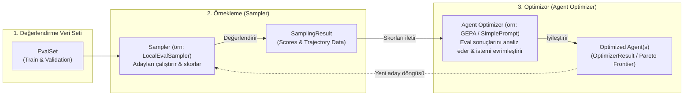

---
title: "ADK Agent Optimization Guide"
description: "Complete guide for automated agent optimization, prompt tuning, GEPA optimizers, samplers, and the adk optimize command in Google ADK"
category: optimization
doc_type: guide
status: active
version: "2.0"
last_updated: "2026-10-04"
author: "Antigravity Engineering"
tags:
  - adk
  - optimization
  - prompt-tuning
  - gepa
  - samplers
  - evaluation
---

# Google ADK Ajan Optimizasyonu (Optimization) Rehberi

Ajanların değerlendirme sonuçlarına (evaluation) dayanarak sistem yönergelerini (prompts) ve yeteneklerini (skills) otomatik olarak iyileştiren genişletilebilir bir optimizasyon çerçevesidir (Supported in ADK Python v1.24.0).

---

## 1. Mimari ve Temel Kavramlar

Optimizasyon döngüsü iki temel soyutlamaya dayanır:



- **Sampler (Örnekleyici):** Aday ajanları değerlendirme veri setleri (`train` ve `validation`) üzerinde çalıştırarak skorlar ve ayrıntılı değerlendirme verileri üretir.
- **Agent Optimizer (Ajan Optimizörü):** Sampler'dan gelen değerlendirme sonuçlarını inceleyerek ajanın prompt ve yönergelerini sistematik biçimde iyileştirir.

---

## 2. Temel Veri Tipleri (`google.adk.optimization.data_types`)

### A. Sampler Çıktıları:
- **`SamplingResult`:** Temel çıktı sınıfı. Her test vakası UID'sini ajanın genel skoruna eşleyen `scores: dict[str, float]` sözlüğü içerir.
- **`UnstructuredSamplingResult`:** `SamplingResult` alt sınıfı. Skorlara ek olarak yörüngeler (trajectories), ara çıktılar ve alt metrikler gibi yapılandırılmamış JSON-serileştirilebilir ek verileri (`data` alanı) taşır.

### B. Optimizör Çıktıları:
- **`AgentWithScores`:** Tek bir optimize edilmiş ajan nesnesi (`optimized_agent`) ve bunun doğrulama kümesindeki genel skoru (`overall_score`).
- **`OptimizerResult`:** Optimizasyon sürecinin nihai çıktısı. Birden çok metriğe göre en iyi adayları temsil eden bir `optimized_agents` listesi (Pareto frontier) ve süreç metriklerini taşır.

---

## 3. Komut Satırı ile Optimizasyon (`adk optimize`)

Basit ajanlar için herhangi bir Python kodu yazmadan doğrudan CLI üzerinden optimizasyon çalıştırılabilir:

```powershell
adk optimize <AGENT_MODULE_DIR> \
  --sampler_config_file_path <PATH_TO_SAMPLER_CONFIG> \
  --optimizer_config_file_path <PATH_TO_OPTIMIZER_CONFIG> \
  --print_detailed_results \
  --log_level INFO
```

- `<AGENT_MODULE_DIR>`: İçinde `agent.py` veya `__init__.py` üzerinden `root_agent` dışa aktaran ajan klasör yolu.
- `--sampler_config_file_path`: Örnekleyici yapılandırma JSON dosya yolu.
- `--optimizer_config_file_path` (İsteğe bağlı): Optimizör ayar dosyası (belirtilmezse varsayılan GEPA ayarları kullanılır).
- `--print_detailed_results`: Optimizör tarafından ölçülen detaylı metrikleri konsola yazdırır.

### Örnek Yapılandırma Dosyaları:

#### `sampler_config.json`:
```json
{
  "eval_config": {
    "criteria": {
      "response_match_score": 0.75
    }
  },
  "app_name": "hello_world",
  "train_eval_set": "train_eval_set",
  "validation_eval_set": "validation_eval_set"
}
```

---

## 4. Yerleşik Sampler ve Optimizörler

### 4.1. `LocalEvalSampler`
ADK'nın `LocalEvalService` motorunu kullanarak aday ajanları yerel ortamda test eder.
- `eval_config`: Değerlendirme kriterlerini ve kullanıcı simülasyon ayarlarını içeren `EvalConfig`.
- `app_name`: Test edilecek uygulamanın adı.
- `train_eval_set`: Optimizasyon eğitimi için kullanılacak eval seti.
- `train_eval_case_ids` (İsteğe bağlı): Eğitime dahil edilecek spesifik vaka ID'leri (boşsa tümü).
- `validation_eval_set` (İsteğe bağlı): Doğrulama için kullanılacak eval seti (verilmezse train seti yeniden kullanılır).

---

### 4.2. `GEPARootAgentPromptOptimizer`
[GEPA](https://gepa-ai.github.io/gepa/) (Generative Evolutionary Prompt Adaptation) algoritmasını kullanarak yalnızca root agent'ın `instruction` (prompt) metnini evrimleştirir. Aday havuzunda Pareto frontier tutar.
- `optimizer_model`: İstemleri analiz edip revize eden LLM (varsayılan model).
- `model_configuration`: 10K token düşünme bütçeli (`thinking_budget: 10240`) üretim ayarları.
- `max_metric_calls`: Optimizasyon boyunca çalıştırılacak maksimum eval sayısı (varsayılan: 100).
- `reflection_minibatch_size`: Her adımda ajanı güncellemek için incelenecek vaka adedi (varsayılan: 3).
- `run_dir`: Ara ve nihai sonuçların kaydedileceği dizin (warm start / sıcak yeniden başlatma sağlar).

> [!NOTE]
> `GEPARootAgentPromptOptimizer` deneyseldir (experimental). Alt ajanları (sub-agents) veya araçları (tools) değil, yalnızca ana ajanın prompt metnini optimize eder.

---

### 4.3. `GEPARootAgentOptimizer`
`GEPARootAgentPromptOptimizer`'ın genişletilmiş sürümüdür. Root agent yönergelerinin yanı sıra `SkillToolset` ile ajana sağlanan beceri yönergelerini (skill instructions) de eşzamanlı olarak optimize eder.
- `model_configuration`: `ThinkingLevel: HIGH` ile çalışır.
- `max_metric_calls`: 100
- `reflection_minibatch_size`: 3

---

### 4.4. `SimplePromptOptimizer`
Çoklu Pareto adayları yerine tek bir ana istem üzerinde sıralı ve doğrudan çalışan otomatik istem ayarlama motorudur. 4 aşamalı asenkron döngü yürütür:

1. **Execute (Yürüt):** Hedef ajan belirli bir değerlendirme grubu üzerinde çalıştırılır.
2. **Evaluate (Değerlendir):** Sampler sonuçları puanlar ve `SamplingResult` döner.
3. **Critique (Eleştir):** Optimizasyon LLM'i geçmiş puanları ve mevcut istemi analiz ederek davranışsal zafiyetleri ve eksikleri belirler.
4. **Rewrite (Yeniden Yaz):** Tespit edilen eksikleri kapatacak yeni istem varyasyonunu üretir ve bir sonraki iterasyona iletir.

> [!IMPORTANT]
> `SimplePromptOptimizer` orijinal ajanı yerinde mutate etmez (in-place değiştirmez). İşlem sonunda en yüksek skorlu ajanın kopyasını `OptimizerResult` içinde döner.

---

## 5. Programatik Optimizasyon (Python API)

Özel örnekleyiciler, optimizörler veya kod içi entegrasyonlar için Python API örneği:

```python
import asyncio
import logging
import os

from google.adk.cli.utils import envs, logs
from google.adk.evaluation.eval_config import EvalConfig
from google.adk.evaluation.local_eval_sets_manager import LocalEvalSetsManager
from google.adk.optimization.gepa_root_agent_prompt_optimizer import (
    GEPARootAgentPromptOptimizer,
    GEPARootAgentPromptOptimizerConfig,
)
from google.adk.optimization.local_eval_sampler import (
    LocalEvalSampler,
    LocalEvalSamplerConfig,
)

# 1. Ortam ve Loglama Kurulumu
envs.load_dotenv_for_agent(".", ".")
logs.setup_adk_logger(logging.INFO)

# 2. Sampler Tanımlama
sampler_config = LocalEvalSamplerConfig(
    eval_config=EvalConfig(criteria={"response_match_score": 0.75}),
    app_name="hello_world",
    train_eval_set="train_eval_set",
)
eval_sets_manager = LocalEvalSetsManager(agents_dir=os.path.dirname(os.getcwd()))
sampler = LocalEvalSampler(sampler_config, eval_sets_manager)

# 3. Optimizör Tanımlama
opt_config = GEPARootAgentPromptOptimizerConfig(max_metric_calls=50)
optimizer = GEPARootAgentPromptOptimizer(config=opt_config)

# 4. Optimizasyonu Çalıştırma
import agent  # Ajan modülünüz
initial_agent = agent.root_agent

result = asyncio.run(optimizer.optimize(initial_agent, sampler))

# 5. En İyi Adayı Alma
best_idx = result.gepa_result["best_idx"]
best_agent = result.optimized_agents[best_idx]

print("En Yüksek Skor:", best_agent.overall_score)
print("Optimize Edilmiş Prompt:\n", best_agent.optimized_agent.instruction)
```

---

## 6. Özel Sampler ve Optimizör Geliştirme

İhtiyacınıza göre soyut sınıfları miras alarak kendi algoritmalarınızı yazabilirsiniz:

- **Özel Sampler:** `google.adk.optimization.sampler.Sampler` sınıfından türetilir; `get_train_example_ids()`, `get_validation_example_ids()` ve `sample_and_score()` metotlarını uygular.
- **Özel Optimizör:** `google.adk.optimization.agent_optimizer.AgentOptimizer` sınıfından türetilir; `optimize(self, initial_agent, sampler)` metodunu uygular.

---

## 7. İlgili Bağlantılar
- Resmi Dokümantasyon: [Optimize Agents](https://adk.dev/optimize/index.md)
- Değerlendirme Rehberi: [ADK Evaluation Guide](file:///c:/dev/doc-agent/.agents/skills/google-agents-cli/references/adk-evaluation-guide.md)
