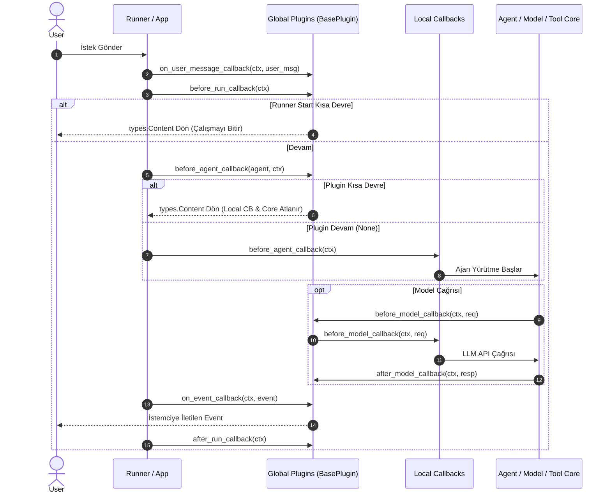

---
title: "ADK Plugins Architecture & Lifecycle Interception Guide"
description: "Comprehensive guide to Google ADK Plugins covering BasePlugin, global lifecycle hooks, precedence over callbacks, prebuilt plugins, and multi-language patterns."
category: architecture
doc_type: guide
status: active
version: "2.0"
last_updated: "2026-10-04"
author: "Antigravity Engineering"
tags:
  - adk
  - plugins
  - base-plugin
  - lifecycle
  - guardrails
  - prebuilt-plugins
  - python
  - java
  - typescript
  - go
  - kotlin
  - architecture
---

# Google ADK Plugins (Eklenti Mimarisi ve Küresel Yaşam Döngüsü) Rehberi

Google ADK'da **Plugins (Eklentiler)**, tekil bir ajana veya araca bağlı kalmaksızın, bir `Runner` veya `App` tarafından yönetilen tüm iş akışı genelinde çalışan modüler kod bileşenleridir.

Güvenlik politikası denetimi (Model Armor, guardrails), merkezi OpenTelemetry izleme, kurumsal BigQuery loglaması, küresel önbellekleme ve olay (event) zenginleştirme gibi çapraz kesen sistem yetenekleri için kullanılır.

---

## 1. Mimari Prensipler ve Yaşam Döngüsü

### Callbacks vs. Plugins Ayrımı ve Öncelik Hiyerarşisi

ADK'da Callback'ler ile Plugin'ler aynı kanca altyapısını kullanır; ancak kapsam ve öncelikleri temelden farklıdır:

| Özellik | Plugins (Eklentiler) | Callbacks (Kancalar) |
| :--- | :--- | :--- |
| **Kapsam (Scope)** | **Küresel (Global):** `Runner` veya `App` seviyesinde bir kez kaydedilir; tüm ajanlara, modellere ve araçlara uygulanır. | **Yerel (Local):** Belirli bir `BaseAgent` veya `Tool` örneğine atanır; yalnızca o bileşende çalışır. |
| **Öncelik (Precedence)** | **Birincil Öncelik:** Her olayda Plugin kancaları, yerel Callback'lerden **ÖNCE** çalışır. | **İkincil Öncelik:** Plugin kancalarından sonra çalışır. |
| **Kısa Devre (Short-Circuit)** | Plugin kancası `None` dışında bir değer dönerse, **yerel Callback tamamen atlanır (çalıştırılmaz)**. | Yalnızca kendi yerel seviyesini kısa devre eder. |
| **Konfigürasyon** | `InMemoryRunner(plugins=[...])` veya `App(plugins=[...])`. | `LlmAgent(before_agent_callback=...)`. |
| **Kullanım Alanı** | Güvenlik duvarları, audit loglama, merkezi metrikler, global önbellek. | Ajanın görevine özel prompt kontrolü, tekil araç sanitizasyonu. |



---

## 2. 3 Çalışma Modu (Modes of Operation)

Bir eklenti kancası üç farklı şekilde davranabilir:

1. **Gözlemleme (To Observe):**
   - Kanca `None` döndürür.
   - İş akışı kesintiye uğramadan devam eder. Loglama, sayaç artırma, metrik gönderme için kullanılır.
2. **Müdahale / Kısa Devre (To Intervene):**
   - Kanca bir değer döndürür (`types.Content`, `LlmResponse`, `dict`).
   - `Runner` o aşamadaki yürütmeyi durdurur, sonraki eklentileri, yerel kancaları ve asıl işlemi (örneğin LLM çağrısını) atlar ve dönen değeri sonuç kabul eder.
3. **Değiştirme (To Amend):**
   - Kanca `Context`, `llm_request` veya `event` nesnesi üzerinde doğrudan değişiklik yapar ve `None` döner.
   - İş akışı kesilmeden sonraki modüllere modifiye edilmiş veri aktarılır (örn. sistem promptuna şirket kuralı ekleme).

---

## 3. 10 Yaşam Döngüsü Kancası ve İmzaları

Eklentiler `BasePlugin` sınıfından türer ve aşağıdaki kancaları ezebilir (override):

### A. Kullanıcı Mesajı ve Çalışma Başlangıcı
```python
from google.adk.plugins.base_plugin import BasePlugin
from google.adk.agents.invocation_context import InvocationContext
from google.genai import types
from typing import Optional

class LifecyclePlugin(BasePlugin):
    async def on_user_message_callback(
        self, 
        *, 
        invocation_context: InvocationContext, 
        user_message: types.Content
    ) -> Optional[types.Content]:
        """Kullanıcı mesajı Runner'a ulaştığı ilk anda tetiklenir.
        Girdiyi incelemek, PII temizlemek veya mesajı değiştirmek için kullanılır.
        types.Content dönülürse kullanıcının mesajı bu içerikle değiştirilir.
        """
        return None

    async def before_run_callback(
        self, 
        *, 
        invocation_context: InvocationContext
    ) -> Optional[types.Content]:
        """Tüm ajan mantığı başlamadan önce global hazırlık anında tetiklenir.
        types.Content dönerse Runner DERHAL çalışmayı sonlandırır ve bu yanıtı döner.
        """
        return None
```

### B. Ajan Seviyesi Kancalar
```python
    async def before_agent_callback(
        self, 
        *, 
        agent: "BaseAgent", 
        callback_context: "CallbackContext"
    ) -> Optional[types.Content]:
        """Herhangi bir ajan çalışmaya başlamadan hemen önce tetiklenir."""
        return None

    async def after_agent_callback(
        self, 
        *, 
        agent: "BaseAgent", 
        callback_context: "CallbackContext"
    ) -> Optional[types.Content]:
        """Ajan çalışmasını tamamlayıp sonuç ürettiğinde tetiklenir."""
        return None
```

### C. Model Seviyesi Kancalar (İstek, Yanıt, Hata)
```python
    async def before_model_callback(
        self, 
        *, 
        callback_context: "CallbackContext", 
        llm_request: "LlmRequest"
    ) -> Optional["LlmResponse"]:
        """LLM çağrısı öncesi. LlmResponse dönerse model çağrısı atlanır (önbellek)."""
        return None

    async def after_model_callback(
        self, 
        *, 
        callback_context: "CallbackContext", 
        llm_response: "LlmResponse"
    ) -> Optional["LlmResponse"]:
        """LLM çağrısı başarıyla tamamlandığında yanıtı inceleme/değiştirme."""
        return None

    async def on_model_error_callback(
        self, 
        *, 
        callback_context: "CallbackContext", 
        llm_request: "LlmRequest", 
        error: Exception
    ) -> Optional["LlmResponse"]:
        """Model istisna fırlattığında tetiklenir.
        LlmResponse dönerse istisna BASTIRILIR ve akış after_model_callback ile sürdürülür.
        """
        return None
```

### D. Araç Seviyesi Kancalar (Yürütme, Çıktı, Hata)
```python
    async def before_tool_callback(
        self, 
        *, 
        tool: "BaseTool", 
        tool_args: dict, 
        tool_context: "ToolContext"
    ) -> Optional[dict]:
        """Herhangi bir araç çalıştırılmadan hemen önce tetiklenir."""
        return None

    async def after_tool_callback(
        self, 
        *, 
        tool: "BaseTool", 
        tool_args: dict, 
        tool_context: "ToolContext", 
        tool_response: any
    ) -> Optional[any]:
        """Araç başarıyla tamamlandığında çıktıyı inceleme veya maskeleme."""
        return None

    async def on_tool_error_callback(
        self, 
        *, 
        tool: "BaseTool", 
        tool_args: dict, 
        tool_context: "ToolContext", 
        error: Exception
    ) -> Optional[dict]:
        """Araç istisna fırlattığında tetiklenir.
        dict dönerse istisna BASTIRILIR ve akış after_tool_callback ile sürdürülür.
        """
        return None
```

### E. Olay (Event) ve Kapanış (Runner End) Kancaları
```python
    async def on_event_callback(
        self, 
        *, 
        invocation_context: InvocationContext, 
        event: "Event"
    ) -> Optional["Event"]:
        """Ajan her Event (metin, araç çağrısı, durum) ürettiğinde,
        istemciye/kullanıcıya akıtılmadan hemen önce tetiklenir.
        Event'e özel metadata eklemek veya sansürlemek için Event döndürülür.
        """
        return None

    async def after_run_callback(
        self, 
        *, 
        invocation_context: InvocationContext
    ) -> None:
        """Runner isteği tamamen bitirip tüm olaylar işlendikten sonra çalışır.
        Nihai temizlik, veritabanı bağlantılarını kapatma ve telemetri flush için kullanılır.
        Sonucu DEĞİŞTİREMEZ (yalnızca teardown).
        """
        pass
```

---

## 4. Hazır ADK Eklentileri (Prebuilt Plugins Kataloğu)

Google ADK, doğrudan projeye eklenebilen zengin bir yerleşik eklenti paketi sunar:

| Eklenti Adı | Modül Yolu / Referans | Amacı ve İşlevi |
| :--- | :--- | :--- |
| **Model Armor** | `/integrations/model-armor/` | Google Cloud Model Armor şablonlarını kullanarak kullanıcı girdisini (prompt injection, jailbreak) ve model çıktısını denetler. |
| **BigQuery Analytics** | `/integrations/bigquery-agent-analytics/` | Ajanın tüm konuşma, araç ve token metriklerini kurumsal analiz için doğrudan BigQuery tablolarına akıtır. |
| **Reflect and Retry Tools** | `/integrations/reflect-and-retry/` | Araç başarısızlıklarını yakalar, hatayı analiz ederek parametreleri akıllıca yeniden dener. |
| **Context Filter** | `google.adk.plugins.context_filter_plugin` | Token tüketimini ve gecikmeyi azaltmak için LLM bağlam geçmişini filtreleyip budar. |
| **Global Instruction** | `google.adk.plugins.global_instruction_plugin` | `App` seviyesinde tanımlanan kurumsal sistem yönergelerini altındaki tüm ajanların prompt'una otomatik ekler. |
| **Save Files as Artifacts** | `google.adk.plugins.save_files_as_artifacts_plugin` | Kullanıcı mesajlarında gelen dosya/ekleri otomatik olarak oturum Artifact'i olarak kaydeder. |
| **Auto Tracing** | `google.adk.plugins.auto_tracing_plugin` | Ajan paketlerindeki fonksiyonları otomatik olarak OpenTelemetry trace span'leri ile sarmalar. |
| **Multimodal Tool Results** | `google.adk.plugins.multimodal_tool_results_plugin` | Python fonksiyon araçlarının ikili/multimodal `Content` parçalarını doğrudan modele aktarmasını sağlar. |
| **Logging** | `google.adk.plugins.logging_plugin` | Her yaşam döngüsü adımında yapılandırılmış JSON logları üretir. |

---

## 5. Uçtan Uca Python Uygulama Örneği

Aşağıda hem sayaç tutan hem de güvenlik denetimi yapan özel bir `AuditGuardPlugin` tanımlanmakta ve `Runner` seviyesinde kaydedilmektedir:

```python
import asyncio
from google.adk import Agent
from google.adk.plugins.base_plugin import BasePlugin
from google.adk.runners import InMemoryRunner
from google.adk.agents.callback_context import CallbackContext
from google.adk.models.llm_request import LlmRequest
from google.adk.models.llm_response import LlmResponse
from google.genai import types
from typing import Optional

class AuditGuardPlugin(BasePlugin):
    """Kurumsal güvenlik ve çağrı sayacı eklentisi."""
    def __init__(self):
        super().__init__(name="audit_guard")
        self.request_count = 0

    async def before_model_callback(
        self, 
        *, 
        callback_context: CallbackContext, 
        llm_request: LlmRequest
    ) -> Optional[LlmResponse]:
        self.request_count += 1
        prompt = "".join(p.text for c in llm_request.contents for p in c.parts if p.text)
        
        # Güvenlik politikası denetimi
        if "gizli_sirket_verisi" in prompt.lower():
            # Kısa devre: LLM çağrısını tamamen atla
            return LlmResponse(
                content=types.Content(
                    parts=[types.Part.from_text(text="[GÜVENLİK BLOKAJI] İstek şirket politikalarına aykırıdır.")]
                )
            )
        return None

    async def after_run_callback(self, *, invocation_context) -> None:
        print(f"[AuditGuard] İstek tamamlandı. Toplam model çağrısı: {self.request_count}")

# 1. Ajan Tanımı
assistant = Agent(
    model="gemini-2.5-flash",
    name="customer_agent",
    instruction="Yardımsever bir asistansın."
)

# 2. Eklentinin Runner'a Kaydı
runner = InMemoryRunner(
    agent=assistant,
    app_name="enterprise_crm",
    plugins=[AuditGuardPlugin()] # Birden fazla eklenti verilebilir
)

# 3. Çalıştırma
async def main():
    session = await runner.session_service.create_session(
        user_id="user_123", 
        app_name="enterprise_crm"
    )
    async for event in runner.run_async(
        user_id="user_123",
        session_id=session.id,
        new_message=types.Content(parts=[types.Part.from_text(text="Merhaba!")])
    ):
        if event.is_final_response() and event.content:
            print(f"Yanıt: {event.content.parts[0].text}")

if __name__ == "__main__":
    asyncio.run(main())
```

---

## 6. Çok Dilli SDK Desteği

| SDK Dili | Taban Sınıf | Kayıt Noktası | Örnek İmza |
| :--- | :--- | :--- | :--- |
| **Python** | `google.adk.plugins.BasePlugin` | `InMemoryRunner(plugins=[...])` | `async def before_model_callback(self, *, callback_context, llm_request)` |
| **TypeScript** | `BasePlugin` (`@google/adk`) | `new InMemoryRunner({ plugins: [...] })` | `async beforeModelCallback(context, llmRequest): Promise<LlmResponse>` |
| **Java** | `BasePlugin` (`com.google.adk.plugins`) | `new InMemoryRunner(agent, app, List.of(plugin))` | `public Maybe<LlmResponse> beforeModelCallback(ctx, req)` |
| **Go** | `plugin.Plugin` (`google.golang.org/adk/v2/plugin`)| `runner.Config{ PluginConfig: runner.PluginConfig{ Plugins: [...] } }` | `func (p *P) BeforeModelCallback(ctx, req) (*model.LLMResponse, error)` |
| **Kotlin** | `Plugin` (`com.google.adk.plugins`) | `InMemoryRunner(agent = ..., plugins = listOf(...))` | `override suspend fun beforeModel(context, request): CallbackChoice` |
