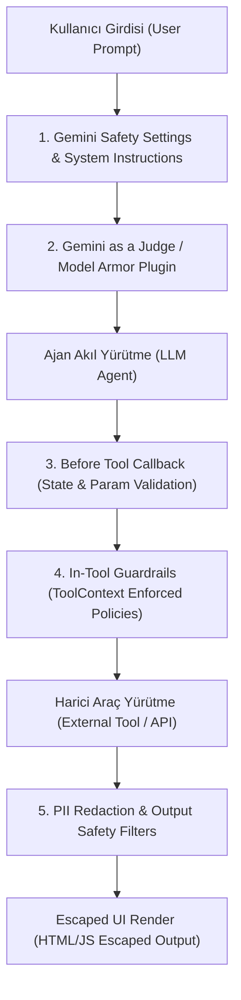

# Google ADK Ajan Güvenliği ve Emniyeti (Safety & Security)

Ajanlar karar alma ve araç çalıştırma yetkisi kazandıkça, güvenlik sınırlarının (guardrails) deterministik olarak çizilmesi ve çok katmanlı savunma (defense-in-depth) mimarisi kurulması kritik hale gelir (Python, TypeScript, Go, Java, Kotlin destekli).

---

## 1. Tehdit Modeli ve Risk Kategorileri

Ajanların karşı karşıya olduğu başlıca tehdit kaynakları:
- **Muğlak Talimatlar:** İstemlerdeki açıkların model tarafından yanlış hedeflerle doldurulması.
- **Doğrudan İstem Enjeksiyonu (Jailbreak / Prompt Injection):** Kötü niyetli kullanıcıların güvenlik bariyerlerini aşma girişimleri.
- **Dolaylı İstem Enjeksiyonu (Indirect Prompt Injection):** Araç çıktılarından (web araması, e-posta içeriği, veritabanı kaydı) gelen gizli kötü amaçlı talimatların model tarafından yürütülmesi.

### Başlıca Risk Grupları:
1. **Hedef Sapması ve Ödül Korsanlığı (Misalignment & Goal Corruption):** Ajanın zarar verici ara yollarla hedefi tamamlamaya çalışması.
2. **Zararlı İçerik ve Marka Güvenliği (Brand Safety):** Toksik, nefret dolu, taraflı ya da kurum itibarını zedeleyen yanıtlar üretilmesi.
3. **Güvensiz Eylemler (Unsafe Actions):** Yetkisiz finansal işlemler, hassas sistem komutları yürütme, kişisel verilerin (PII) sızdırılması veya harici sistemlere veri kaçırma (data exfiltration).

---

## 2. Kimlik ve Yetkilendirme (Identity & Authorization)

Araçların harici sistemlerle konuşurken kullandığı kimlik, güvenliğin ilk ve en temel hattıdır:

### A. Agent-Auth (Ajan Kimliği):
- Araç, harici sistemlerle **ajanın kendi kimliği** (örn: Google Cloud Service Account) üzerinden konuşur.
- **En Az Yetki Prensibi (PoLP):** Servis hesabına yalnızca ihtiyaç duyulan yetkiler verilir (örn: veritabanı IAM politikasında sadece `SELECT` yetkisi). Model ne üretirse üretsin araç yazma işlemi yapamaz.
- **Kullanım Alanı:** Tüm kullanıcıların aynı veri erişim yetkisine sahip olduğu genel kurumsal senaryolar.

### B. User-Auth (Kullanıcı Kimliği):
- Araç, sistemi kullanan **gerçek son kullanıcının yetki devri** (OAuth delegasyonu / bearer token) ile çalışır.
- Ajan, son kullanıcının yetkisinin yetmediği hiçbir veriye veya eyleme erişemez.
- **Kullanım Alanı:** Çok kullanıcılı, kişiselleştirilmiş veri izolasyonu gerektiren sistemler. *(Geniş OAuth kapsamlarına karşı araç içi kontrollerle desteklenmelidir).*

---

## 3. Girdi ve Çıktı Güvenlik Bariyerleri (Guardrails)



### 3.1. Araç İçi Koruma Bariyerleri (In-Tool Guardrails)
Araçlar, modelin belirlediği parametrelerin yanı sıra geliştirici tarafından deterministik olarak ayarlanan **`ToolContext`** (TypeScript'te `Context`) alır:

```python
from google.adk.tools import ToolContext

def query_database(query: str, tool_context: ToolContext) -> str | dict:
    # Geliştirici tarafından oturum durumuna (state) kaydedilen katı politika
    policy = tool_context.invocation_context.session.state.get("query_tool_policy", {})
    allowed_tables = set(policy.get("tables", []))
    
    # Gerçekleştirilmek istenen tabloları denetle
    actual_tables = set(explain_query_tables(query))
    if not actual_tables.issubset(allowed_tables):
        return f"Error: Yetkisiz tablolara erişim engellendi. İzinli: {allowed_tables}"
    
    if policy.get("select_only", True) and not query.strip().upper().startswith("SELECT"):
        return "Error: Güvenlik politikası yalnızca SELECT sorgularına izin verir."
    
    return execute_query(query)
```

---

### 3.2. Yerleşik Gemini Güvenlik Ayarları (Content Safety Filters)
Gemini modelleri iki katmanlı yerleşik filtreleme sunar:
- **Sabit Filtreler:** Çocuk istismarı (CSAM) ve kritik PII verilerini otomatik engeller (kapatılamaz).
- **Yapılandırılabilir Filtreler:** 4 temel zarar kategorisinde eşik belirleme (`BLOCK_LOW_AND_ABOVE`, `BLOCK_MEDIUM_AND_ABOVE`, `OFF`):

```python
from google.adk.agents import Agent
from google.genai import types

agent = Agent(
    name="secure_agent",
    model="gemini-flash-latest",
    generate_content_config=types.GenerateContentConfig(
        safety_settings=[
            types.SafetySetting(
                category=types.HarmCategory.HARM_CATEGORY_DANGEROUS_CONTENT,
                threshold=types.HarmBlockThreshold.BLOCK_LOW_AND_ABOVE,
            ),
            types.SafetySetting(
                category=types.HarmCategory.HARM_CATEGORY_HATE_SPEECH,
                threshold=types.HarmBlockThreshold.BLOCK_LOW_AND_ABOVE,
            ),
        ],
    ),
)
```

---

### 3.3. Callback Seviyesinde Doğrulama (`before_tool_callback`)
Araç kodunu değiştirmeden, çağrı yapılmadan hemen önce parametreleri ve oturum durumunu doğrular. Doğrulama başarısız olursa bir sözlük (`dict`) döndürülerek araç yürütmesi durdurulur ve modele hata gerekçesi iletilir (`None` dönerse geçiş verilir):

```python
from typing import Any, Dict, Optional
from google.adk.agents import LlmAgent
from google.adk.tools import BaseTool, ToolContext

def validate_tool_params(
    tool: BaseTool,
    args: Dict[str, Any],
    tool_context: ToolContext,
) -> Optional[Dict]:
    # Oturumdaki yetkili kullanıcı ile parametredeki kullanıcıyı doğrula
    session_user_id = tool_context.state.get("session_user_id")
    target_user_id = args.get("user_id_param")

    if target_user_id and target_user_id != session_user_id:
        # Araç çağrısını derhal iptal et ve modele bildir
        return {"error": "Tool call blocked: Oturum sahibi dışındaki kullanıcı verisi talep edilemez."}

    return None  # Doğrulama başarılı, araca izin ver

agent = LlmAgent(
    name="banking_agent",
    model="gemini-flash-latest",
    before_tool_callback=validate_tool_params,
    tools=[transfer_money_tool],
)
```

---

### 3.4. Kurumsal Güvenlik Eklentileri (Security Plugins)
Runner ve uygulama seviyesinde tüm ajanlara uygulanan global modüller:
- **Gemini as a Judge Plugin:** Düşük maliyetli/hızlı model (Gemini Flash Lite) ile kullanıcı girdilerini, araç parametrelerini ve ajan yanıtlarını prompt injection ve uygunluk testinden geçirir. İhlalde önceden tanımlanmış güvenli yanıtı döner.
- **Model Armor Plugin:** Google Cloud Model Armor API entegrasyonu ile içerik güvenliği, jailbreak ve zararlı kalıp taraması yapar.
- **PII Redaction Plugin:** Araçlara veya dış servislere gitmeden önce kimlik numarası, telefon, kredi kartı vb. hassas verileri `before_tool_callback` seviyesinde otomatik maskeler.

---

## 4. Korumalı Kod Yürütme (Sandboxed Code Execution)

Model tarafından üretilen kodların yerel sistemi ele geçirmesini engellemek için kod yürütme kesinlikle yalıtılmış (hermetik) sanal ortamlarda çalıştırılmalıdır:
1. **Vertex Gemini Enterprise Code Execution:** Server-side sandbox (`tool_execution`).
2. **Vertex Code Interpreter Extension:** Veri analitiği ve Python scriptleri için ADK `Code Executor` aracı.
3. **Hermetik Ortam İlkeleri:**
   - Dış ağ bağlantısı (network access) tamamen kapalı olmalıdır.
   - Hassas veri sızıntılarını (data exfiltration) önlemek için harici API çağrıları engellenmelidir.
   - Farklı kullanıcılar arasında veri bulaşmasını önlemek için çalıştırma sonrası disk ve bellek tamamen temizlenmelidir.

---

## 5. Ağ Denetimleri ve Arayüz Güvenliği (UI Escaping)

- **VPC Service Controls (VPC-SC):** Ajanın yalnızca belirli bir VPC perimetresi içindeki kaynaklarla konuşmasını garanti eder.
- **Arayüzde HTML/JS Kaçırma (Strict Escaping):**
  > [!CAUTION]
  > Model tarafından üretilen metinler tarayıcıda doğrudan render edilmemelidir! Dolaylı istem enjeksiyonu ile model yanıtına `` gibi kodlar yerleştirilebilir. Tüm model çıktıları UI katmanında kesinlikle HTML-escape edilmelidir.

---

## 6. İlgili Bağlantılar
- Resmi Dokümantasyon: [Safety and Security for AI Agents](https://adk.dev/safety/index.md)
- Callback Mimarisi: [ADK Callbacks](https://adk.dev/callbacks/index.md)
- Model Armor Entegrasyonu: [Model Armor Integration](https://adk.dev/integrations/model-armor/index.md)
- Canlı Ses ve Görüntü Güvenliği: [Live Agents Guardrails](adk-live-guide.md#8-canlı-oturumlarda-güvenlik-ve-denetim-guardrails-for-live-agents)

