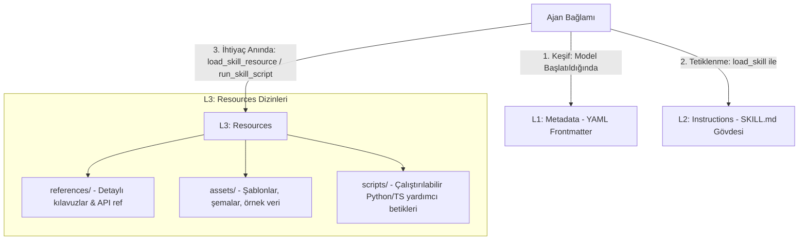

---
title: "ADK Skills & SkillToolset Architecture Guide"
description: "Complete guide for building, packaging, and executing modular Agent Skills in Google ADK based on the agentskills.io specification using SkillToolset."
category: integrations
doc_type: guide
status: active
version: "2.0"
last_updated: "2026-10-04"
author: "Antigravity Engineering"
tags:
  - adk
  - skills
  - skilltoolset
  - agentskills-io
  - load-skill
  - load-skill-resource
  - run-skill-script
  - l1-l3-architecture
  - integrations
---

# Google ADK Ajan Becerileri (Skills) ve SkillToolset Mimarisi

ADK Ajan Becerileri (**Agent Skills**), bir ajanın belirli bir uzmanlık görevini yerine getirmesi için gerekli talimatları, referans materyallerini, veri varlıklarını ve yardımcı betikleri bağımsız bir paket olarak kapsülleyen self-contained bir yapıdır.

Bu mimari, açık kaynaklı [Agent Skill Specification](https://agentskills.io/specification) standardını temel alır ve ajanın işletim bağlam penceresini (context window) korumak için **kademeli yükleme (incremental loading)** prensibiyle çalışır.

---

## 1. Üç Seviyeli Beceri Mimarisi (L1 - L3)

Bir beceri, bilginin derinliğine ve modelin ihtiyaç duyduğu ana göre üç kademede yapılandırılır:



### Seviye 1: L1 Metadata (Keşif)
`SKILL.md` dosyasının en başındaki YAML frontmatter alanıdır. Ajanın araç şemasına eklenir ve modelin bu beceriyi ne zaman tetikleyeceğini anlamasını sağlar.
- **`name`:** Becerinin benzersiz kimliği. Küçük harf `kebab-case` olmalı, en fazla 64 karakter içermeli ve ardışık/baş/son tire içermemelidir.
- **`description`:** Modelin beceriyi seçmesini sağlayan özet açıklama. Boş olamaz, en fazla 1024 karakter olabilir.

### Seviye 2: L2 Instructions (Ana Yönergeler)
`SKILL.md` dosyasının gövdesidir. Model bu beceriyi kullanmaya karar verip `load_skill` aracını çağırdığında bağlama tam metin olarak yüklenir. Adım adım iş akışlarını, kural ve kısıtlamaları içerir.

### Seviye 3: L3 Resources (Genişletilmiş Kaynaklar)
Yalnızca ihtiyaç duyulduğunda yüklenen yan dizinlerdir:
- **`references/`:** Derinlemesine API referansları, form doldurma rehberleri veya etki alanı dokümantasyonu (`.md`).
- **`assets/`:** Şablonlar, şemalar, görsel ve veri setleri.
- **`scripts/`:** Doğrudan çalıştırılabilir yardımcı script'ler (`.py`, `.js`, `.ts`).

---

## 2. Dizin Yapısı Standardı

Aşağıdaki yapı, standart bir ADK projesindeki önerilen beceri organizasyonudur:

```text
my_agent/
├── agent.py (veya agent.ts / main.go)
├── .env
└── skills/
    └── weather-skill/            # Beceri dizini (kebab-case)
        ├── SKILL.md              # L1 Frontmatter + L2 Yönergeler (ZORUNLU)
        ├── references/           # L3 Genişletilmiş kılavuzlar
        │   ├── api_reference.md
        │   └── error_codes.md
        ├── assets/               # L3 Şablon ve şemalar
        │   └── city_mappings.json
        └── scripts/              # L3 Yürütülebilir araçlar
            └── fetch_radar.py
```

---

## 3. `SkillToolset` ve Yerleşik Ajan Araçları

Ajanlara becerileri sunmak için `SkillToolset` kullanılır. Bu araç seti, ajana otomatik olarak şu 3 yerleşik aracı ve sistem talimatlarını enjekte eder:

1. **`load_skill`:** Becerinin `SKILL.md` dosyasındaki ana yönergeleri okur.
2. **`load_skill_resource`:** Beceri dizini altındaki `references/` veya `assets/` dosyalarını görüntüler.
3. **`run_skill_script`:** Becerinin `scripts/` dizini altındaki bir betiği güvenli ortamda çalıştırır.

### Python Uygulaması (Dosya Sisteminden Yükleme)
```python
import pathlib
from google.adk import Agent
from google.adk.skills import load_skill_from_dir
from google.adk.tools import skill_toolset

# 1. Beceriyi dizinden yükle
weather_skill = load_skill_from_dir(
    pathlib.Path(__file__).parent / "skills" / "weather-skill"
)

# 2. SkillToolset oluştur (İstenirse ek araçlar da eklenebilir)
my_skill_toolset = skill_toolset.SkillToolset(
    skills=[weather_skill],
    additional_tools=[get_weather_tool],
)

# 3. Ajanı tanımla
root_agent = Agent(
    model="gemini-2.5-flash",
    name="skill_user_agent",
    description="Özelleşmiş becerileri kullanan asistan.",
    instruction="Görevleri yerine getirirken yetenekli becerilerden (skills) faydalanın.",
    tools=[my_skill_toolset],
)
```

### TypeScript Uygulaması
```typescript
import {Agent, SkillToolset, loadSkillFromDir} from '@google/adk';
import * as path from 'node:path';

const weatherSkill = await loadSkillFromDir(
  path.join(__dirname, 'skills/weather-skill')
);

const mySkillToolset = new SkillToolset([weatherSkill], {
  additionalTools: [getWeatherTool],
});

export const rootAgent = new Agent({
  model: 'gemini-2.5-flash',
  name: 'skill_user_agent',
  instruction: 'Görevleri yerine getirmek için tanımlı becerileri kullanın.',
  tools: [mySkillToolset],
});
```

---

## 4. Kod İçi Tanımlı Beceriler (Inline Skills)

Dinamik veya dosya sistemi erişimi olmayan ortamlarda beceriler doğrudan kod içerisinde nesne olarak tanımlanabilir:

```python
from google.adk.skills import models

greeting_skill = models.Skill(
    frontmatter=models.Frontmatter(
        name="greeting-skill",
        description="Belirli bir kişiyi samimi bir dille selamlayan beceri.",
    ),
    instructions=(
        "Adım 1: 'references/greetings.txt' dosyasını inceleyin. "
        "Adım 2: Referanstaki şablona uygun selam üretin."
    ),
    resources=models.Resources(
        references={
            "greetings.txt": "Merhaba! Burada olmanız harika!",
        },
    ),
)
```

---

## 5. Diller Arası SDK Desteği

| Dil | Minimum Sürüm | Dosya Sistemi Kaynağı | Kod İçi (Inline) Kaynak |
| :--- | :--- | :--- | :--- |
| **Python** | `v1.25.0+` | `load_skill_from_dir(path)` | `models.Skill(...)` |
| **TypeScript** | `v0.6.1+` | `loadSkillFromDir(path)` | `{ frontmatter, instructions, resources }` |
| **Go** | `v1.2.0+` | `skill.NewFileSystemSource(os.DirFS(...))` | Özel `skill.Source` arayüzü |
| **Kotlin** | `v0.1.0+` | `NewFileSystemSource("skills")` | Özel `SkillSource` arayüzü |

---

## 6. Mimari En İyi Uygulamalar

1. **Bağlam Penceresi Optimizasyonu:** Büyük API belgelerini veya 500 satırlık şablonları doğrudan ajanın sistem promptuna koymak yerine L3 `references/` veya `assets/` altına alın. Model bunları yalnızca kullanıcı ilgili soruyu sorduğunda `load_skill_resource` ile okur.
2. **Kebab-Case İsimlendirme:** Beceri dizin adı ve frontmatter `name` değeri birebir aynı ve kesinlikle küçük harfli kebab-case olmalıdır (`sql-optimization`, `data-cleaning`).
3. **Deterministik Betikler:** Karmaşık matematiksel hesaplamalar veya dosya dönüştürme işlemleri için modelin kendisinin kod üretmesini beklemek yerine `scripts/` dizinine güvenilir Python/Node yardımcı betikleri ekleyin ve modele `run_skill_script` çağrısı yaptırın.
